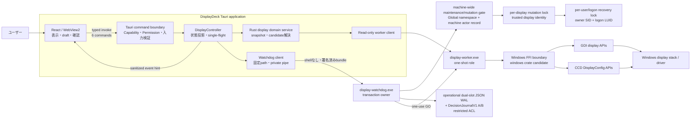
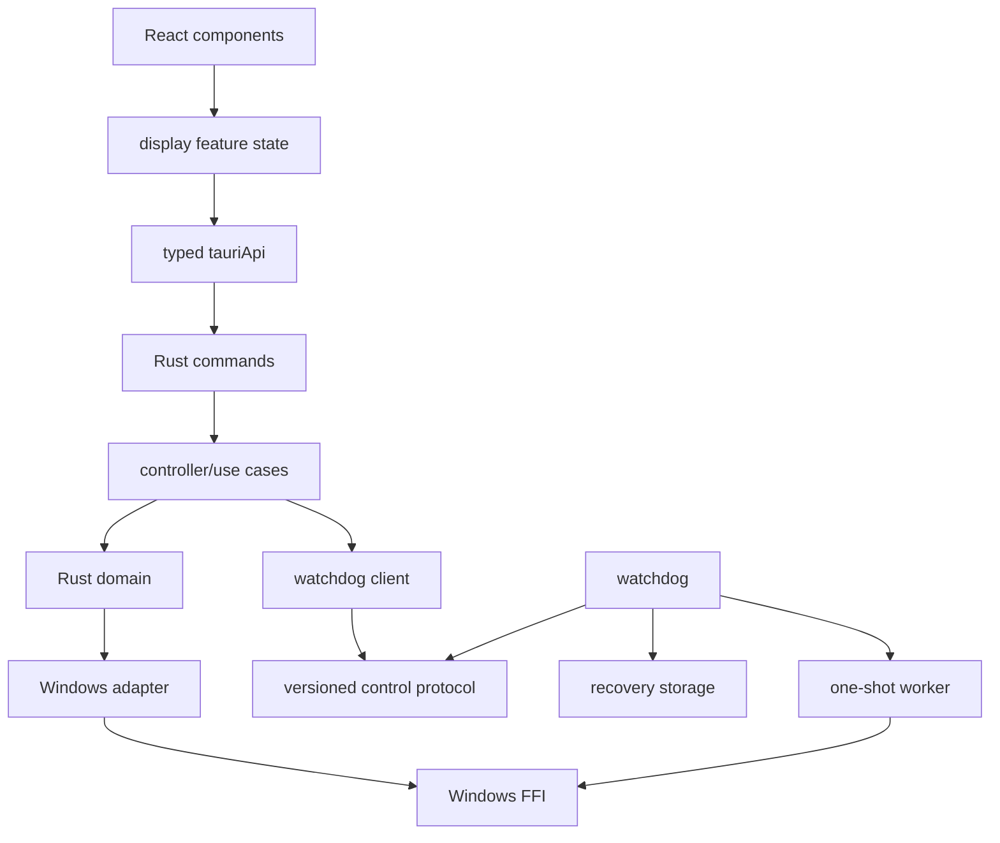
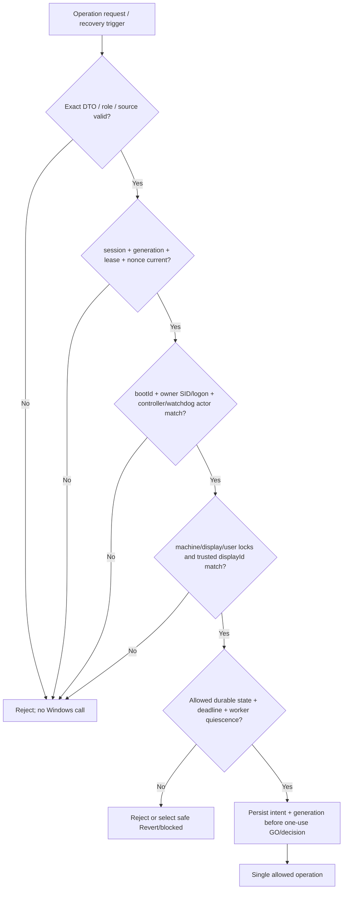
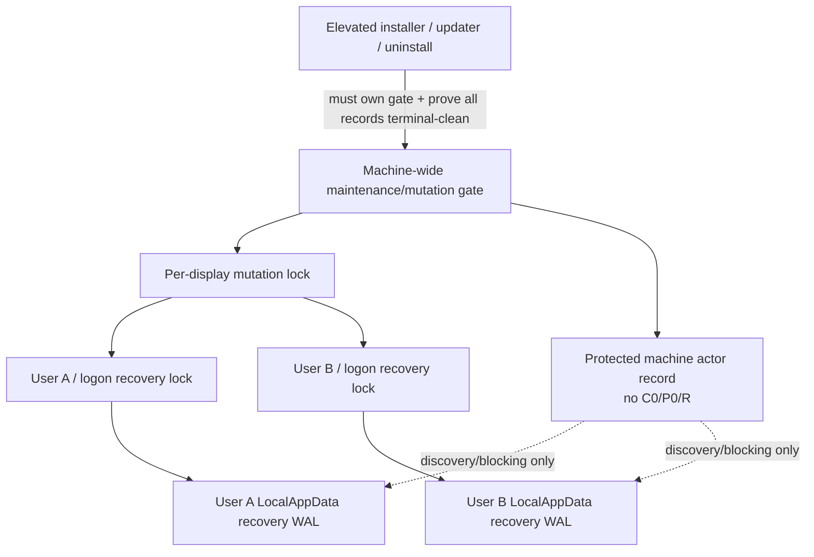

# DisplayDeck アーキテクチャ設計

最終更新: 2026-08-05  
状態: Tauri 2移行後の設計案。再レビュー・実装・技術スパイク未承認。

## 1. 推奨アーキテクチャの要約

DisplayDeckは、単一のReact/WebView2フロントエンド、Tauri Rust core、独立Rust watchdog、one-shot Rust workerの4層で構成する。

- Reactは表示、draft、比較、入力、確認画面だけを担当する。
- Tauri Rust coreは最小command境界、状態投影、snapshot/session照合、watchdogの固定path起動、UI同期を担当する。
- watchdogはTauri本体と別processで、transactionの唯一のownerとしてOS-wide lock、durable epoch、operational dual-slot WAL、fixed-slot `DecisionJournalV1`、deadline、親process喪失、keep/revert競合、復旧decisionを管理する。
- workerは1回のWin32 inspect/preflight/apply/readback/restoreだけを実行して終了する。watchdog自身はblocking display APIを呼ばない。

Tauriのsidecar同梱機構は配布手段の第一候補だが、親終了後もwatchdogが生存することは同梱機構だけからは保証できない。起動方法、Windows Job、handle inheritance、Task Manager終了をPhase 2A、NSIS同梱をPhase 8で実証する。フロントエンドにはshell起動権限を与えない。

初期Windows戦略は次のhybridを候補とする。

- CCD: `QueryDisplayConfig`、`DisplayConfigGetDeviceInfo`によるactive path、source/target、friendly name、expected observation取得
- GDI: `EnumDisplayDevicesW`、`EnumDisplaySettingsExW`によるtarget関連付けとmode列挙
- GDI: `ChangeDisplaySettingsExW`のtest/dynamic applyによる単一active pathの事前検証・temporary apply・exact restore
- CCD `SetDisplayConfig`: validation比較と将来multi-pathの候補。初期apply APIとして採るかはPhase 1のevidenceで最終決定

初期版はprofileへ保存しないsession-only temporary modeを基本とする。multi-monitor、scale mutation、DLDSR固有処理は別設計である。

## 2. 設計原則

1. **fail closed**: identity、topology、candidate、state、journal、actor ownershipのどれかが曖昧ならWindowsを変更しない。
2. **Reactを信頼しない**: 表示label、index、deadline、eventをOS操作の根拠にしない。
3. **候補を合成しない**: 列挙済み完全tupleをopaque tokenで参照する。
4. **temporary first**: 初期版はpersisted settingを変更しない。
5. **read-after-write**: API returnだけでなくfresh GDI/CCD observationで結果を確定する。
6. **watchdogを独立させる**: Tauri core、WebView、workerの停止からrollback ownerを分離する。
7. **watchdogをblockさせない**: Win32 operationはone-shot workerへ委譲し、旧workerのexitを証明してから次へ進む。
8. **write ahead**: intentとworker identityをdurable化してからだけone-use `GO`を渡す。
9. **actorをfenceする**: machine-wide maintenance/mutation gate、per-display/per-user lock、bootId、owner SID/logon、epoch、leaseVersion、generation、actor nonce、operation sequence、process identityを全live/recovery actorで照合する。
10. **sessionを混同しない**: stale sessionId、古いgeneration、PID単独でkeep/restoreしない。
11. **Windows専用に狭める**: runtimeのOS切替や別OS backendを持たない。test doubleは製品platform abstractionではない。
12. **変更機能より復元を先に証明する**: watchdog/WAL/fencingの合格前にproduct mutation integrationへ進まない。

## 3. システム構成



### 3.1 信頼境界

- React/WebViewは侵害・stale・event lossがあり得る未信頼clientである。
- Tauri Runtime Authority、Capabilities、Permissionsはfrontend露出を減らすが、Rustの誤実装を防がない。command handler自身のvalidationが必須である。
- Rust coreはUI/session viewの正本だが、mutation開始後のdeadlineとtransaction finalityの正本ではない。
- watchdogはRust coreを信頼せず、private channel、sessionId、epoch、owner nonce、journal generation、current topologyを再検証する。
- workerはwatchdogのprivate inherited handleとone-use nonceを検証し、許可された1 operation以外を実行しない。
- driver/EDID/friendly name/device path/API output、preferences JSON、recovery fileはすべて未信頼入力として扱う。

## 4. 各process/componentの責務

### 4.1 React frontend

担当:

- loading/ready/dirty/processing/confirmation/restored/errorの表示
- monitor/current/planned/scale statusの表示
- resolution/refresh候補indexの選択とdraft reset
- typed API wrapper経由のcommand呼出し
- fixed state eventの受信とstatus commandによる再同期
- 2段階presentationを描画し、専用`ack_display_change_presentation` commandで現在のstage tokenをACKする
- 確認overlay、visible countdown、keyboard/accessibility

担当しない:

- Windows/Tauri privileged API、filesystem、shell、processの直接利用
- device/executable/journal path、raw Win32 value、timeoutの生成
- watchdog起動、rollback decision、session finality
- event受信だけによるsuccess判定

確認画面は初期版では同じmain WebViewWindow内のmodal overlayとする。単一windowのままmutation前にoverlay DOMを準備し、apply後にTauri coreがwindowをrestore/show/focusし、必要な期間だけalways-on-top要求を行う。focus/topmostが保証できない場合はpresentation failureとしてrollbackする。専用第2windowは初期版に含めず、必要になった場合はCapability分離を含む再レビューを行う。

### 4.2 Tauri command boundary

- command名を固定登録し、main windowのbundled local originからだけ呼べるCapability/Permissionへ結び付ける。
- DTOをstrict deserializeし、unknown field、過大値、不正token、範囲外整数、非finite数、prototype由来の意味を受け付けない。
- invoking WebViewWindow label/originが期待値であることを利用可能なTauri APIで確認する。Capabilityだけに依存しない。
- command内部でsnapshot/session/stateを再解決し、raw path/flag/handleへ変換させない。
- errorを固定code、message key、severity、retryable、diagnosticIdに正規化する。

### 4.3 DisplayController

- application state machineとsingle-flight guardを保持する。
- Reactへ返す`DisplayControllerView`を作る。
- `begin_display_change`のpublic requestを1つの内部transaction開始へ変換する。
- watchdogからのstateをjournal generation順で受け、late eventを破棄する。
- Tauri/WebView lifecycle eventを監視するが、rollbackの唯一のtriggerにはしない。
- startup時は通常snapshotより先にpending recoveryを開始する。

### 4.4 Rust display domain service

- worker outputをdomain typeへ変換する。
- GDI candidate、CCD path、target identityを関連付ける。
- product-allowed/lab-unqualified/hard-excludedへ分類する。
- opaque snapshot/monitor/resolution/mode tokenを発行・失効する。
- candidateからapply tupleとexactly one expected observationをtrusted codeで解決する。

これはWindows専用domain serviceであり、production時のOS切替interfaceは持たない。unit testではtraitまたはfunction boundaryにtest doubleを差し込めるが、別OS実装を意味しない。

### 4.5 Watchdog client

- Tauri bundlerが同梱した固定watchdog pathだけを解決する。
- pathが想定install root内にあり、reparse/置換、署名publisher、runtime digest/image identityがpolicyに一致することを確認する。
- command shellを使わず、限定されたprocess creation wrapperで起動する。
- private control pipeを作り、sessionId/nonce/protocol version以外のdynamic command-line値を最小化する。
- handshake、stdout/control、stderr/diagnostic、process handleを並行監視する。
- parent終了時にwatchdogまで同じJobで終了しないことをPhase 2Aで証明する。証明前はmutation不可。

### 4.6 Independent watchdog

- machine-wide maintenance/mutation gate、trusted target由来のper-display mutation lock、owner SID/logon単位のrecovery lockをこの順に取得する。初期版は端末全体で1 transactionだけを許す。
- abandoned/stale journalとactive workerを検査し、quiescenceを証明するまでfresh operationを開始しない。
- durable epoch、leaseVersion、generation、128-bit owner nonce、watchdogInstanceId、operation sequence、presentation token/command nonce、session stateの唯一の発行者となる。
- dual-slot WALをprovision/write/flush/reopen/validateする。
- Win32 `GetTickCount64`によるpre-apply/operation/presentation/confirmation/maximum-protection deadline、session change、parent control pipe EOFを監視する。
- keep/revert/timeout/disconnectをcompare-and-setし、1つのdurable decisionにする。
- workerをGO待機でspawnし、identityとintentをdurable化してからone-use GOを送る。
- worker terminal frameだけでなくWindows process objectのsignaledを確認してからactive workerをclearする。
- terminal observationをdurable化してからlockを解放する。
- Tauri coreへ承認済み`HeartbeatPolicyV1`でheartbeatを送り、replacement takeover用にprocess handle、journal generation、leaseVersionを同期する。250ms/4回/250ms silenceはPhase 2A測定候補に過ぎない。watchdog単独loss後のreplacementはconfirmationを再開せず、安全側にabort/restore/resumeする。

watchdogは常駐serviceではない。active transactionまたはstartup recoveryの間だけ動作する。Tauri coreからの通常shutdown要求でも、non-terminal sessionなら先にrollbackする。

### 4.7 One-shot worker

- `inspect`、`capture-baseline`、`preflight`、`temporary-apply`、`readback`、`restore-current`、`restore-persisted-fallback`のうち起動時に固定された1 roleだけを実行する。
- private inherited handle、protocol、session/epoch/owner/sequence/nonceを検証する。
- one-use GO前にdisplay APIを呼ばない。
- Win32 call後にkeep/revertを判断せず、bounded resultを返して終了する。
- Rust `unsafe`をFFI boundaryに限定し、buffer長、structure size、field mask、return codeを検査する。
- timeout後に終了要求が出ても、process objectがsignaledになるまでwatchdogは競合workerを起動しない。
- 1 worker processは起動時に固定し1 role、1 operation、1 `workerInstanceId`だけを持つ。same process identityのまま`workerInstanceId`をrotateする、または2回目のoperationへworkerをreuseすることを禁止する。
- record/frameの`workerProcessIdentity={PID,process creation time,signed image identity,role,processNonce}`が同じで`workerInstanceId`が異なる場合はprotocol/schema faultとしてrejectする。PIDが再利用されてもcreation timeが異なれば別processである。old workerのexact exit証明後だけnew process/new instanceを発行できる。exact wire representationとnegative vectorはDD-FR-002 pre-Phase 2A freeze対象である。

## 5. Tauri command・event境界

### 5.1 公開command

queryを3 commandへ分けるとtopology/current/mode listの世代がずれるため、整合snapshotを1 commandで返す。public `prepare`と`apply`の分離も、stale prepared planの再利用やwatchdog未準備でのapplyを生むため採用しない。内部では段階を分けるが、frontendにはatomicな`begin_display_change`だけを公開する。

| Command | 引数 | 戻り値 | 呼出可能state | 冪等性・timeout | 主なerror/validation |
| --- | --- | --- | --- | --- | --- |
| `get_display_snapshot` | なし | `DisplaySnapshotView`とcontroller state | Idle/Ready/Restored/非critical Failed。active mutation中はstatus付きbusy | read-only。目標5秒、上限はPhase 1で固定 | no display、multi-path、remote、worker timeout、limit exceeded。API outputも検証 |
| `begin_display_change` | `{snapshotRevision, monitorToken, modeToken}` | `{sessionId,state,generation,leaseVersion,remainingMs?,view}` | Readyかつdirty、active sessionなし | 同じrequestの自動retryはしない。acceptまでpre-apply guard、apply/readbackは別operation guard | stale snapshot、token不所属、no exact mapping、busy、watchdog unavailable、journal failure、preflight/apply/readback failure |
| `ack_display_change_presentation` | `{sessionId,generation,leaseVersion,presentationToken,stage,viewRevision,ackNonce}` | authoritative `ChangeStatusView`と次stage tokenの有無 | `PresentingConfirmation`の該当stageのみ | 同一stage/token/nonce/payloadの再送だけ冪等。2秒枠内。stageを進めるがdeadlineを開始/延長しない | `STALE_VIEW_INSTANCE`、`STALE_PRESENTATION_ACK`（generation/lease/stage/token/payload）、late、old controller |
| `confirm_display_change` | `{sessionId,generation,leaseVersion,commandNonce}` | authoritative `ChangeStatusView` | AwaitingConfirmationのみ。同一terminal Keepは再読出し可 | watchdogがdecision lock下で期限内に`KEEP_AUTHORIZED`へ遷移するとaccepted。durable `KEPT_SESSION` readback後だけsuccess response | stale session/generation/lease/nonce、expired、presentation incomplete、Revert already won、commit outcome unknown |
| `restore_display_change` | `{sessionId,generation,leaseVersion,commandNonce}` | authoritative `ChangeStatusView` | Applying/Presenting/Awaitingと、`KEEP_AUTHORIZED`前のConfirm arbitration中 | 同一session/nonceのRevertは冪等。`KEEP_AUTHORIZED`前にdecision lockへ到達したRevert classは勝ち得る。以後はterminal result待ち | stale/cross-owner/wrong-display/different session、`KEEP_AUTHORIZED`/commit後。rollback failureはcritical result |
| `get_display_change_status` | `StatusRequestV1` | current/pending/terminal sanitized status、current view binding、最新generation | 常時。startup recovery中も可 | read-only。`BOOT_HANDSHAKE`だけview bindingをrotateし、他modeは再同期のみ | protocol/mode/session mismatch、stale known binding。journal raw dataは返さない |

共通規則:

- 全DTOはversion fieldを持つ。互換性が必要になった時点でversioned request/result variantを追加し、command数や既存variantの意味を黙って変更しない。
- tokenはASCII/base64url等の限定alphabet、最大128 bytes、sessionId/actor instance/presentationToken/command nonce/`viewRevision`はCSPRNG random 128-bit以上とする。React生成counterをtokenとして受理しない。
- frontendからowner SID、bootId、display native identity、authoritative controller/watchdog instanceを指定させない。`StatusRequestV1.knownControllerInstanceId`だけはlast-seen non-authoritative echoとして許すが、Rust coreのcurrent bindingを作成・上書き・移送しない。authorityはcurrent access token、process、journal、trusted enumerationから付与する。
- authoritative `ChangeStatusView`は許可stateに限り、watchdog発行でoperation/state/generation/leaseへbindしたcurrent `confirmNonce`、`revertNonce`、presentation token/ackNonceを返す。nonceは使用またはstate変化でrotateし、frontendが生成しない。
- width/height/Hz/flagsをfrontendから受け取らないため、integer range検証はnative outputとjournal decodeにも適用する。
- mutation commandをasyncにしても、watchdogのdeadlineをTauri async taskへ委譲しない。

### 5.2 Event

公開eventは`display-state-changed` 1種類を基本とし、payloadは`{sessionId?, generation, leaseVersion, state, severity, remainingMs?, viewRevision}`だけにする。

- eventは通知hintであり、Keep/Revert/Applyのrequestやfinal responseには使わない。
- Reactはgeneration gap、window focus復帰、startup、event parse失敗時に`get_display_change_status`を呼ぶ。
- raw journal、device path、worker output、log、Win32 codeはeventへ載せない。
- generic event bridgeやfrontend指定event nameを作らない。

### 5.3 Capability/Permissionとの関係

- 単一main WebViewWindowに上記6 custom commandと、必要最小限のevent listen/unlistenだけを許可する。
- custom command permission identifierの正確な表記は採用するTauri 2 versionのgenerated schemaでPhase 3に固定する。推測したidentifierを設計から設定へ転記しない。
- remote URL capability、shell、fs、http、opener、process、updater、global shortcut、tray permissionは付与しない。
- Tauri公式資料では登録したapp commandが既定で全window/WebViewから利用可能になり得るため、app manifest command listとCapabilityの両方で明示制限する。

参考: [Tauri Calling Rust](https://v2.tauri.app/develop/calling-rust/)、[Capabilities](https://v2.tauri.app/security/capabilities/)、[Permissions](https://v2.tauri.app/security/permissions/)

### 5.4 `viewRevision` lifecycleとpresentation binding

`viewRevision`は名前を維持するが、数値revisionではなくcoreがfrontend bindingごとに発行する128-bit以上のCSPRNG opaque tokenである。core memoryの`CurrentViewBinding`とsanitized status projectionだけに保持し、raw tokenをlog、machine record、per-user WALへ残さない。frontendは値を生成・増分・引継ぎしない。

6 commandを増やさず、`get_display_change_status`へ次のversioned request variantを置く。

| `StatusRequestV1` field | Contract |
| --- | --- |
| `protocolVersion` | exact `1`。unknown versionはfail closed |
| `mode` | `BOOT_HANDSHAKE` / `ORDINARY_RESYNC` / `PRESENTATION_RESYNC`のwire enum |
| `frontendBootNonce` | frontend bootごとの128-bit以上CSPRNG値を推奨し、ASCII/base64url・最大128 bytesでstrict validationする。同一frontend bootからのduplicate handshake識別専用で、authority、identity、Keep/ACK tokenではない |
| `knownControllerInstanceId` | optional。frontendが最後に観測した値。current判定のhintであり、coreの値を上書きしない |
| `knownViewRevisionDigest` | optional。raw tokenではなくfrontendが最後に観測したbindingのbounded digest。authority移送に使わない |
| `sessionId` | optional。active/terminal sessionのstatus絞込みだけ。別sessionを操作するauthorityではない |

modeごとのaccepted pointと効果は次で固定する。

| Mode | Accepted use | Binding effect | Active presentation |
| --- | --- | --- | --- |
| `BOOT_HANDSHAKE` | React root初回mount、root remount、frontend boot処理の明示的再開始、renderer復旧後のfrontend再起動 | 受理時に旧bindingを失効し、新しい`viewRevision`を発行してcurrent `controllerInstanceId`へbind。同じ`frontendBootNonce`のbyte-identical duplicateは同じ結果を返し、再rotateしない | 旧stage bindingを失効し、残りpresentation deadline内でStage 1から再構築する。間に合わない、再構築不能、またはACK不整合ならRevert。deadlineは延長しない |
| `ORDINARY_RESYNC` | focus復帰、minimize解除、event gap、通常status再取得、child component remount | rotateしない。current bindingのstatusだけ返す | current stageのauthoritative projectionを返すがstage authorityを作り直さない |
| `PRESENTATION_RESYNC` | active presentationの表示状態再取得 | rotateしない。旧stage authorityを新rootへ移送しない | current viewに既にbindされたstageのprojectionだけ返す。root remount後の復旧には使えず`BOOT_HANDSHAKE`が必要 |

同一`frontendBootNonce`/byte-identical requestのduplicateはbounded consumed digestから同じstatusを返す。同一nonceでmode/known/session payloadが異なるrequestはrejectし、bindingを変更しない。`BOOT_HANDSHAKE`を異なるnonceで繰り返す未信頼frontendが起こせるのはbinding失効とpresentation再構築によるavailability DoSまでである。nonceはKeep authorityではなく、Stage 1/2 ACKとConfirmは別のwatchdog発行tupleを全て満たす必要があるため、虚偽handshakeからKeep権限は得られない。

| Event | Rotate | 旧token | UIの扱い |
| --- | --- | --- | --- |
| initial main WebView creation | page-load Startedで失効。Finished後の`BOOT_HANDSHAKE`受理時にyes | 存在しない、または直前bindingを即時失効 | handshake status完了までApply/ACK/Keep/Revert disabled |
| WebView reload、renderer crash、WebView recreate | lifecycle検出時に失効し、次の`BOOT_HANDSHAKE`受理時にyes | `STALE_VIEW_INSTANCE` | local draftとACK済み表示を破棄。active presentationはStage 1から再構築またはRevert |
| frontend root application restart/remount | explicit `BOOT_HANDSHAKE`受理時にyes | 直前bindingを即時失効 | old Stage authorityを移送せず、active presentationはStage 1から再構築またはRevert |
| main-document navigation | page-load Startedで失効。external/任意navigation自体はpolicyでdeny | navigation前tokenを失効 | Finished後の`BOOT_HANDSHAKE`までunbound。child component remountや同一document renderは対象外 |
| `controllerInstanceId`変更、coreによるpresentation reconstruction | yes | 即時失効 | active mutationなら新presentation Stage 1から開始。期限は延長しない |
| Stage 1 ACK成功→Stage 2 token/generation発行 | no | 同一viewをexact next-stage tupleへrebind | stage tokenとexpected generationだけrotate |
| focus、minimize/restore、child remount、ordinary React render | no | currentのまま | `ORDINARY_RESYNC`でauthoritative statusへ同期するだけ |
| terminal化、takeoverによるunrelated lease/generation前進、新session開始 | active bindingをclear/replace | active operation不可 | terminal/status readだけ可 |

ACKのacceptance tupleは`{controllerInstanceId,viewRevision,sessionId,leaseVersion,generation,stage,presentationToken,ackNonce,presentationDeadlineTickMs,observedPayloadDigest}`である。Stage 1 consume後だけwatchdog/coreは同じ`viewRevision`を新しいexact Stage 2 generation/tokenへ明示的にrebindできる。別経路のgeneration/lease変更はbindingを失効する。

新しいpresentation session/reconstructionのStage 1 `presentationToken`を発行するときは、先に旧presentation instanceの`viewRevision`を失効し、新しい`viewRevision`へbindする。Stage 1→Stage 2のtoken rotationだけは同一presentation instance内の明示的な例外で、同じ`viewRevision`を要求する。したがって「新しいpresentationに旧viewを流用」と「同じpresentationのStage 2へ進む」を混同しない。

page lifecycleはTauri Rust coreが次の順で扱う。page-load `Started`で旧view bindingを即時失効し、page-load `Finished`は新bindingを自動発行せず次の`BOOT_HANDSHAKE`を待つ。external navigationはdenyし、renderer crash/WebView recreateでは旧bindingを失効する。React root remountだけはnative page-loadを伴わない可能性があるため、frontendが必ず`BOOT_HANDSHAKE`を明示送信する。`PRESENTATION_RESYNC`はこのaccepted pathの代替ではない。

| Input | Result |
| --- | --- |
| current tupleのfirst ACK | consume、durable result、次stage bindingまたはpresentation complete |
| byte-identical payload/nonceのduplicate | bounded consumed digestから同じresultを返す。stateを再前進しない |
| same nonce/different payload、old stage/token/generation/lease | `STALE_PRESENTATION_ACK`。state不変 |
| reload/crash/recreate前のview token | `STALE_VIEW_INSTANCE`。status read以外を許可しない |
| new viewから旧Stage 1 ACKの継承またはStage 2だけACK | presentation failureとして即Revert decision pathへ進む |
| deadline後、terminal session、別controller | rejectし、active mutationならRevert |

```mermaid
sequenceDiagram
    participant R0 as Old WebView
    participant C as Tauri core
    participant W as Watchdog
    participant R1 as Reloaded WebView
    C-->>R0: viewRevision=V0 / Stage 1 binding
    R0->>C: ACK(V0, Stage 1)
    C->>W: validate exact tuple
    W-->>C: Stage 1 consumed / bind Stage 2 to V0
    R0--xC: reload or crash
    C->>C: invalidate V0; issue V1
    C-->>R1: V1 + authoritative active status; controls disabled
    R1->>C: ACK(V1, Stage 2 only)
    C-->>R1: reject: prior ACK authority is not transferred
    C->>W: presentation failure / Revert trigger
```

```mermaid
sequenceDiagram
    participant O as Stale/old WebView
    participant C as Tauri core
    participant W as Watchdog
    participant N as Current WebView
    C-->>N: current V1 + exact Stage 1 token
    O->>C: late ACK(V0, token from V1 or old token)
    C-->>O: STALE_VIEW_INSTANCE; no state change
    C->>W: retain current tuple; never transfer consumed ACK
    N->>C: ACK(V1, exact tuple)
    C->>W: validate/consume once
```

## 6. 状態モデル

### 6.1 Application state

| State | 意味 | 許可操作 |
| --- | --- | --- |
| `Idle` | 起動直後、未検査 | load/statusのみ |
| `Loading` | startup recoveryまたはsnapshot取得中 | statusのみ |
| `Ready` | fresh snapshotがあり、transactionなし | draft、refresh、begin |
| `Validating` | Rust側再列挙・candidate解決中 | status、取消ではなく待機 |
| `PreparingRollback` | watchdog/lock/journal/baseline/preflight準備中 | status、明示restore requestはsafe abortとして扱う |
| `Applying` | applyまたはpost-apply readback中 | status、restore request |
| `PresentingConfirmation` | verified R、watchdog deadline進行中。Stage 1/2 ACK待ち | 該当presentation ACK、restore、status。confirm不可 |
| `AwaitingConfirmation` | 2-stage ACK完了、watchdog deadline進行中 | confirm、restore、status |
| `Confirming` | Confirm arbitration中。`KEEP_AUTHORIZED`後のUI projectionは`ConfirmCommitInProgress` | statusのみ。accepted前に届いたRevert requestはwatchdog decision lockで競合し得るが、`KEEP_AUTHORIZED`後は新しいRevertを開始しない |
| `Restoring` | C0またはP0 fallbackを処理中 | statusのみ。confirm不可 |
| `Restored` | exact/degraded restoration terminalをUIへ提示 | acknowledge/refresh |
| `Failed` | no-mutation failureまたはcritical recovery state | status、条件に応じrefresh。critical時はmutation禁止 |

```mermaid
stateDiagram-v2
    [*] --> Idle
    Idle --> Loading: app start
    Loading --> Ready: recovery clear + snapshot
    Loading --> Restoring: pending journal
    Loading --> Failed: corrupt/blocked/unsupported
    Ready --> Validating: begin
    Validating --> PreparingRollback: candidate exact
    Validating --> Ready: stale/rejected
    PreparingRollback --> Applying: watchdog ready + WAL durable + preflight ok
    PreparingRollback --> Failed: safe abort/no mutation
    Applying --> PresentingConfirmation: apply/readback exact; t0 durable
    Applying --> Restoring: failure or manual revert
    PresentingConfirmation --> AwaitingConfirmation: Stage 1 + Stage 2 ACK durable
    PresentingConfirmation --> Restoring: ACK timeout/failure/revert/session change
    AwaitingConfirmation --> Confirming: Confirm arbitration
    AwaitingConfirmation --> Restoring: Revert class wins before KEEP_AUTHORIZED
    Confirming --> Confirming: KEEP_AUTHORIZED / durable commit I/O
    Confirming --> Ready: KEPT_SESSION durable readback + fresh snapshot
    Confirming --> Restoring: no authorization or outcome readback finds no new Keep
    Confirming --> Failed: journal unreadable or commit actor cannot be fenced
    Restoring --> Restored: exact or degraded terminal
    Restoring --> Failed: failed or blocked recovery
    Restored --> Loading: acknowledge/refresh
    Failed --> Loading: safe retry/restart recovery
```



Invalid transitionはcommand handlerとwatchdog state machineの双方で拒否する。特に次を禁止する。

- `Applying`から再`begin`
- `Restoring`から`confirm`
- watchdog ready前またはWAL durable前のapply GO
- old session/generationによるconfirm/restore
- terminal sessionのreapply
- active worker exit未確認中のfresh worker GO

### 6.2 Durable watchdog state

WALはapplication stateより細かく、少なくとも次を区別する。

`EMPTY` → provisional capture intent/result → `DECISION_BASELINE_PROVISIONED` → `PREPARED` → `WATCHDOG_READY` → `PREFLIGHT_INTENT` → `APPLY_INTENT/APPLY_GO_ARMED` → `APPLIED_VERIFIED(t0)` → `PRESENTING_STAGE1` → `PRESENTING_STAGE2` → `AWAITING_CONFIRMATION` → in-memory only `KEEP_AUTHORIZED` → durable `KEPT_SESSION`、または`KEEP_AUTHORIZED`より前のstateから`REVERT_DECIDED` → restore/readback intent → terminal。provisional captureと`DECISION_BASELINE_PROVISIONED`はどちらもno-mutation stateで、current sessionの`DecisionJournalV1(REVERT_REQUIRED)` rootのclose/reopen readbackが成功したことを後者にexact linkするまで`PREPARED`へ進まない。`APPLY_GO_ARMED`はGO待機workerのfull identity/sequence/one-use nonceを含むdurable `APPLY_INTENT`であり、これのflush/reopen前にGOを渡さない。

`KEEP_AUTHORIZED`はwatchdog process memoryにだけ存在するone-way arbitration stateであり、operational WALや`DecisionJournalV1`へstartup authorityとして保存しない。これへの遷移がConfirm accepted、valid `DecisionJournalV1(KEPT_SESSION)`のpublicationとreadbackがConfirm committedである。actor lossでmemoryだけが失われ、valid terminal Keepがない場合はrecoveryがRevertを選ぶ。authoritative `KEPT_SESSION`とRevert terminalは同一sessionで排他的である。

terminalは`KEPT_SESSION`、`RESTORED_EXACT`、`RESTORED_DEGRADED`、`ABORTED_NO_MUTATION`、`ABORTED_EXTERNAL_DIVERGENCE`、`ROLLBACK_FAILED`、`PERSISTENCE_DIVERGED`、`RECOVERY_BLOCKED_BY_INFLIGHT_CALL`、`JOURNAL_CORRUPT_OR_UNKNOWN`を分ける。

## 7. データモデル

### 7.1 Snapshot/candidate

| Model | 主要field | 規則 |
| --- | --- | --- |
| `RefreshRate` | numerator、denominator、label | denominator>0、約分してexact比較 |
| `CandidateIdentity` | opaque token、GDI tuple digest、eligibility | snapshot-scoped |
| `ApplyTuple` | allowlisted DEVMODE field mask/value | fresh enumerationからRustが再構築 |
| `ExpectedObservation` | CCD source/target、rational refresh、scanline/rotation/color evidence | `canApply` candidateごとexactly one |
| `DisplayModeCandidate` | identity、label、apply tuple ref、expected observation、evidence source | UIへはproduct-allowedだけ投影 |
| `ResolutionGroup` | resolution token、width/height、refresh options | candidateのUI projection |
| `ScaleObservation` | known/unknown/unsupported、percent?、source、reason | mutation capabilityなし |
| `DisplaySnapshot` | schema、revision、capturedAt、activePathCount、monitor views、support fingerprint | bounded lifetime、topology changeで失効 |

### 7.2 Change session

`DisplayChangeSessionV1`は少なくとも次を持つ。

- `schemaVersion`
- `sessionId`
- `snapshotRevision`
- target monitor tokenとtrusted GDI/CCD identity
- `currentBaseline` C0、`persistedBaseline` P0、`requestedTrial` R
- `createdAtWallUtc`、`createdTickMs`、`t0TickMs`、presentation/confirmation/pre-apply/maximum deadline tick、wall-clock diagnostic time
- application/durable state、WAL `generation`、decision/transition `stateVersion`
- bootId、owner SID/logon LUID/Windows session ID、displayId、controllerInstanceId
- watchdog PID、process creation time、signed image identity、watchdogInstanceId、epoch、leaseVersion、owner nonce
- active worker PID、creation time、role、image identity、operation sequence、one-use nonce
- current presentation stage/token/ack nonce、core current-view binding digest（raw `viewRevision`はcore memory/UI projectionのみ）、operation-specific command nonceとconsumed result digest
- confirmed/restore decisionとsource
- readback/result/error/diagnostic ID

PID単独、friendly name、UI indexはsession identityに使わない。

### 7.3 Recovery journal

`JournalEnvelopeV1`は固定上限の2 slotを使い、各slotにmagic、schema/minReader、canonical JSON length、generation、stateVersion、epoch、owner、session、state-required mask、payload、SHA-256 digestを持つ。`generation`は全durable transitionの順序、`stateVersion`はexpected transition preconditionの順序であり、同じ意味に流用しない。terminal Keepの正本は別の`DecisionJournalV1`である。digestはtorn write/corruption検出であり、同一userの悪意ある改ざん防止を単独では保証しない。

payloadにはC0/P0/R、target/topology、support fingerprint、active worker、operation intent/result、expected/observed tuple、deadline/decision、attempt counter、resume stateを含む。raw pointer、native buffer、process handle、arbitrary path、driver-private blobは含めない。

保存先はcurrent userの固定application local-data配下にある専用Recovery directoryとし、owner userと必要なOS principalだけのDACLを設定する。通常preferences JSONとは分離する。具体path APIとACLはPhase 2Aで確定する。

各遷移の順序:

1. 最大valid generationではないslotを選ぶ。
2. 次generation全体を書き、file handleをflushする。
3. close/reopenし、length/digest/schema/transition/required fieldを検証する。
4. operation intentではGO待機workerのidentityを含めた手順1〜3の後だけone-use GOを渡す。
5. terminal frame受信後もprocess objectがsignaledになるまで待つ。
6. quiescence/resultを次generationへdurable化し、必要なら同じ手順でreadback workerを起動する。
7. terminal observationをdurable化してからlock/pipeを閉じる。cleanupは後の安全な起動時だけ行う。

### 7.4 Confirm linearizationと`DecisionJournalV1`

confirmation deadlineはdurable I/O完了期限ではなく、ユーザーのKeep意思をauthoritative watchdogが受理できる期限である。Confirm処理は次を区別する。

- **Confirm accepted**: watchdogがdecision lock保持中にone-way in-memory state `KEEP_AUTHORIZED`へ遷移したこと。internal resultでありReactへsuccessを返さない。
- **Confirm committed**: `DecisionJournalV1`の新しいvalid `KEPT_SESSION` slotをpublicationし、close/reopen後のA/B再読込でそのgenerationを正本として確認したこと。この時点だけReactへsuccessを返せる。
- **Confirm outcome unknown**: `WriteFile`、`FlushFileBuffers`、close/reopen、readbackの失敗により、new slotが残ったかwriter自身には確定できないこと。追加writeを止め、journal再読込を唯一の判定根拠にする。

final readback workerによるcurrent=R/persisted=P0のexact確認とprocess exit証明は、`KEEP_AUTHORIZED` arbitrationへ入る前に完了し、operational WALへdurable化しておく。不一致、worker不明、presentation未完了はRevert classである。その後のlinearization pointは次の7 stepだけで決まる。

1. authoritative watchdogがdecision lockを取得する。
2. `{sessionId,bootId,machineEpoch,leaseVersion,stateVersion,generation,controllerInstanceId,watchdogInstanceId,ownerSid,ownerLogonId,displayId,commandNonce,readbackDigest}`のcurrent authoritative tupleを検証する。
3. current stateがexact `AWAITING_CONFIRMATION`であることを検証する。
4. manual Revert、timeout、EOF、presentation/session failureその他のRevert classが先に勝っていないことを検証する。
5. lock保持中にwatchdogが`GetTickCount64`を直接読む。
6. `tick <= confirmationDeadlineTickMs`かつmaximum session lifetime内であることを検証する。deadline前にlockを取得しただけでは足りない。
7. lockを保持したままone-way in-memory transition `AWAITING_CONFIRMATION -> KEEP_AUTHORIZED`をlinearizeする。

step 7より前に同じdecision lockでRevert classがlinearizeすればRevert、step 7が先ならConfirm acceptedである。deadline後に新たな`KEEP_AUTHORIZED`へ入れない。`KEEP_AUTHORIZED`後はordinary manual Revert、timeout、EOF、presentation failure、session changeが新たなRevertを開始せず、deadlineも再評価しない。以後のI/O時間は15秒へ含めず、UIは`ConfirmCommitInProgress`（「確定処理中」）を表示する。frontendはacceptedをsuccessと推測しない。

#### `DecisionJournalV1` wire layout

`DecisionJournalV1`はper-user Recovery directoryの固定名1 fileで、固定file header、固定offset/fixed-size slot A、固定offset/fixed-size slot Bから成る。active-slot selector、rename、別head fileを持たず、readerが両slotを検証し、current identityに完全一致するsession-local chainの最大valid generationだけを選ぶ。foreign identityのgenerationは比較せずreclaim/retention判定へ渡す。file headerは`fileMagic,formatVersion,headerLength,slotSize,headerChecksum`を持つ。

各slotは次のfieldをこのschemaのcanonical orderで持つ。

| Field | Contract |
| --- | --- |
| `magic`, `schemaVersion`, `slotIndex`, `recordLength` | exact constant/version、A/B index、fixed slot boundaryを検証 |
| `generation`, `previousGeneration`, `stateVersion` | current identityに閉じたsession-local monotonic publication chain。file-global値やforeign identityを継承せず、wrap、rollback、gap、same-generation conflictを拒否 |
| `decision` | wire enumは`REVERT_REQUIRED`または`KEPT_SESSION`だけ。`KEEP_AUTHORIZED`を保存しない |
| `sessionId`, `bootId`, `leaseVersion` | exact live/recovery identity |
| `controllerInstanceId`, `watchdogInstanceId` | actor instanceをprocess identityから分離して保存 |
| `displayId`, `ownerSidDigest`, `logonId` | trusted target/owner/logon fence。raw pathや不要な個人情報を保存しない |
| `confirmationDeadlineTickMs`, `keepAuthorizedTickMs`, `decisionWrittenTickMs` | diagnostic/arbitration evidence。`keepAuthorizedTickMs`は`KEPT_SESSION`だけnonzeroで、startup Keep authority単独にはしない |
| `candidateDigest`, `expectedDisplayModeDigest` | final readback済みR/P0 evidenceとterminal payloadのbounded digest |
| `previousDisplayModeDigest`, `expectedRollbackSnapshotDigest`, `createdTickMs` | baselineがbindするC0とC0/P0/target rollback snapshot、baseline作成tick。`REVERT_REQUIRED`で必須 |
| `payloadChecksum`, `headerChecksum` | torn/corrupt record検出。authorizationや絶対的power-loss durabilityの証明ではない |

mutation前にcurrent session用のvalid `REVERT_REQUIRED` generationをwrite/flush/close/reopen検証する。これが作れない場合はapply GOを渡さない。`KEEP_AUTHORIZED`を別のdiagnostic intent journalへ記録する実装は許せるが、そのrecordはstartup Keep判定、generation選択、React successに一切使わない。

#### `ProvisionCurrentDecisionBaselineV1`

`ProvisionCurrentDecisionBaselineV1`は`DecisionJournalV1`の初回作成、current session root baseline、session rolloverを定める唯一のnormative algorithmである。Keep publication前だけでなく、このalgorithmが完了するまでdisplay mutation callは0件である。

##### Preconditions, lock order, and lifetime

baseline provisioningは既存の19.2/19.4のlock順序を変えない。current watchdogは次を順に満たす。

1. machine-wide maintenance/mutation gateを取得する。abandonedは成功ではなくrecovery inspection triggerである。
2. trusted targetから導出したper-display mutation lockを取得する。
3. current access tokenから導出したper-user/logon recovery lockを取得する。
4. `DecisionJournalV1`専用journal-writer lockを取得する。このlockはfile classificationからbaseline readback、operational WAL link、machine-record linkが完了するまで保持する。decision lockとは別物で、Keep publication時もA/B readbackかoutcome ownership transferまでjournal-writer ownershipを保持する。
5. PID、process creation time、signed image identity、role、process nonce/instance IDでold controller/watchdog/worker/finalizerのabsenceと、in-flight worker 0件を証明する。currentのnew controller/watchdogは当該actor absenceから除外する。
6. linked operational WALをreopen検証し、old sessionはexact terminal、current sessionはmutationをauthorizeしないprovisional capture stateであることを確認する。C0/P0/targetから`previousDisplayModeDigest`/`expectedRollbackSnapshotDigest`を作れなければ停止する。
7. 新規transactionの`MachineActorRecordV1` `ACTIVE_INTENT`がowner WAL `PREPARED`より先にdurable/reopen検証済みで、prior `TERMINAL_CLEAN`証拠のrecord stateVersion/digestを保持していることを確認する。missing/unknown/contradictory recordは停止する。
8. trusted observationから`bootId,owner SID,logonId,displayId,sessionId,leaseVersion,controllerInstanceId,watchdogInstanceId`を得てexact tupleとしてfreezeする。frontend、environment、old slotから値を採用しない。

machine/display/user lockはtransaction終了まで保持し、終了時はjournal handle/journal-writer lockをclose/releaseした後、user→display→machineの既存逆順で解放する。baseline provisioningはlock順序の例外を作らない。

##### File classification

fixed pathを開いたreaderは、file identityとheader/A/Bの全体を読み、他の処理より前に次の排他的classificationを行う。`current identity`は`{sessionId,bootId,displayId,ownerSidDigest,logonId,leaseVersion}`の全一致を意味する。controller/watchdog actor fieldもrecord acceptanceでexact validationするが、別leaseのrecordをchain接続する理由にしない。

| Classification | Exact condition / result |
| --- | --- |
| `FILE_ABSENT` | trusted directoryにfixed filenameが存在せず、machine record/operational historyもprior journalの存在を要求しないfirst-useの場合だけ。historyがfileを要求するにもかかわらずmissingな場合は`CORRUPT_OR_UNREADABLE`である |
| `FRESH_UNINITIALIZED` | exact header/file length/file identityがvalidで、A/Bが両方ともexact all-zero `UNINITIALIZED` slot |
| `CURRENT_SESSION_BASELINE_PRESENT` | current identityのvalid `generation=1,previousGeneration=0,stateVersion=1,decision=REVERT_REQUIRED` rootが唯一あり、current valid terminal Keepがない。他slotはUNINITIALIZED、exact reclaim intentにbindしたinvalid partial target、またはreclaim eligibility判定対象のforeign normal evidenceに限る |
| `CURRENT_SESSION_TERMINAL_PRESENT` | current rootからgapなしで接続する唯一の最大valid `KEPT_SESSION`がある。same sessionでnew baseline/mutationを開始しない |
| `OLD_NORMAL_TERMINAL_ONLY` | initialized recordがすべて一のold identity chainに属し、linked old WALはnormal terminal、prior machine evidenceは`TERMINAL_CLEAN`、digest/actor absence/retentionが全て証明済み |
| `OLD_CRITICAL_OR_BLOCKED_EVIDENCE` | foreign slotのいずれかが`FAILED_CLOSED`,`RECOVERY_REQUIRED`,`RESTORING`,outcome unknown、actor/worker unknown、unreadable/checksum conflict、machine/WAL mismatch、owner/boot/display unknownのいずれかとlinkする |
| `MIXED_SESSION_SLOTS` | A/Bのinitialized/partial evidenceが異なるidentity groupに属する。old normal+old normal、old normal+current partial、different boot/display/owner/logon/leaseを含む。各groupは独立にreclaim eligibility判定する |
| `CORRUPT_OR_UNREADABLE` | read/open/final-path/file-ID/header/length/checksum/slot boundaryを検証できない、short/trailing/sparse/reparse、またはprior historyが要求するfileがmissing。証明済みfresh-create/reclaim intentの中断targetだけは下記retry規則に従う |
| `UNSUPPORTED_SCHEMA` | headerまたはinitialized slotのschema/minReader/enumがcurrent readerで完全解釈不能。自動初期化しない |
| `CONFLICTING_GENERATION` | 同一identityの同一generationが異なるcontentを持つ、gap/rollback/previous mismatch/wrap/impossible stateVersionのいずれか |

classificationのpriorityは`UNSUPPORTED_SCHEMA`/`CONFLICTING_GENERATION`/critical evidenceをnormal reclaimより強くする。current decision readerはcurrent identityに完全一致するslotだけをgeneration comparisonへ入れる。foreign slotは決定として無視せず、必ずreclaim/critical retention判定へ渡す。

##### Fresh file semantic layout

- directoryはtrusted Windows APIで導出したcurrent owner固定Recovery directory、filenameはexact `DecisionJournalV1`とする。environment、frontend、old slot、current directoryからpathを作らない。
- `FILE_ABSENT`では、先にoperational WALへ`DECISION_JOURNAL_CREATE_INTENT`をdurable/reopen記録し、expected path digest、expected symbolic file length、prior-absence attestation、new file identity expectationをbindした後だけ`CREATE_NEW`相当で開く。create collisionは既存fileを上書きせずreopen/classifyへ戻る。
- exact file lengthは`fixedHeaderLength + 2 * fixedSlotSize`。numeric byte width/offsetはDD-FR-002 pre-Phase 2A freezeでversion付きに固定するが、それと異なるshort file/trailing byteを拒否するsemantic contractは今回固定する。
- allocationしたfile全体をphysical non-sparse all-zeroで初期化し、その後fixed headerを書く。headerは`fileMagic,formatVersion,headerLength,slotSize,headerChecksum`のvalid initial values、A/Bはどちらもslot bytes全体`0x00`の`UNINITIALIZED`とする。reserved/paddingも`0x00`だけを許す。
- initial fileはfull initialization後に`FlushFileBuffers`、close、trusted path/file identityを再確認してreopenし、header/A/B/exact length/non-sparseをreadbackして初めて`FRESH_UNINITIALIZED`とする。
- directoryからfileまでreparse point/symlinkを拒否し、final path、volume identity、file IDをcreate/open/reopen間で照合する。hardlink/alternate pathの許容はDD-FR-002でexact APIとともfreezeし、証明できなければ拒否する。
- remote/network/cloud/removable/unsupported/sparse volume/filesystemは使わない。eligible local fixed volume/filesystemのexact listはDD-FR-002とPhase 2A evidenceでfreezeし、unlisted cellはmutation disabledとする。
- V1はfile全体のdelete/truncate/recreateをsession rollover手段として採用しない。valid `DECISION_JOURNAL_CREATE_INTENT`とprior-absence attestationが証明するfirst creation中断fileは、同じfile identity/expected lengthへzero/header initializationを再開できる。これはold evidenceを持つfileのtruncate/recreateではない。その証明がなければ`FAILED_CLOSED`である。

##### Generation root, baseline record, and target slot

- current decision chainの最初のbaselineはexact `generation=1`, `previousGeneration=0`, `stateVersion=1`, `decision=REVERT_REQUIRED`とする。`previousGeneration=0`はROOTだけを表し、valid record generationとして使わない。
- generation/stateVersionはsession-local decision chain内だけで単調増加し、file-global counterとしない。異なるsession/boot/display/owner/logon/decision-chain leaseのgenerationを比較または継承しない。
- baseline後の最初の`KEPT_SESSION`は`generation=2,previousGeneration=1,stateVersion=2`とする。V1は同一sessionで複数Keep publicationを行わない。incrementが整数上限を超える、0へwrapする、またはexpected nextと異なる場合は`CONFLICTING_GENERATION/FAILED_CLOSED`である。
- takeover後のnew actor leaseをold decision chainへ接続しない。replacementはoperational WALが保持するimmutable decision-chain leaseのA/Bをread-only判定し、survived KeepがあればKeep、なければRevert/failed closedにする。new leaseからold chainへnew generationをpublishしない。
- baseline recordは`sessionId,bootId,displayId,ownerSidDigest,logonId,leaseVersion,controllerInstanceId,watchdogInstanceId,generation,previousGeneration,stateVersion,decision,previousDisplayModeDigest,expectedRollbackSnapshotDigest,createdTickMs,schemaVersion,payloadChecksum,headerChecksum`を必須とする。confirmation/Keep/candidate fieldはschema-defined zero/ABSENT、`keepAuthorizedTickMs=0`で、`KEEP_AUTHORIZED`やKeep candidateを含めない。
- `FRESH_UNINITIALIZED`ではslot Aをbaseline target、slot BをUNINITIALIZEDのままとする。
- eligible old normal evidenceとUNINITIALIZEDが1つずつならUNINITIALIZED slotをtargetにする。一のold chainのbaseline+terminalが両slotを占有する場合はold nonterminal/older slotをtargetにし、old terminal slotを保持する。異なるeligible old normal identityがA/Bにある場合はslot Aをtargetとする。いずれもdurable reclaim intentに決定を記録する。
- current valid baselineがAなら最初のKeep targetはB、baselineがBならKeep targetはA。Keepのfull write/flush/close/reopen/readbackが完了するまでbaseline slotを書き換えない。`slotIndex`とfixed offsetが異なればrecordは拒否する。

##### Session rollover and reclaim

old slotのreclaimを行うには、次をすべて証明する。一つでもunknown/falseならreclaim/new session mutationを拒否する。

1. machine/display/user/journal-writer lockのexact ownership。
2. old controller/watchdog/worker/finalizer absence。
3. prior `MachineActorRecordV1=TERMINAL_CLEAN`とold operational WAL exact terminal、両者のterminal generation/digest一致。
4. old `bootId,owner,display,session,logon,lease`の全てがreadable/validで、current identityと混同しないこと。
5. unresolved recovery/outcome unknown/actor ambiguityが0件。
6. maintenance/update/repair/uninstall intentがなく、old schemaを読めるsigned recovery binaryが保持されていること。
7. V1 retention policyが満たされること。normal terminalのfull slotは少なくともold `TERMINAL_CLEAN`とactor exitの後まで保持し、次sessionがslotを必要とするときにだけdemand-driven reclaimできる。新sessionがなければ削除しない。

reclaim前にcurrent operational WALへ`DECISION_SLOT_RECLAIM_INTENT`をfull write/flush/close/reopenし、target slot/index/file identity、old record identity/full-slot digest、old terminal WAL/machine digest、retained slot、reclaim reason、normal-terminal summaryを記録する。このintentはcrash後にold recordとcurrent partial baselineを識別する唯一の根拠である。current baselineは常にgeneration 1/ROOTから開始し、old generationを引き継がない。

normal terminalのreclaim後も、old identity、decision/terminal class、slot digest、linked WAL/machine digest、reclaim actor/time/reasonのbounded audit summaryをcurrent operational WAL/historyに保持する。full old slotを上書きするときは他slotのold evidenceまたはnew baselineがvalidな状態で、両slotを同時に失わない。current terminal Keepとbaselineは終了直後に削除せず、後続sessionの同じreclaim gateまで保持する。cleanup/reclaimはsession terminalizationの一部ではなく、別のdurable operationである。

次は自動reclaimしない: `FAILED_CLOSED`、unreadable/checksum/same-generation conflict、outcome unknown、`RECOVERY_REQUIRED`、`RESTORING`、actor/worker unknown、machine/WAL mismatch、unsupported schema、owner unavailable、boot/display identity unknown、critical/degraded/blocked/unresolved terminal。該当slotが1つでもあればnew sessionを拒否し、support-approved evidence-preserving procedure以外で上書きしない。

##### Mixed-slot decision rules

| A/B combination | Classification / action |
| --- | --- |
| old normal terminal + UNINITIALIZED | `OLD_NORMAL_TERMINAL_ONLY`。UNINITIALIZED側をnew baseline target |
| one old normal chainのbaseline + terminal | `OLD_NORMAL_TERMINAL_ONLY`。old nonterminal/older側をtargetにしterminalを保持 |
| different old normal terminal + old normal terminal | `MIXED_SESSION_SLOTS`。両方のrollover proof/reclaim summaryが完全な場合だけslot Aをtarget |
| old normal terminal + current partial baseline | `MIXED_SESSION_SLOTS`。exact reclaim intent/file identity/target digestにbindするpartialなら同じtargetへretry。intentなしは`FAILED_CLOSED` |
| old critical/blocked + current partial | `OLD_CRITICAL_OR_BLOCKED_EVIDENCE`。partialも含め自動上書きなし |
| different boot/display/owner/logon/lease | 別chain。一切generation比較せず、全foreign evidenceがnormal-terminal reclaim gateを満たす場合だけrollover |
| same identity/same generation/different content | `CONFLICTING_GENERATION`。`FAILED_CLOSED` |
| current identity slotなし / both invalid | current decisionなし。old eligibilityを証明できなければ`FAILED_CLOSED`でnew mutationなし |
| current baseline only | idempotent `CURRENT_SESSION_BASELINE_PRESENT`。別baselineを書かずlink stateを確認 |
| current baseline + current partial Keep | partial Keepを無効候補としbaselineからRevert/outcome readback。baselineは変更しない |
| current baseline + current valid Keep | `CURRENT_SESSION_TERMINAL_PRESENT`。最大valid generationがKeep、new operationなし |

##### Normative baseline publication order

1. header/A/B/file identityを読み、上記classificationを決定する。
2. fresh-create/reclaimが必要なら、対応intentをoperational WALへdurable/reopen記録し、eligibilityとretained evidenceを再確認する。
3. 一意のbaseline target slotを決定する。
4. generation 1/ROOTのcomplete `REVERT_REQUIRED` baseline recordをmemory上で構築する。
5. reserved/padding/decision-specific ABSENT fieldを規定値`0x00`で初期化する。
6. checksum対象byteとchecksum field自身の扱いをDD-FR-002 profileに従い計算する。
7. target fixed offsetへexact fixed-slot lengthのbounded synchronous `WriteFile`を1回発行する。
8. bytes-writtenがexact slot sizeでないshort writeをfailureとする。
9. target file handleへ`FlushFileBuffers`を実行する。
10. file handleをcloseする。
11. trusted path/final path/volume/file identityを再確認してreopenする。
12. exact length/header/A/Bを全て再読込する。
13. current identityの`generation=1,previousGeneration=0,stateVersion=1,decision=REVERT_REQUIRED`とbaseline digests/checksum/slotIndexを検証する。
14. exact file identity/slot/generation/full-slot digestをowner operational WAL `DECISION_BASELINE_PROVISIONED`へwrite/flush/close/reopenする。
15. current machine wire `ACTIVE_INTENT`のnext `recordStateVersion`にexact owner WAL state/generationとdecision baseline digestをlinkし、write/flush/close/reopen検証する。architecture 19.2のcanonical fieldは変えず、linkは`ownerWalState/ownerWalGeneration/operationIntent`のbounded baseline digestで表す。
16. owner WALを`PREPARED`へdurableに進め、machine recordを`ACTIVE_PREPARED`へexact linkする。この後でも`WATCHDOG_READY`、preflight intent、`APPLY_GO_ARMED`の既存gateを別に満たすまでGOを渡さない。

step 13より前にwatchdog ready、`PREPARED`、`APPLY_GO_ARMED`、display mutationへ進まない。step 13の結果が不明な場合は追加writeの前にclose/reopen A/Bを再読込し、current valid rootがなければsession preparation failure/`FAILED_CLOSED`とする。

##### Baseline provisioning crash table

全行でdisplay mutation実行済みは0件で、foreign/old slotをcurrent decisionとして採用しない。`retry`は全preconditionsとexact create/reclaim intent/file identityをreopen後に再検証できる場合だけを意味する。

| Checkpoint | Current valid baseline | Mutation | Recovery action | Retry | Reclaim | `FAILED_CLOSED` condition | Old/foreign slotをcurrent decisionへ採用 |
| --- | --- | --- | --- | --- | --- | --- | --- |
| file作成前 | No | 0 | `FILE_ABSENT`、prior absence、create intentを再検証 | Yes、全precondition一致時 | No | historyがprior fileを要求、absence/create intent不明 | No |
| file header作成途中 | No | 0 | same file IDでin-place initializationを再開 | exact fresh-create intent/prior absence一致時だけYes | No | intent/absence/file identity不明。自動recreate禁止 | No |
| file size確保途中 | No | 0 | header途中と同じ。sparse/short/trailingをcompleted fileにしない | exact intent/same file ID時だけYes | No | length/allocation/identityを証明不能 | No |
| slot A書込み前 | No | 0 | freshはA、rolloverはdurable reclaim intentのexact targetを再確認 | exact target/intent一致時だけYes | No。intent後も完了扱いしない | target/intent/retained slot不明 | No |
| slot A partial write | No | 0 | partial targetをinvalidとし、他slotを保持 | exact intentの同targetへだけYes | No。old evidence消去完了としない | intent/file identity/target不明 | No |
| slot A full write / flush前 | Unknown until reopen | 0 | close/reopen/classify。valid rootなら追加writeせずlinkへ進む | root不在かつexact intentなら同targetだけYes | No additional reclaim | unreadable/conflict/intent不明 | No |
| `FlushFileBuffers` failure | Unknown | 0 | close/reopen A/Bを唯一のoracleにする | valid root不在かつexact intentなら同targetだけYes | No additional reclaim | unreadable/conflictingまたはintent不明 | No |
| flush成功 / close前 | Unknown to writer | 0 | restart後もclose/reopenでcurrent rootを判定 | root不在かつexact intentなら同targetだけYes | No additional reclaim | reopen/identity/readbackを証明不能 | No |
| close後 / reopen前 | Unknown | 0 | trusted path/final path/file identityを検証してreopen | same identity/exact intent時だけYes | No additional reclaim | stale planting、identity change、open不能 | No |
| reopen後 / readback前 | Unknown | 0 | header/A/B全体を最初から再読込 | observation完了後、exact intentに限りYes | No additional reclaim | partial observation、unreadable/conflict | No |
| readback成功 / WAL link前 | Yes | 0 | baselineを変えず`DECISION_BASELINE_PROVISIONED`をpublish | WAL linkだけYes | No | baseline digest/file identity再照合不一致 | No |
| WAL link後 / MachineActorRecord link前 | Yes | 0 | A/BとWALを再読込しexpected `ACTIVE_INTENT`へlink | expected stateVersionへのlinkだけYes | No | record/WAL/baseline digest不一致 | No |
| MachineActorRecord link後 / `PREPARED`遷移前 | Yes | 0 | A/B/WAL/machine exact一致後だけ`PREPARED`へ進む | exact transitionだけYes | No | link/state/identity不一致 | No |
| `PREPARED`遷移後 / apply GO前 | Yes | 0 | no-mutation PREPARED recoveryとしてresume、または`ABORTED_NO_MUTATION` | transaction gate全再検証時だけYes | No | WAL/machine contradiction、actor/quiescence不明 | No |

current baselineを確認できない、reclaim/create intentを確認できない、またはold evidenceのcritical/normalを判別できないときは全てsession preparation failure/`FAILED_CLOSED`で、そのsessionでmutationを一度も行わない。

##### Invariants and truncate/recreate policy

- mutation前にcurrent valid `REVERT_REQUIRED` rootが必ず1つ存在する。
- Keep targetはbaselineと別slotで、Keep write開始からreadback完了までbaselineを変更しない。partial/torn/invalid Keepでbaselineが残る。
- Keep committed後はcurrent chainの最大valid generationが`KEPT_SESSION`である。terminal Keep後もbaselineを直ちに消さない。
- cleanup/reclaimはsession terminal、old actor absence、prior machine `TERMINAL_CLEAN`、linked WAL digest、retentionの全証明後だけで、両slotを同時に失わない。
- active/current/unresolved sessionでtruncate/delete/recreateしない。unknown schema、checksum mismatch、critical evidence、missing expected fileの自動初期化をしない。
- V1はnormal rolloverでもwhole-file delete/recreateを使わず、durable intentで選んだ1 slotだけを上書きする。file全体がcorrupt/unreadableな場合は自動修復せず、evidence-preserving support/schema-migrationの別reviewまでmutationをblockする。

#### Normative publication algorithm

1. `KEEP_AUTHORIZED`を保持するwriter watchdogがdecision/journal-writer lockを取得し、exact actor/session ownershipを再検証する。deadlineは再検証しない。
2. file headerとslot A/Bをfixed offsetからreadし、schema/length/checksumとcurrent session/boot/display/owner/logon/decision-chain leaseを検証する。exact `generation=1,previousGeneration=0,stateVersion=1,REVERT_REQUIRED` rootをauthoritative baselineとし、linearization時に保持したexpected identity/generation/stateVersionと比較する。foreign identityのgenerationを比較へ入れない。
3. authoritative baselineと反対側のfixed slotだけをtargetにし、exact `generation=2,previousGeneration=1,stateVersion=2,KEPT_SESSION`を構築する。baseline slotはstep 7のreadback完了まで変更しない。
4. checksumを含むfixed-size slot全体を1回のbounded `WriteFile`対象としてfixed offsetへ書き、short writeをfailureとする。
5. target file handleへ`FlushFileBuffers`を実行する。
6. handleをcloseし、fixed path/identityを検証してreopenする。
7. file headerとA/Bを再読込し、新generationが唯一の最大valid chain、decision=`KEPT_SESSION`、expected identity/digest一致であることを検証する。
8. ここで初めてConfirm committedへ遷移し、Tauri coreを介してReactへsuccessを返す。duplicate Confirm/statusは同じterminal generationを返す。

step 4〜7の間にconfirmation deadlineを再検査しない。`FlushFileBuffers`はdeadline条件を評価せず、I/Oがdeadlineを跨いでもstep 7が成功すればcommitである。

#### Recovery and outcome-unknown algorithm

1. readerはwriteせずfileをclose/reopenし、headerと両slotをfixed boundaryで読む。
2. 各slotのmagic/schema/slotIndex/recordLength/checksum、session/boot/lease/display/owner/logon、`generation/previousGeneration/stateVersion` chain、decision enum、required fieldsを検証する。partial/torn/checksum mismatch/unknown schema/invalid length/impossible stateVersionのslotはvalid候補から外す。current identity不一致のslotはcurrent chain候補から外すが、破棄せずreclaim/critical retention classificationへ渡す。
3. 同一generationで内容が競合する、file/header/両slotが読めず安全なprior chainもない場合は`FAILED_CLOSED`とし、自動Keep/Revert/cleanupを行わない。
4. current identity chainの一意な最大valid generationが`KEPT_SESSION`ならKeepを採用し、追加restoreを行わない。
5. valid chainはあるがvalid terminal `KEPT_SESSION`がなければ`REVERT_REQUIRED`を採用し、worker quiescenceとfresh target mapping後にRevertする。

`WriteFile`/flush/readback errorの直後にpossible Keepを`REVERT_REQUIRED`で上書きしてはならない。まず上記readbackを行い、新しいvalid `KEPT_SESSION` generationがあればKeep、新generationがなくprior valid `REVERT_REQUIRED`だけならRevert、journalを判定できなければ`RECOVERY_REQUIRED/FAILED_CLOSED`とする。

| Crash/failure point | Recovery result |
| --- | --- |
| `KEEP_AUTHORIZED`前 | Revert |
| `KEEP_AUTHORIZED`後、slot write前 | memory authorityは失われ、valid terminal KeepがないためRevert |
| partial/torn/short slot write | invalid new slotを除外し、prior valid `REVERT_REQUIRED`からRevert |
| full write後、flush前 | new slotが再読込でvalidならKeep、残らない/invalidならprior chainからRevert |
| flush成功後、readback前 | new slotがvalidならKeep。読めなければ`FAILED_CLOSED` |
| readback成功後、React response前 | Keep。status/duplicate Confirmも同じterminal result |
| deadline直前に`KEEP_AUTHORIZED`、I/Oがdeadline後に完了 | Keep。deadlineはentryにだけ適用 |
| deadline後にdecision lock内でtick検査 | `KEEP_AUTHORIZED`を拒否してRevert |
| duplicate Confirm | 最大valid `KEPT_SESSION`を返し、追加write/workerなし |
| terminal Keep後のRevert | terminal reject。Windows operationなし |

crashが`KEEP_AUTHORIZED`後であってもcomplete new slotが実際にsurviveしvalidならKeepでよい。Confirm意思は期限内にlinearize済みだからである。一方、in-memory stateだけはstartup Keepの根拠にならない。

#### Commit I/O停止とwriter fencing

coreはwriter watchdogのprocess handleとversioned heartbeat policyを監視し、alive、suspect、alive-but-hung、exitedを区別する。`KEEP_AUTHORIZED`後にI/Oが停止した場合もreplacementはwriter processのexitをfull process identityで証明し、machine/display/user locksとjournal-writer ownershipを取得し、lease/instanceをfenceするまで同じjournalへ書かない。alive-but-hung actorからownershipを奪わず、termination可否・hang threshold・heartbeat値はPhase 2A evidenceと人間承認で固定する。

writer exit後のreplacementはpossible outcomeをA/B readbackで判定し、valid terminal KeepならKeep、なければRevert、journal unreadable/conflictなら`FAILED_CLOSED`とする。writerとreplacementの同時write、readback前の推測成功、frontend local timeoutによる成功推測を禁止する。

#### Windows file APIの位置付けと保証境界

- `MoveFileExW`および`ReplaceFileW`をdeadline付きCAS、Confirm linearization point、active-slot publicationとして扱わない。
- `FlushFileBuffers`はdirty dataをflushするdocumented primitiveとして使うが、deadlineを評価せず、単独でatomicity/CAS/power-loss絶対耐久性を保証しない。
- `FILE_FLAG_WRITE_THROUGH`だけでatomicity、sector tear回避、ordering、CASを証明しない。
- safetyはfixed A/B slot、monotonic generation/previousGeneration、checksums、`FlushFileBuffers`、close/reopen readback、recovery selection規則の組合せで構成する。
- Windows/filesystem/storage/filter driver/power-loss上の実挙動はPhase 2AでAV/EDR干渉、short/torn write、flush error、process/OS crash、power-loss相当fault injectionを行う。documented APIだけで全hardwareの電源断時絶対耐久性が保証されるとは断定しない。
- Phase 2Aで一意なoutcome、writer fencing、crash consistencyを証明できないfilesystem/support cellではPhase 1BをNo-Goとする。

## 8. ディレクトリ構成

設計上の目標構成であり、承認前に作成しない。

```text
DisplayDeck/
├─ src/
│  ├─ app/                         # composition、route、controller view
│  ├─ components/                  # 共通UI
│  ├─ features/display/            # snapshot、draft、confirmation UI
│  ├─ services/tauriApi.ts         # 唯一のtyped invoke/event wrapper
│  ├─ types/                       # frontend DTO/view types
│  └─ mocks/                       # frontend開発用deterministic mock
├─ src-tauri/
│  ├─ src/
│  │  ├─ commands/                 # 6 commandの薄いadapter
│  │  ├─ controller/               # state projection、single-flight
│  │  ├─ domain/display/           # Rust domain model/validation
│  │  ├─ windows/
│  │  │  ├─ query.rs
│  │  │  ├─ validate.rs
│  │  │  ├─ apply.rs
│  │  │  ├─ restore.rs
│  │  │  └─ ffi/                   # unsafeを限定するwindows crate境界
│  │  ├─ watchdog/                 # client、protocol、launch verification
│  │  ├─ storage/                  # preferencesとrecovery schema
│  │  ├─ errors/
│  │  ├─ lib.rs
│  │  ├─ main.rs
│  │  └─ bin/
│  │     ├─ display-watchdog.rs    # 独立transaction ownerのsource
│  │     └─ display-worker.rs      # one-shot operation source
│  ├─ binaries/                    # bundler用sidecar artifact配置先候補
│  ├─ capabilities/                # 最小Capability/Permission
│  └─ permissions/                 # custom command permission定義候補
└─ docs/
```

Rust sourceを`src/bin`へ置き、`binaries`をpackaged artifact stagingに分けるのは、sourceとarch-specific executableを混同しないためである。正確なTauri layoutはPhase 3/8で採用versionの公式schemaに合わせて固定する。

## 9. 依存方向



- Reactは`tauriApi.ts`以外からTauri APIをimportしない。
- command adapterはthinにし、Windows structをDTOへ出さない。
- domainはTauri window typeやWebView payloadに依存しない。
- `unsafe` FFIはsafe domain typeを返す。
- watchdog protocolはUI DTOと分離する。
- test doubleはdependency injection点であり、runtime platform switchではない。

## 10. 適用処理sequence

```mermaid
sequenceDiagram
    participant U as User
    participant R as React
    participant T as Tauri Rust core
    participant D as Display domain
    participant W as Independent watchdog
    participant M as Machine actor record
    participant J as Owner dual-slot WAL
    participant X as One-shot worker
    participant O as Windows display APIs

    U->>R: Apply
    R->>T: begin_display_change(revision, monitorToken, modeToken)
    T->>D: fresh enumerate + exact re-resolve
    D-->>T: trusted target/R/expected observation
    T->>W: spawn fixed signed image + private pipe
    W->>W: acquire machine/display/user locks; inspect stale actor; allocate epoch/session
    W->>M: ACTIVE_INTENT, flush/reopen/publish
    W->>X: spawn capture worker in GO-wait
    X-->>W: identity/ready
    W->>J: capture intent + worker identity, flush/reopen
    W->>X: one-use GO
    X->>O: capture C0/P0/topology
    X-->>W: result + process exit
    W->>J: provisional capture result, no-mutation
    W->>J: ProvisionCurrentDecisionBaselineV1 / REVERT_REQUIRED root
    W->>J: DECISION_BASELINE_PROVISIONED, flush/reopen
    W->>M: ACTIVE_INTENT + exact baseline/WAL link, flush/reopen
    W->>J: PREPARED(C0/P0/R), flush/reopen
    W->>M: ACTIVE_PREPARED + exact WAL generation, flush/reopen
    W->>J: WATCHDOG_READY, flush/reopen
    W->>M: ACTIVE_WATCHDOG_READY + exact WAL generation
    W->>X: preflight worker via write-ahead GO
    X->>O: validate mode without mutation
    X-->>W: result + exit
    alt preflight rejected or watchdog not ready
        W->>J: ABORTED_NO_MUTATION terminal
        W-->>T: safe failure
        T-->>R: Ready/error
    else preflight exact
        W->>X: spawn apply worker in GO-wait
        W->>J: APPLY_INTENT/APPLY_GO_ARMED + worker identity, flush/reopen
        W->>M: link APPLY_GO_ARMED generation
        W->>X: one-use GO
        X->>O: temporary apply R
        X-->>W: result + exit
        W->>X: readback worker via intent + GO
        X->>O: fresh GDI/CCD readback
        X-->>W: observation + exit
        alt observation != exactly expected
            W->>J: REVERT_DECIDED
            W->>W: start rollback sequence
        else observation exact
            W->>J: APPLIED_VERIFIED(t0) + PRESENTING_STAGE1 + deadlines
            W-->>T: pending(session,generation,leaseVersion,remainingMs,stage1Token)
            T->>R: show pre-rendered overlay; Revert enabled/focused; Keep disabled
            R->>T: ack_display_change_presentation(stage1, token, viewRevision, nonce)
            T->>W: typed STAGE1_ACK with full fencing tuple
            W->>J: PRESENTING_STAGE2 + rotate token/generation
            W-->>T: stage2Token + remainingMs
            T->>R: enable Keep/Revert; verify bounds/focus/accessibility
            R->>T: ack_display_change_presentation(stage2, new token, viewRevision, nonce)
            T->>W: typed STAGE2_ACK with full fencing tuple
            W->>J: AWAITING_CONFIRMATION
            W-->>T: confirmation active
            T-->>R: ACK result/status; Keep remains enabled
        end
    end
```

### 10.1 Deadline

- `t0`はpost-apply exact readbackと`APPLIED_VERIFIED`をwatchdogがdurable化した`GetTickCount64`値とする。watchdog ready、apply API return、presentation ACKは開始点ではない。
- confirmation deadlineは`t0+15,000ms`、presentation deadlineは`min(t0+2,000ms, confirmationDeadline-12,000ms)`、pre-apply leaseはsession creation+30,000ms、maximum protection deadlineはcreation+60,000msで、いずれも延長しない。
- Reactにはabsolute native tickを渡さず、authoritative status sampleの`remainingMs`、generation、receipt sequenceを返す。Reactのlocal monotonic countdownは表示補助で、1秒ごと、focus/resume/event gap時にstatusへresyncする。`remainingMs>0`でもConfirm受付可とは限らず、watchdogはrequestごとにnative tickを再読する。
- wall clockはdiagnostic timestampとstale/cross-boot evidenceの補助だけに使う。前後変更はacceptanceへ影響せず、それだけで同一bootを証明しない。sleep/hibernateは`GetTickCount64`に含め、resume時に未authorizedかつ期限超過ならpresentation/Keepを無効化してrestoreする。`KEEP_AUTHORIZED`後はdeadlineでdecisionを逆転させない。
- confirmation deadlineはdecision lock内で`KEEP_AUTHORIZED`へ入るためのentry deadlineである。request到着やlock取得だけでは足りず、identity/state/Revert未勝利を検証して`GetTickCount64 <= confirmationDeadlineTickMs`の間にone-way transitionを完了する。期限内にacceptedなら後続のslot write/flush/readbackは期限後に完了してよく、React successはdurable commit後だけ返す。
- operation guard超過後も旧worker exit未確認なら、deadline達成のために並行restoreを発行してはならない。

### 10.2 Presentation ACK専用sequence

```mermaid
sequenceDiagram
    participant W as Watchdog
    participant T as Tauri core
    participant R as React/WebView
    W->>W: persist APPLIED_VERIFIED(t0) + PRESENTING_STAGE1
    W-->>T: stage1 token / generation / remainingMs
    T-->>R: render Stage 1
    R->>T: ack_display_change_presentation(Stage 1)
    T->>T: validate main window, current view, exact DTO
    T->>W: ACK(session, generation, lease, token, nonce)
    W->>W: consume once; persist PRESENTING_STAGE2; rotate token
    W-->>T: Stage 2 status
    T-->>R: render Stage 2
    R->>T: ack_display_change_presentation(Stage 2)
    T->>W: ACK with rotated token
    alt both ACKs before presentation deadline
        W->>W: persist AWAITING_CONFIRMATION
        W-->>T: confirmation active
    else missing, late, stale, crash, hidden, or invalid
        W->>W: persist REVERT_DECIDED
        W-->>T: restoration active
    end
```

同一stage/token/nonce/payloadのduplicateだけは、Rust coreがbounded consumed-ACK digestを照合し、watchdogがpersistしたconsumed-resultを返す冪等readとなる。この場合だけstate generation前進後の再読出しを許す。nonceが同じでpayloadが異なる場合、前stage tokenからの新規ACK、old generation/lease、old controller/view、deadline後、WebView reload後のACKは状態を進めず拒否する。React/WebView crashや非表示化ではACKが成立せず、control pipe EOFまたはpresentation timeoutでrestoreする。

## 11. 確定・rollback sequence

### 11.1 Keep

1. Rust coreがsessionId/generation/leaseVersion/current commandNonce、invoking viewを検証し、private pipeで`CONFIRM`を送る。core local stateだけで勝者を決めない。
2. watchdogがone-shot readback workerのintentをdurable化してGOを渡し、exitを証明してcurrent=R/persisted=P0をexact確認する。不一致またはquiescence不能ならRevert/blockedであり、Keep arbitrationへ入らない。
3. watchdogはdecision lock下で7.4のexact tuple、`AWAITING_CONFIRMATION`、Revert未勝利、fresh `GetTickCount64`を検証する。`tick <= confirmationDeadlineTickMs`なら同じlock下でin-memory `KEEP_AUTHORIZED`へ遷移する。これがConfirm acceptedである。
4. `KEEP_AUTHORIZED`後はordinary Revert classとconfirmation deadlineを再評価せず、UIへ`ConfirmCommitInProgress`を投影する。acceptedはReact successではない。
5. watchdogが`DecisionJournalV1`のcurrent root baselineと反対側のfixed slotへ次generationの`KEPT_SESSION`全体を書き、short writeを拒否し、`FlushFileBuffers`、close/reopen、A/B readbackでcurrent identity chainの最大valid generationを検証する。foreign generationは比較せず、baselineはreadback完了まで保持する。
6. readback成功がConfirm committedである。Rust coreはterminal resultとfresh snapshotを得てからReactへsuccessを返す。write/flush/readback errorは追加Revert writeをせず、journal再読込でKeep/Revert/`FAILED_CLOSED`を決める。
7. commit後のRevert/Confirmは同じterminal resultを返し、新operationを開始しない。

#### Confirm/Revert競合

```mermaid
sequenceDiagram
    participant U as User/UI
    participant T as Tauri core
    participant W as Watchdog decision owner
    participant J as DecisionJournalV1 A/B
    participant X as Readback worker

    U->>T: Confirm(session,generation,lease,nonce)
    T->>W: forward CONFIRM (core does not decide)
    W->>X: final readback current=R / persisted=P0
    par competing safety trigger
        U->>T: manual Revert
        T->>W: forward REVERT before authorization
    and deadline/session/parent monitor
        W->>W: timeout / EOF / session change may fire
    end
    W->>W: decision lock; validate tuple/state/Revert + tick
    alt Revert class wins or tick is late
        W->>J: retain/publish REVERT_REQUIRED
        W-->>T: Confirm not committed; restore wins
    else enter KEEP_AUTHORIZED by deadline
        W-->>T: ConfirmCommitInProgress (not success)
        W->>J: write fixed slot / flush / close / reopen A+B
        alt newest valid slot is KEPT_SESSION
            W-->>T: Confirm committed
        else no new Keep or journal unreadable
            W-->>T: Revert or FAILED_CLOSED by journal readback
        end
        T-->>U: return only the journal-derived authoritative result
    end
```

priorityはpublication時点ではなく`KEEP_AUTHORIZED` linearization pointで切り替わる。それより前にdecision lockへ到達した`manual Revert/session change/presentation failure/parent loss/timeout`はConfirmより優先し、以後はordinary Revert classを開始しない。複数Confirm/Revert/timeoutはnonceと最大valid decision generationにより同じ結果へ収束し、追加workerやconcurrent writerを起動しない。

### 11.2 Rollback

```mermaid
sequenceDiagram
    participant G as Trigger
    participant W as Watchdog
    participant J as Operational WAL + DecisionJournalV1
    participant X as One-shot worker
    participant O as Windows APIs
    participant T as Tauri core

    G->>W: timeout / revert / EOF / failure
    W->>W: decision lock: Revert wins before KEEP_AUTHORIZED; inspect active worker
    alt old worker exit not proven
        W->>J: RECOVERY_BLOCKED_BY_INFLIGHT_CALL
        W-->>T: critical blocked
    else quiescent
        W->>J: publish/retain REVERT_REQUIRED + REVERT_DECIDED + RESTORE_CURRENT_INTENT
        W->>X: spawn GO-wait; persist identity; one-use GO
        X->>O: dynamic exact restore C0
        X-->>W: result + process exit
        W->>X: readback via new write-ahead worker
        X->>O: read current and persisted
        X-->>W: observation + exit
        alt current=C0 and persisted=P0
            W->>J: RESTORED_EXACT terminal
            W-->>T: restored exact
        else same target and validated P0 fallback allowed
            W->>J: RESTORE_PERSISTED_INTENT
            W->>X: dynamic P0 fallback via one-use worker
            X->>O: restore P0 and exit
            W->>X: fresh readback worker
            X->>O: read current/persisted
            X-->>W: observation + exit
            alt current=P0 and persisted=P0
                W->>J: RESTORED_DEGRADED terminal
                W-->>T: critical degraded
            else not verified
                W->>J: ROLLBACK_FAILED terminal
                W-->>T: critical failed
            end
        else target/persistence ambiguous
            W->>J: ROLLBACK_FAILED or PERSISTENCE_DIVERGED
            W-->>T: critical failed
        end
    end
```

### 11.3 Startup recovery decision

startupはactive worker再同定を最初に行う。PID、creation time、image、role、epochが一致する旧workerの消滅を証明できなければblockedにする。quiescence後の主要decisionは次のとおり。

| Durable state / fresh observation | Decision |
| --- | --- |
| journalなし/EMPTY | mutationせず通常snapshot |
| 両slot invalid、unknown schema/transition | journal保持、mutation禁止 |
| PREPARED、current=C0/persisted=P0 | ABORTED_NO_MUTATION |
| PREPAREDだがexternal divergence | 値を上書きせずABORTED_EXTERNAL_DIVERGENCE |
| APPLY_INTENT/awaiting、current=C0/persisted=P0 | RESTORED_EXACT、追加callなし |
| APPLY_INTENT/awaiting、current=R/persisted=P0 | confirmationを再開せずC0 rollback |
| APPLY_INTENT/awaiting、同一targetでcurrent不明/persisted=P0 | C0 rollback |
| operational WALがAWAITING/ConfirmingでDecisionJournalのcurrent identity chainの最大valid decisionがREVERT_REQUIRED | in-memory `KEEP_AUTHORIZED`の有無を推測せずC0 rollback |
| DecisionJournalのcurrent identity chainの最大valid generationがexact identity/digestのKEPT_SESSION | KEPT_SESSION terminalとして認識。追加restoreなし |
| new decision slotがpartial/torn/invalidだがprior valid REVERT_REQUIRED chainあり | invalid slotを無視してC0 rollback |
| DecisionJournalがunreadable、両slot invalid、same-generation conflict、unknown schema | 自動Keep/Revert不可。JOURNAL_CORRUPT_OR_UNKNOWN/FAILED_CLOSEDとして証拠保持 |
| Confirming相当のWAL、current=C0/persisted=P0、valid terminal Keepなし | RESTORED_EXACT |
| REVERT/restore intent、current=C0/persisted=P0 | RESTORED_EXACT |
| persisted drift | profileを書き戻さずcritical PERSISTENCE_DIVERGED。必要ならcurrent C0だけ試す |
| target/topology ambiguous | 他targetを変更せずROLLBACK_FAILED |
| critical/degraded/blocked terminal | 自動retryせずevidence保持 |
| normal terminalだが現状drift | external post-terminal changeとして記録し、mutationせず通常snapshot |

## 12. Watchdog/worker control protocol

候補protocol v1は、4-byte unsigned little-endian lengthとstrict UTF-8 JSON frameを使う。Phase 2Aで値を実測し、不足時はversionを上げて再レビューする。

| 項目 | v1 design limit |
| --- | --- |
| request frame | 16 KiB |
| response/control frame | 256 KiB |
| JSON depth / properties / array elements | 8 / 64 / 512 |
| ordinary string / opaque token / requestId | 4096 bytes / 128 bytes / ASCII 1-64 bytes |
| one-shot worker total frames / bytes | 8 / 512 KiB |
| watchdog transaction total frames / bytes | 64 / 1 MiB |
| retained stderr / fault threshold | 64 KiB / 1 MiB。超過後もdiscard drain |
| handshake / inspect / partial frame / terminal-to-exit | 5s / 15s / 2s / 1s候補 |

全frameはprotocolVersion、requestId、strictly increasing sequence、sessionId、bootId、owner/logon identity digest、displayId、epoch、leaseVersion、generation、sender actorId、owner nonce、operation sequence、operation-specific nonce、allowlisted message typeを持つ。stdout/controlとstderr/diagnosticを分離し、両方を並行drainする。terminal前EOF、partial frame、trailing bytes、unknown field、budget超過、identity mismatchはprotocol faultである。mutation後かつ`KEEP_AUTHORIZED`前のfaultはquiescence確認後のrollback trigger、authorization後のfaultはDecisionJournal publication/readbackまたはwriter-loss recovery triggerとなる。

Tauri core-watchdog間のlive controlはprivate inherited pipeを第一候補とする。EOFを親喪失signalにでき、任意local clientからの接続面を減らせるためである。named pipe/reconnectが必要と判明した場合は、user/logon-session DACL、random endpoint、mutual session nonce、replay防止を別レビューする。

## 13. Error handling

| Code例 | OS変更 | UI/制御 |
| --- | --- | --- |
| `STALE_SNAPSHOT` | なし | refreshしdraft再確認 |
| `MULTIPLE_ACTIVE_PATHS_UNSUPPORTED` | なし | read-only表示、Apply不可 |
| `REMOTE_OR_VIRTUAL_SESSION_UNSUPPORTED` | なし | 対応外説明 |
| `AMBIGUOUS_MODE_MAPPING` | なし | candidate非公開またはdisabled diagnostic |
| `WATCHDOG_UNAVAILABLE` | なし | Apply禁止、再インストール/診断案内 |
| `RECOVERY_RECORD_NOT_DURABLE` | なし | Apply禁止 |
| `PREFLIGHT_REJECTED` | なし | Windows未変更と明示 |
| `APPLY_FAILED` | 不明 | rollback結果を優先 |
| `APPLY_VERIFICATION_MISMATCH` | あり得る | 即時rollback |
| `TRANSACTION_BUSY` | なし | 二重操作拒否 |
| `SESSION_MISMATCH` | なし | status再同期 |
| `RESTORED_EXACT` | あり | 復元済み表示、fresh snapshot |
| `RESTORED_DEGRADED` | あり | critical警告、journal保持 |
| `ROLLBACK_FAILED` | あり | 最重要復旧案内、mutation禁止 |
| `RECOVERY_BLOCKED_BY_INFLIGHT_CALL` | 不明 | 並行call禁止、監視/physical recovery案内 |
| `JOURNAL_CORRUPT_OR_UNKNOWN` | 不明 | mutation禁止、evidence保持 |

優先順位はrollback failed/blocked > degraded/persistence drift > apply failure > ordinary validation errorとする。UIは「変更していない」「戻した」「戻ったことを確認できない」を明確に分ける。mutationの自動retryはしない。

## 14. Windows専用実装とtest seam

- production buildはWindows専用で、Windows adapterを直接compositionする。
- `cfg`による別OS product backend、runtime OS判定、別OS display serviceを持たない。
- React mockは`tauriApi.ts`と同じfrontend contractを実装するdevelopment/test adapterであり、production artifactへ有効化switchを残さない。
- Rust unit testではdomain trait/function boundaryへfake worker/journal/clockを注入できる。これはprocess/OS abstractionの検証用であり、別OS supportではない。
- 将来multi-monitorはV1 commandのmonitorごとの反復で実装しない。全active pathを単一compensation planにするversioned V2 contractと再レビューを必要とする。

## 15. Packaging architecture gate

- Tauri bundlerの`externalBin`相当でwatchdog/workerを同梱する案をPhase 8で検証する。[Tauri sidecar documentation](https://v2.tauri.app/develop/sidecar/)
- frontendからsidecarをspawnするPermissionは与えない。起動はRust core/watchdog内部だけとする。
- 第一候補はsigned NSIS per-machine installとprotected install directoryである。runtimeは`asInvoker`候補で、自動elevationしない。per-user installはsidecar置換riskとのtradeoffを人間が決める。
- MSIはenterprise policy、WiX tooling、Windows-only packaging、upgrade/repair behaviorと比較する。
- WebView2 bootstrapper、embedded/offline/fixed runtime、minimum versionはexact support matrixとoffline配布要件で決める。`skip`はruntime不在時に起動不能となるためsafe defaultにしない。
- installer、main exe、watchdog、worker、同梱DLLを署名し、active/pending/failed/blocked journal中のupgrade/uninstallを拒否または先に安全復旧する。

参考: [Tauri Windows Installer](https://v2.tauri.app/distribute/windows-installer/)、[Tauri WebView2 prerequisite](https://v2.tauri.app/start/prerequisites/)

## 16. Clock、sleep、boot、deadline contract

### 16.1 Clock source

| 用途 | 正本 | 永続化 | 規則 |
| --- | --- | --- | --- |
| live elapsed/deadline | Win32 `GetTickCount64`をwatchdogが直接読む | `createdTickMs`、`readyTickMs`、`t0TickMs`、各deadline tick、直近sample | system startからの64-bit ms。wall-clock調整の影響を受けず、sleep/hibernateを経過へ含める |
| wall-clock diagnostic/stale補助 | `GetSystemTimePreciseAsFileTime` | `createdAtWallUtc`等 | log/evidence表示とboot/stale recordの矛盾検出補助だけ。live acceptance/order/deadline、同一bootの単独証明へ使わない |
| OS boot identity | read-only WMI `Win32_OperatingSystem.LastBootUpTime`のcanonical UTC値、exact OS build、`GetTickCount64`/UTC差のcross-checkをhashした`bootId` | journalとmachine actor record | secretではない。同一bootで一致し、rebootで変わることをPhase 2A各cellで検証する。query failure、cross-check不一致、clock jumpで同一bootを証明不能ならmutation不可/active sessionはrestore |
| process start identity | process PID + creation time + signed image identity + role + instance nonce | journal/machine actor record | PID単独を使わず、takeover/worker quiescenceで再照合する |

一次資料上、`GetTickCount64`はsystem start後の経過msを返し、working-stateだけを求める別APIとして`QueryUnbiasedInterruptTime`が示されるため、DisplayDeckはsleepを確認期間へ数える契約に`GetTickCount64`を選ぶ。[Microsoft: GetTickCount64](https://learn.microsoft.com/en-us/windows/win32/api/sysinfoapi/nf-sysinfoapi-gettickcount64) `LastBootUpTime`はOSが最後にbootしたread-only時刻である。[Microsoft: CIM_OperatingSystem](https://learn.microsoft.com/en-us/windows/win32/cimwin32prov/cim-operatingsystem)

### 16.2 Event別の時刻

- session作成: `createdTickMs`と`createdAtWallUtc`。ここからpre-apply 30秒とmaximum protection 60秒を固定する。
- watchdog ready: lock、journal provision、identity/boot/session検証後の`readyTickMs`。confirmation deadlineはまだ開始しない。
- apply成功: API returnだけでは開始しない。fresh exact readbackを`APPLIED_VERIFIED`としてdurable化した`GetTickCount64` sampleを`t0TickMs`とする。
- presentation ACK: stageごとの受信tickをdiagnosticに残すがdeadlineを再計算しない。
- confirmation deadline: `t0+15,000ms`。延長/一時停止/再開はない。
- maximum protection: `created+60,000ms`。これはKeep/apply/recovery decisionを開始できる最長契約であり、driver内callやblocked recoveryの完了を保証する値ではない。

### 16.3 Failure decision

| 状況 | Decision |
| --- | --- |
| wall clockが進む/戻る | live deadlineは不変。boot cross-checkが不可信なら新規mutation禁止、active sessionはrestore |
| confirmation中にsleep/hibernate | sleep時間もtickへ含む。未authorizedなら最初のwatchdog loopで期限比較し、期限超過でKeep/ACKを拒否してrestore。authorization後はDecisionJournal I/O/outcomeへ従う |
| 15秒超sleep後resume | 未authorizedならoverlayを再開せずstatus同期/restore。`KEEP_AUTHORIZED`後は`ConfirmCommitInProgress`またはjournal-derived terminalへ同期 |
| logoff/active console change/Fast User Switching | 未authorizedならsession notificationをRevert triggerにする。authorization後はold logon commandをfenceし、journal writer/recoveryだけを許す |
| reboot/bootId mismatch | process-local tickを比較しない。confirmationを再開せずnext-launch recovery tableへ進む。15秒保証外 |
| watchdog restart/takeover | bootId一致とold actor exitを証明後、persisted absolute tick deadlineをそのまま継承。新processの開始時刻から15秒を取り直さない |
| apply前の長時間停止 | pre-apply 30秒またはmaximum 60秒超過でGOを渡さずABORTED_NO_MUTATION |
| deadline直前Confirm | request到着/lock取得だけでは成功しない。decision lock内でtickを読み期限内に`KEEP_AUTHORIZED`へ入ればaccepted。slot I/Oは期限後でもよいがReact successはdurable `KEPT_SESSION` readback後だけ |

## 17. Watchdog単独crashとlive takeover

### 17.1 初期版の方式選択

| 選択肢 | 判断 | 理由 |
| --- | --- | --- |
| Tauri coreが直接restore | 不採用 | coreをblocking Win32 callとdeadline ownerに戻し、watchdog/worker分離を破る |
| replacement watchdogを起動 | **採用** | 既存WAL/worker/lock contractを再利用し、常駐serviceなしでwatchdog単独lossをcoverできる |
| 複数watchdog常時構成 | 不採用 | leader election、二重restore、installer/署名surfaceを初期版に増やす |
| crash時Failedとしてrestore | 単独案では不十分 | restoreを実行する独立actorが必要なため、replacement watchdogのdecisionとして採用する |
| Windows service | 初期版不採用 | elevation、service/session 0、installer/uninstall、常駐privacy/securityの別設計が必要 |

### 17.2 Detectionとtakeover

`HeartbeatPolicyV1`は`emitIntervalMs,suspectAfterMisses,silenceThresholdMs,gracefulStopBudgetMs,replacementLaunchTargetMs,sampleWindow,approvedEvidenceId,approvedBy,approvedAt`を一つのversioned bundleとして持つ。現在記載する250ms emission、4 misses、250ms graceful-stop、250ms replacement-launchはPhase 2Aで測るcandidateであり、silence thresholdを含め未承認値をruntime defaultにしない。evidence/人間承認が欠ければmutation disabledである。

Phase 2A evidenceはheartbeat jitter/latency distribution、CPU高負荷、sleep/resume、debugger pause、AV/EDR scan、disk stall、process-handle wait、termination API/result/access、replacement launch、false-positive count/rateをexact environment cellとsample count付きで記録する。candidateをproduct値へ昇格できるのは、必須cell/scenarioが完了し、unproven takeover/double actorが0件で、worst-case latencyとfalse-positive acceptanceをSafety/Windows/Product ownerがimmutable evidence ID付きで承認した場合だけである。

| Observation | State/Action | Takeover可否 |
| --- | --- | --- |
| heartbeat遅延/候補miss数到達、process handle unsignaled | `HEARTBEAT_SUSPECT`; Keepをdisabled、status/metrics記録 | 不可 |
| private pipe stallだがprocess responsive | `IPC_STALLED`; bounded control再同期 | 不可 |
| process alive、control/heartbeat両方無応答 | `WATCHDOG_HUNG`; exact identityへbounded graceful stop/approved termination attempt | exit証明までは不可 |
| process handle signaled、exact creation time/image/role/nonce一致 | `WATCHDOG_EXIT_PROVEN` | locks/worker quiescence検証後のみ可 |
| resume/長いscheduler pause | native tickでdeadline再判定、原因を`RESUME_OR_STARVATION`として分離 | exit証明なしでは不可 |
| CPU starvation/AV/EDR delay候補 | latency histogramとprocess evidenceを保存しfalse positive扱い | exit証明なしでは不可 |
| termination access denied/timeout | `RECOVERY_TAKEOVER_BLOCKED` | 不可 |

- unresponsiveでprocessが生存する場合、coreはjournalのexact watchdog identityを再照合し、policy内のbounded graceful stopを要求する。同一identityのprocessだけをtermination候補にできる。終了を証明できなければreplacementを起動しない。
- old watchdog process exit後、coreはfixed signed imageからreplacementを直ちに起動する。launch targetはPhase 2A evidenceで決め、deadlineを過ぎていても新15秒を与えない。
- replacementはmachine maintenance/mutation gate、per-display lock、per-user/logon recovery lockを順に取得し、bootId、owner SID/logon、sessionId、displayId、epoch、journal generation、old watchdog identityを検証する。active workerがいればPID+creation time+image+role+nonceでexitを証明する。
- 検証後にだけ`leaseVersion+1`、new watchdogInstanceId、owner nonceをjournalとmachine actor recordへdurable化する。旧leaseのframe/ACK/Confirm/Restore/worker resultは以後拒否する。
- `PREPARED/PREFLIGHT`でWindows未変更なら`ABORTED_NO_MUTATION`、`APPLY_INTENT/APPLIED_VERIFIED/PRESENTING/AWAITING`ならconfirmationを再開せず`REVERT_DECIDED`、restore intentならquiescence後にresume、terminalなら追加mutationなしとする。crash前に`KEEP_AUTHORIZED`だった可能性があるConfirming stateはmemory flagを推測せず`DecisionJournalV1` A/Bを再読込し、valid terminal KeepならKeep、なければRevert、判定不能なら`FAILED_CLOSED`とする。
- takeover launch、lock、boot/owner/display、journal、quiescenceのどれかが失敗したら並行actorを作らずcritical/blockedを保持する。

```mermaid
sequenceDiagram
    participant T as Tauri core monitor
    participant O as Old watchdog
    participant J as WAL + machine actor record
    participant N as Replacement watchdog
    participant X as Active worker
    T->>O: heartbeat under approved HeartbeatPolicyV1
    O--xT: suspect or process exit signal
    T->>T: distinguish miss/hang/IPC/resume; prove exit
    T->>T: verify exact old process identity and exit
    T->>N: launch fixed signed replacement
    N->>N: acquire machine -> display -> user locks
    N->>J: read boot/owner/session/display/epoch/generation/lease
    alt old worker recorded
        N->>X: prove PID+creation+image+role+nonce exit
    end
    alt all fences valid and worker quiescent
        N->>J: persist leaseVersion+1 + new watchdogInstanceId
        N->>N: abort no-mutation or restore; never resume confirmation
        N-->>T: authoritative takeover status
    else any proof fails
        N->>J: preserve/record RECOVERY_TAKEOVER_BLOCKED if writable
        N-->>T: critical; no parallel display call
    end
```

Tauri coreとwatchdogが同時に失われる、coreがreplacementをlaunchできない、またはOS自体がsuspend/crash/rebootした場合はlive takeover保証外である。next-launch recoveryとsupport-cell固有blind procedureが残余controlとなる。

## 18. Cross-session actor fencing

### 18.1 Identity tuple

| Field | 発行元/保存先 | 検証者 |
| --- | --- | --- |
| sessionId | watchdog CSPRNG / WAL、core memory | core、watchdog、worker |
| actorId | `role + instanceId`。core/watchdog/workerごとCSPRNG / WALまたはlive state | 受信側process |
| controllerInstanceId | core CSPRNG / core memory、WAL/machine record projection | core、watchdog |
| watchdogInstanceId | watchdog CSPRNG / WAL、machine record | core、replacement、worker |
| presentationToken | watchdogがstageごと発行/rotate / WAL、sanitized UI projection | core、watchdog |
| viewRevision | core CSPRNG 128-bit以上 / raw値はcore memoryとsanitized current-view projection、binding/consumed digestだけWAL | core、watchdog。React生成・raw WAL永続化は禁止 |
| epoch | machine gate ownership開始時に増加 / WAL、machine record | watchdog、installer/recovery |
| leaseVersion | watchdog takeoverごと増加 / WAL、machine record | core、watchdog、worker |
| generation | durable transitionごと増加 / dual-slot WAL | 全command/protocol receiver |
| bootId | documented boot evidenceからtrusted Rustが算出 / WAL、machine record | core/watchdog/installer |
| owner identity | current access tokenのSID+logon LUID+Windows session ID / WAL、machine record | core/watchdog。frontend値は不採用 |
| displayId | fresh trusted GDI/CCD identityのbounded digest / WAL/lock名 | domain、watchdog、worker |
| command/ack/GO nonce | watchdog CSPRNG、operation/stageごとone-use / WAL consumed record | watchdog/worker |

nonceはsecret authorizationの代替ではなくreplay/stale bindingである。securityはwindow/origin、access token、private handle、locks、journal stateとの全一致を要求する。

### 18.2 Operation別必須fence

| Operation | 必須照合 | Reject例 |
| --- | --- | --- |
| watchdog ready | bootId、owner/logon、controllerInstanceId、epoch、leaseVersion、machine/display/user locks、journal generation | old controller、別user、maintenance中 |
| begin display change | invoking main WebView=core current `viewRevision`/controller binding、snapshot revision、fresh target、no active session | stale/reloaded view、old controller、stale snapshot |
| presentation ACK | sessionId、generation、leaseVersion、controllerInstanceId、core current viewRevision、stage token、ackNonce、deadline、observed payload digest | reload前view、old stage、duplicate mismatch、Stage 1権限のnew view移送 |
| apply | 全lock、boot/owner/display、session/epoch/lease/generation、worker identity、GO nonce、fresh topology | stale token、wrong display、session switch |
| confirm | invoking main WebView=core current view/controller binding、session/generation/lease、owner/logon、boot/display、presentation complete、commandNonce、deadline | stale/reloaded view、old generation/lease、別user、expired |
| manual revert | invoking main WebView=core current view/controller binding、session/epoch/lease、owner/boot/display、decision state、nonce | stale view、old watchdog restore、terminal kept |
| timeout/internal Revert | watchdog identity、session/epoch/lease、owner/boot/display、decision state、authoritative tick/source | old watchdog、terminal kept、wrong boot |
| watchdog takeover | old process exit、worker quiescence、全lock、boot/owner/display/session/epoch/generation、expected old lease | old watchdog alive、boot mismatch、wrong owner |
| session cleanup | terminal generation、owner/boot/session、machine record一致、critical evidence retention policy | active/critical/unknown、新session開始後のold cleanup |
| stale recovery | journal owner/boot/display、target fresh mapping、actor absence、machine gate | 別user journal、ambiguous target、unknown schema |
| maintenance begin/complete | machine gate、machine `recordStateVersion`、boot、all referenced owner WAL terminal digest、actor/worker absence、installer identity | unreadable owner WAL、non-`TERMINAL_CLEAN`/stale record、in-use recovery binary |



## 19. Per-machine maintenanceとper-user recovery

### 19.1 Initial supported user model

- mutationをsupportするのは、standard userまたはasInvoker admin userのうち、唯一のlocal active-console interactive logonだけである。
- 複数profileの存在自体は許すが、second interactive/RDP logonがconnected/disconnectedを問わず存在する場合、新規mutationを拒否する。live transaction中に検出した場合はRevertを選ぶ。
- 別userのDisplayDeckはread-only snapshotまで許せるが、machine gateがbusy/pendingならmutation不可である。別user・別adminはowner SIDのjournalをrestore/cleanupできない。
- Windows serviceは採用しない。そのためowner不在で別user journalを自動復元すること、all-process lossを15秒内に回復すること、maintenanceがowner recoveryを代行することは初期保証外である。

### 19.2 Locksとmachine actor record

取得順序は常に次とし、逆順取得やlock保持中のUI待ちは禁止する。

1. `Global\\DisplayDeck.MaintenanceMutation.v1` machine-wide gate。runtime/watchdogはtransaction全期間、installer/repair/update/uninstallはmaintenance全期間保持する。
2. `Global\\DisplayDeck.Display.<trusted-display-digest>.v1` per-display mutation lock。nameはfrontend/device friendly nameから作らない。
3. `Local\\DisplayDeck.Recovery.<ownerSidDigest>.<logonLuid>.v1` per-user/logon recovery lock。
4. machine actor recordとper-user journalのfile handles。

exact name/SDDL/APIはPhase 2Aでstandard user、Fast User Switching、RDP、installer elevationを検証する。default DACLには依存せず、必要最小のsynchronize/read/write-data権限をprincipal別に固定する。abandoned mutexは成功ではなくrecovery inspection triggerである。machine directoryはfixed path、reparse拒否、継承無効を要求し、SYSTEM/Administratorsはmaintenanceに必要なread、owner runtimeはbounded record更新に必要な権限だけを持つ候補とする。per-user WALはownerとSYSTEMがfull、elevated installer/updater/repair/uninstall principalがterminal照合に必要なread/synchronizeだけを持ち、別interactive userは権限なしとする。exact SDDLとstandard-user feasibilityはPhase 2A evidence/人間承認対象で、成立しなければmutation/maintenanceを有効にしない。

installerが作るprotected machine-data directoryに、baseline/modeを含まないbounded `MachineActorRecordV1`を置く。本節だけをnormative wire schemaの正本とし、他文書はfieldやwire stateを再定義せず参照する。raw profile/journal path、display mode、C0/P0/R、user display name、不要な個人情報は保存しない。`ownerSid`はcross-user authorizationに必要なcanonical Windows SIDだけ、WAL locationは`ownerWalPathDigest`だけを持つ。

#### Canonical fields

| Field | Wire contract |
| --- | --- |
| `recordSchemaVersion`, `recordLength`, `recordStateVersion`, `recordState` | exact version/length、monotonic state generation、下記唯一のwire enum |
| `machineEpoch`, `bootId`, `activeDisplayId` | machine-gate epoch、trusted boot identity、trusted target digest |
| `ownerSid`, `ownerLogonId`, `ownerSessionId` | current access token/sessionから取得。frontend、environment、WAL payloadから採用しない |
| `ownerWalPathDigest`, `ownerWalGeneration`, `ownerWalState`, `ownerTerminalDigest` | fixed owner pathのdigestとexact linked WAL evidence。raw pathを保存しない |
| `controllerInstanceId`, `controllerProcessIdentity` | controller logical instanceとprocess identityを別fieldにする |
| `watchdogInstanceId`, `watchdogProcessIdentity` | watchdog logical instanceとprocess identityを別fieldにする |
| `workerInstanceId`, `workerProcessIdentity` | active one-shot worker logical instanceとprocess identityを別fieldにする |
| `binaryVersion`, `recoveryBinaryVersion` | active binary setと保持すべきschema-capable recovery binary version |
| `createdTickMs`, `updatedTickMs`, `createdWallClock`, `updatedWallClock` | same-boot ordering用tickとdiagnostic wall clock。wall clockをauthorityにしない |
| `operationKind`, `operationNonce`, `operationIntent`, `operationCompletion` | `DISPLAY_CHANGE/RECOVERY/MAINTENANCE/UPDATE/REPAIR/UNINSTALL`のbounded intent/completion。maintenance actor identityはintent内のsigned bounded structure |
| `terminalGeneration`, `lastErrorClass` | linked terminal WAL generationとbounded error class |
| `payloadChecksum`, `headerChecksum` | torn/corrupt detection。authorizationではない |

各`*ProcessIdentity`は`pid,processCreationTime,signedImageIdentity,role,processNonce`のexact structureである。`*InstanceId`はCSPRNG logical incarnationであり、processが生存したままcontroller/watchdog instanceだけがrotateすることを許す。その場合も`recordStateVersion`を進め、旧instanceのoperationをfenceする。process identityとinstance IDを結合fieldやaliasへ畳み込まない。

`ownerWalState`はversioned operational WAL schemaのexact wire stateまたはschema-defined `ABSENT_EXPECTED`であり、UI labelやmachine `recordState` aliasではない。unknown WAL stateはrecord/WAL inconsistencyとしてfail closedにする。

#### Canonical wire enum

`recordState`のwire値は次の13個だけである。

`UNKNOWN`, `ACTIVE_INTENT`, `ACTIVE_PREPARED`, `ACTIVE_WATCHDOG_READY`, `ACTIVE_APPLY_ARMED`, `ACTIVE_MUTATED`, `RECOVERY_REQUIRED`, `RESTORING`, `TERMINALIZING`, `TERMINAL_CLEAN`, `MAINTENANCE_INTENT`, `MAINTENANCE_ACTIVE`, `FAILED_CLOSED`

`ACTIVE`、`PREPARING`、`CRITICAL_UNKNOWN`、`CLEAN`、`PENDING`はUI/diagnostic projection名だけでwireへencode/decodeしない。projectionからwire stateを推測しない。

| Wire state | UI/diagnostic projection例 |
| --- | --- |
| `ACTIVE_INTENT`, `ACTIVE_PREPARED` | `PREPARING` |
| `ACTIVE_WATCHDOG_READY`, `ACTIVE_APPLY_ARMED`, `ACTIVE_MUTATED` | `ACTIVE` |
| `RECOVERY_REQUIRED`, `RESTORING`, `TERMINALIZING` | `PENDING`または具体的recovery表示 |
| `TERMINAL_CLEAN` | `CLEAN` |
| `UNKNOWN`, `FAILED_CLOSED` | `CRITICAL_UNKNOWN` |
| `MAINTENANCE_INTENT`, `MAINTENANCE_ACTIVE` | maintenance専用projection |

#### Field groups and state-specific contract

state表を一意にするため、canonical field groupを次で定義する。表中の「その他禁止」はrequired/optionalに列挙しないcanonical fieldをwire上で禁止する意味である。

- `H`: `recordSchemaVersion,recordLength,recordStateVersion,recordState,machineEpoch,bootId,binaryVersion,recoveryBinaryVersion,createdTickMs,updatedTickMs,createdWallClock,updatedWallClock,payloadChecksum,headerChecksum`
- `O`: `activeDisplayId,ownerSid,ownerLogonId,ownerSessionId,ownerWalPathDigest,ownerWalGeneration,ownerWalState`
- `C`: `controllerInstanceId,controllerProcessIdentity`
- `W`: `watchdogInstanceId,watchdogProcessIdentity`
- `X`: `workerInstanceId,workerProcessIdentity`
- `T`: `ownerTerminalDigest,terminalGeneration`
- `P`: `operationKind,operationNonce,operationIntent`
- `Q`: `operationCompletion`
- `E`: `lastErrorClass`

| `recordState` | Required | Optional | Forbidden | Allowed previous | Allowed next | Maintenance | Recovery action | Actor presence | WAL consistency |
| --- | --- | --- | --- | --- | --- | --- | --- | --- | --- |
| `UNKNOWN` | `H+E` | `O,C,W,X,T,P,Q` as preserved evidence | なし。ただしoptional fieldの部分groupは禁止 | record decode後に意味を分類不能とした任意state | `FAILED_CLOSED` | No | writeせずfail closed | actorをtrustedとみなさない | WAL有無からstateを推測しない |
| `ACTIVE_INTENT` | `H+O+C+W+P` | `E` | `X,T,Q` | `TERMINAL_CLEAN` | `ACTIVE_INTENT,ACTIVE_PREPARED,RECOVERY_REQUIRED,FAILED_CLOSED` | No | no-mutation abortまたはowner recovery | exact controller+watchdog | 初期は`generation=0/ABSENT_EXPECTED`。PREPARED前のcapture intent/result、`DECISION_BASELINE_PROVISIONED`を作る場合は同stateの次versionへexact provisional generation/state/baseline digestをlink |
| `ACTIVE_PREPARED` | `H+O+C+W+P` | `E` | `X,T,Q` | `ACTIVE_INTENT` | `ACTIVE_WATCHDOG_READY,RECOVERY_REQUIRED,FAILED_CLOSED` | No | owner WALからabort/recover | exact controller+watchdog | exact `PREPARED` generation/tuple |
| `ACTIVE_WATCHDOG_READY` | `H+O+C+W+P` | `E` | `X,T,Q` | `ACTIVE_PREPARED` | `ACTIVE_APPLY_ARMED,RECOVERY_REQUIRED,FAILED_CLOSED` | No | pre-mutationならabort | exact controller+ready watchdog | exact `WATCHDOG_READY` generation |
| `ACTIVE_APPLY_ARMED` | `H+O+C+W+X+P` | `E` | `T,Q` | `ACTIVE_WATCHDOG_READY` | `ACTIVE_MUTATED,RECOVERY_REQUIRED,FAILED_CLOSED` | No | worker exitを証明してreadback/recover | controller+watchdog+GO-wait/in-flight worker | exact `APPLY_GO_ARMED` generation/worker tuple |
| `ACTIVE_MUTATED` | `H+O+C+W+P` | `X,E` | `T,Q` | `ACTIVE_APPLY_ARMED,ACTIVE_MUTATED` | `RECOVERY_REQUIRED,RESTORING,TERMINALIZING,FAILED_CLOSED` | No | confirmation、readback、またはrestore。KeepはDecisionJournal規則 | controller/watchdog必須、workerはoperation中だけexact pair | mutation済みnonterminal WALとexact generation |
| `RECOVERY_REQUIRED` | `H+O+W+P+E` | `C,X` | `T,Q` | 任意`ACTIVE_*`, `RESTORING` | `RESTORING,TERMINALIZING,FAILED_CLOSED` | No | owner recoveryだけ。別user/maintenance restore禁止 | recovery watchdog必須、他actorはexactならoptional | nonterminal/contradictory WALをclean扱いしない |
| `RESTORING` | `H+O+W+P` | `C,X,E` | `T,Q` | `ACTIVE_MUTATED,RECOVERY_REQUIRED,RESTORING` | `RESTORING,TERMINALIZING,FAILED_CLOSED` | No | C0 exact、条件付きP0 fallback | recovery watchdog、workerは1回のrestore/readback中だけ | restore intent/result generationとexact一致 |
| `TERMINALIZING` | `H+O+W+T+P+Q` | `C,E` | `X` | `ACTIVE_INTENT,ACTIVE_PREPARED,ACTIVE_WATCHDOG_READY,ACTIVE_MUTATED,RECOVERY_REQUIRED,RESTORING` | `TERMINAL_CLEAN,FAILED_CLOSED` | No | finalizerはclean publication以外を開始しない | sole finalizing watchdog。workerはquiescent、controller transaction bindingなし | owner WAL exact terminal generation/digest |
| `TERMINAL_CLEAN` | `H+O+T+P+Q` | `E` | `C,W,X` | `TERMINALIZING,MAINTENANCE_ACTIVE` | `ACTIVE_INTENT,MAINTENANCE_INTENT,FAILED_CLOSED` | Yes candidate | recoveryなし。gate取得後に再検証 | transaction/worker actorなし | exact terminal WALまたはclean-install sentinel |
| `MAINTENANCE_INTENT` | `H+T+P` | complete `O`, `E` | `C,W,X,Q` | `TERMINAL_CLEAN` | `MAINTENANCE_ACTIVE,FAILED_CLOSED` | exact intent actor only | binary変更前ならverified rollback/failed closed | transaction actorsなし。maintenance actorは`operationIntent`内 | referenced WALはexact terminal/readable |
| `MAINTENANCE_ACTIVE` | `H+T+P` | complete `O`, `Q,E` | `C,W,X` | `MAINTENANCE_INTENT` | `TERMINAL_CLEAN,FAILED_CLOSED` | exact active actor only | old recovery readerを保持してcomplete/rollback | transaction actorsなし。exact maintenance actorだけ | terminal referenceを変更中も読める |
| `FAILED_CLOSED` | `H+E` | `O,C,W,X,T,P,Q` as preserved evidence | なし。ただしoptional fieldの部分groupは禁止 | 任意state | `FAILED_CLOSED`。別承認support recoveryだけ新recordへ移行可 | No | 自動mutation/restore/cleanupなし | actorをtrustedとみなさない | unreadable/mismatch/unknown evidenceを保持 |

fresh installの`TERMINAL_CLEAN` sentinelでもrequired fieldは省略しない。owner/display/WAL/terminal fieldsにはschema-defined typed `NONE`/zero-generation/absence digestを明示し、空文字、field欠落、UIの`CLEAN`値で代用しない。最初のtransactionはこのsentinelを検証してから`ACTIVE_INTENT`へ進む。

#### Schema compatibility

- unknown `recordSchemaVersion`、unknown wire enum、required field欠落、forbidden field混入、group片側欠落、length/checksum mismatchは`FAILED_CLOSED`である。
- old readerがcurrent schema/stateを完全に解釈できない場合、maintenance/update/repair/uninstallを拒否する。
- new writerを導入するupdateは、current record/WAL schemaを読んで安全復旧できるold signed `recoveryBinaryVersion`をtransactional migration完了まで保持する。
- schema migration中、record/WAL readerのどちらかが不確定ならupdate commit/uninstallを禁止する。
- alias値、大小文字違い、旧wire state、UI projection名をwire上で受理しない。
- UI/diagnostic projectionから`recordState`、actor presence、maintenance可否、recovery actionを逆算しない。

per-user C0/P0/R journalは各ownerのfixed local-dataに残す。machine recordはmaintenanceを安全側にblockし、owner WALの場所/世代/terminal digestを照合する索引であり、これだけからrestoreを許可しない。checksumはtorn write検出であってauthorizationではない。ACL/reparse/破損/unknown/tamper疑い、owner WAL read拒否、record/WAL不一致はmaintenance拒否とし、他userのbaselineを推測・restore・cleanupしない。



### 19.3 Maintenance decision

1. installer/updater/repair/uninstall actorは自身のsigned image/package identityを検証し、machine gateをnon-blocking/boundedに取得する。busyならactive actorとみなしoperationを中止する。
2. acquired/abandonedでも安全とはみなさず、`MachineActorRecordV1`をread/reopen検証し、recordに参照されたowner per-user WALをread-onlyで開いてschema/generation/state/terminal digestを照合する。ACL、sharing、owner不在その他によりWALを読めなければfail closedである。
3. recordが`TERMINAL_CLEAN`以外、WALがnonterminal/degraded/failed/blocked/unknown/corrupt、boot/process/worker不明、record/WAL不一致、tamper疑いのいずれかならupdate/repair/uninstallを拒否する。UI projectionの`ACTIVE/CRITICAL_UNKNOWN/CLEAN`を判定に使わず、19.2のwire stateだけを読む。一般的なprofile directory走査やprocess nameだけを安全根拠にしない。
4. valid `TERMINAL_CLEAN`、参照WALがexact terminal、controller transaction binding/watchdog/workerが不在でretention contractを満たす場合だけ、次`recordStateVersion`の`MAINTENANCE_INTENT`をdurable化し、exact actor/intent再検証後に`MAINTENANCE_ACTIVE`へ進む。clean installもinstallerがprovisionしたvalid `TERMINAL_CLEAN` sentinelを要求し、missing recordをcleanと推測しない。
5. `MAINTENANCE_ACTIVE` publication後だけbinary staging/replace/removeを開始する。in-use binaryを途中置換せず、old schemaを読めるsigned recovery binaryをoperation commit前に削除しない。
6. completion時はinstalled binary set/signature、recovery readability、machine recordを再検証し、成功なら次`recordStateVersion`の`TERMINAL_CLEAN`またはversioned uninstall tombstoneをdurable化してからgateを解放する。失敗/rollbackでは旧binary setを復元し、`FAILED_CLOSED`を`TERMINAL_CLEAN`へ偽装しない。
7. uninstallは全参照user recordがcleanであることを要求する。owner不在のpending/unreadable recordは別user/adminが復元せず、owner logon recoveryまたは明示承認されたsupport procedureが完了するまで拒否する。

bootId変更時のstale machine recordは自動削除しない。process不在、per-user terminal evidence、retention/cleanup規則をowner contextで照合できた場合だけcleanupし、照合不能ならmaintenanceをblockする。same-user actorによるmachine gate/record DoSは残るが、recovery binaryを危険に削除するより安全側のavailability failureとして扱う。

### 19.4 Transaction actor durable order

新規transactionの取得順序は以下を固定する。

1. coreがread-only support/session checkを行い、watchdogをfixed verified imageから起動する。
2. watchdogがmachine gateを取得する。abandonedならrecovery inspectionへ分岐する。
3. existing machine recordをread/reopen検証し、wire `TERMINAL_CLEAN`とactor absenceを証明する。missing/unknownなら停止する。
4. trusted targetからper-display lock名を導出して取得し、owner tokenからper-user/logon recovery lockを取得する。
5. fresh boot/owner/session/display/process identityを取得し、epoch/sessionId/leaseVersion/nonceを割り当てる。
6. `MachineActorRecordV1(recordState=ACTIVE_INTENT,ownerWalGeneration=0,ownerWalState=ABSENT_EXPECTED)`全体をinactive machine slotへwrite/checksum/`FlushFileBuffers`/close/reopen検証し、authoritative `recordStateVersion`をpublishする。
7. その後にだけowner per-user WALをfixed path/DACL/reparse rulesでopen/provisionする。capture workerのread-only intent/resultをprovisional WAL stateへdurable化し、process exit後のC0/P0/target digestを得る。
8. 7.4 `ProvisionCurrentDecisionBaselineV1`を実行し、current sessionの`generation=1,previousGeneration=0(ROOT),REVERT_REQUIRED`をwrite/flush/close/reopenする。readback成功後だけowner WAL `DECISION_BASELINE_PROVISIONED`へexact slot/generation/digestをdurable化する。
9. machine `ACTIVE_INTENT`のnext `recordStateVersion`へexact provisional owner WAL generation/stateとbaseline digestをlinkし、flush/reopen検証する。
10. C0/P0/R、actor tuple、deadline、verified decision baseline linkを含む`PREPARED`をinactive WAL slotへwrite/checksum/`FlushFileBuffers`/close/reopen検証する。
11. machine recordを次`recordStateVersion`の`ACTIVE_PREPARED(ownerWalState=PREPARED,ownerWalGeneration=<exact>,ownerTerminalDigest=null)`へ更新し、flush/reopen検証する。
12. watchdog control/deadline/process monitorがreadyであることをowner WAL `WATCHDOG_READY`とmachine wire `ACTIVE_WATCHDOG_READY`のexact linked generationへdurable化し、reopen検証する。
13. machine recordとWALの双方向tupleが一致した後だけpreflight workerをspawnし、intent durable後にone-use GOを渡す。
14. apply workerをGO-waitでspawnし、full worker identity/operation sequence/one-use nonceをowner WALの`APPLY_INTENT/APPLY_GO_ARMED`へdurable publishし、machine wire `ACTIVE_APPLY_ARMED`へexact worker instance/process identityとgenerationをlinkしてからだけGOを渡す。mutation/readback確認後は`ACTIVE_MUTATED`へ進む。

解放は逆向きの所有関係を守る。

1. per-user WALへexact terminal observationをdurable化する。
2. active worker、old watchdog、replacement候補が不在/quiescentであることをprocess objectとfull identityで証明する。
3. coreがterminal resultを受け、当該sessionのcontroller transaction bindingと全view/command authorityを失効する。controller process自体はread-only appとして存続可能だがtransaction actorではない。
4. finalizing watchdogだけがgate/locksを持つ唯一のtransaction actorであることを再確認する。これは最後のrecord writerとしてactor-absence判定から除外され、以後新worker/decisionを開始できない`FINALIZER_EXITING` live stateに入る。同時にmachine wire `TERMINALIZING`をexact terminal generation/digestとsole-finalizer identity付きでdurable化する。
5. owner WALをreopenし、terminal generation/schema/checksum/required observationのdurabilityをactor/quiescence確認後にもう一度検証する。step 1のpublicationを遡って変更するのではなく、machine cleanへ進むためのterminal durability confirmationである。
6. machine recordを次`recordStateVersion`の`TERMINAL_CLEAN`へ更新し、exact owner WAL terminal generation/digest、worker absence、transaction actor absence attestationをwrite/flush/close/reopen検証する。
7. per-user WAL handle、per-user lock、per-display lock、machine gateの順に解放し、watchdogは終了する。step 6後のcrashではrecordはcleanでもlock/process存在によりmaintenance step 2が拒否または再検証する。

machine wire `ACTIVE_INTENT`のdurable publicationより先にper-user `PREPARED`を作ること、およびper-user terminalより先にmachine `TERMINAL_CLEAN`を公開することを禁止する。

```mermaid
sequenceDiagram
    participant G as Machine gate
    participant M as Machine actor record
    participant U as Per-user lock/WAL
    participant W as Finalizing watchdog
    participant C as Tauri core
    W->>G: acquire machine gate
    W->>W: acquire display then user lock
    W->>M: publish ACTIVE_INTENT
    W->>U: capture C0/P0; provision DecisionJournal root
    W->>U: publish DECISION_BASELINE_PROVISIONED
    W->>M: link baseline while ACTIVE_INTENT
    W->>U: publish PREPARED and operation transitions
    W->>M: publish ACTIVE_PREPARED / ACTIVE_WATCHDOG_READY links
    W->>U: publish terminal observation
    W->>W: prove all workers/old actors quiescent
    W->>C: terminal; invalidate controller transaction binding
    W->>W: enter FINALIZER_EXITING; no new operation
    W->>M: publish TERMINALIZING + exact terminal link
    W->>U: reopen-confirm terminal durability after actor/quiescence proof
    W->>M: publish TERMINAL_CLEAN + WAL digest
    W->>W: close WAL; release user, display, machine gate
```

### 19.5 Machine record / per-user WAL crash matrix

| Crash point | Machine record | Per-user WAL | 次actorのdecision |
| --- | --- | --- | --- |
| gate取得前/直後 | prior cleanまたはlock abandoned | prior state | abandonedをinspection triggerにし、clean推測なし |
| ACTIVE_INTENT partial write | invalid/new slot + prior valid | 未作成 | corrupt/unknownとしてmutation/maintenance block |
| ACTIVE_INTENT flush後reopen前 | valid候補だがpublication/verification不確定 | 未作成 | `ACTIVE_INTENT`または`UNKNOWN`としてblock。自動cleanupなし |
| ACTIVE_INTENT publication後、WAL作成前 | ACTIVE_INTENT | missing | inconsistent active intent。maintenance block、owner recoveryのみがno-mutation abort可 |
| WAL PREPARED partial write | ACTIVE_INTENT | invalid/partial | maintenance block。Windows未変更をtrusted actorが証明後abort |
| WAL PREPARED flush後、machine link更新前 | ACTIVE_INTENT | valid PREPARED | owner/session tuple一致時だけrecoveryがmachine recordを`ACTIVE_PREPARED`へ前進。maintenanceはblock |
| machine ACTIVE_PREPARED partial/flush前 | prior ACTIVE_INTENT | valid PREPARED | 同上。最大valid `recordStateVersion`だけ採用 |
| apply/confirm/restore各intent/result間 | matching `ACTIVE_*`/`RECOVERY_REQUIRED`/`RESTORING` | nonterminal | owner recovery。別user/maintenanceは操作不可 |
| per-user terminal partial | ACTIVE_MUTATED/RESTORING | prior nonterminal | nonterminalとしてrecovery。cleanにしない |
| per-user terminal durable後、worker exit前 | ACTIVE_MUTATED/RESTORING | valid terminal | worker quiescenceまでblock。まだTERMINALIZINGへ進めない |
| worker exit後、TERMINAL_CLEAN前 | TERMINALIZING | valid terminal | finalizer/recoveryがfull identity不在を証明後だけcleanへ進める |
| TERMINAL_CLEAN partial/flush/reopen前 | prior TERMINALIZINGまたはvalid clean candidate | valid terminal | `TERMINALIZING/UNKNOWN`としてmaintenance block |
| TERMINAL_CLEAN publication後、lock release前 | TERMINAL_CLEAN | matching terminal | live lock/finalizerがある間maintenance block。次inspectionでclean確定 |
| lock release後 | TERMINAL_CLEAN | matching terminal | maintenance/new transaction可 |
| OS crash/reboot anywhere | bootId mismatchまたはstale | any | live tickを比較せず、owner recovery/approved support path。maintenanceは照合完了までblock |

指定checkpointをoperation actorの観点まで展開した表を次に示す。`Reject`はmaintenance/update/repair/uninstallの全てを拒否する意味である。

| Checkpoint | Machine / owner WAL | Locks / actors | Maintenance | Recovery owner/action | Update/uninstall |
| --- | --- | --- | --- | --- | --- |
| ACTIVE_INTENT書込み前 | prior clean / none | machine+display+user locks、new watchdog alive | Reject（locks live） | current watchdogがabort | Reject |
| ACTIVE_INTENT書込み途中 | invalid candidate / none | locks、watchdog aliveまたはcrashed | Reject | same owner recoveryがrecordをFAILED_CLOSEDとしてinspect | Reject |
| ACTIVE_INTENT flush後/reopen前 | active candidate/none、publication不確定 | lock abandonedの可能性 | Reject | owner recoveryが最大valid `recordStateVersion`を決定 | Reject |
| ACTIVE_INTENT reopen後 | ACTIVE_INTENT / none | locks/watchdog identityあり | Reject | current ownerだけPREPAREDまたはabortへ前進 | Reject |
| per-user PREPARED前 | ACTIVE_INTENT / absent | locks/actor | Reject | no-mutation証明後owner abort | Reject |
| PREPARED後 | ACTIVE_PREPARED / PREPARED | locks/watchdog | Reject | owner transaction/recovery | Reject |
| WATCHDOG_READY前 | ACTIVE_PREPARED / PREPARED | watchdog readiness不明 | Reject | owner abort、Windows call 0件 | Reject |
| APPLY_GO前 | ACTIVE_WATCHDOG_READY / PREFLIGHTまたはAPPLY_INTENT未armed | apply workerなし/GOなし | Reject | owner abort/worker quiescence | Reject |
| APPLY_GO_ARMED後・GO送信前 | ACTIVE_APPLY_ARMED / APPLY_GO_ARMED | GO-wait worker alive | Reject | workerをquiesceしno-call証明、またはblocked | Reject |
| one-use GO後 | ACTIVE_APPLY_ARMED / APPLY_GO_ARMED | apply worker in-flight | Reject | process exit証明後readback/restore | Reject |
| mutation call途中 | ACTIVE_APPLY_ARMED / APPLY_GO_ARMED | worker in-flight/結果不明 | Reject | quiescenceまでblocked、次にreadback/restore | Reject |
| mutation結果後・durable result前 | ACTIVE_APPLY_ARMED / APPLY_GO_ARMED | worker exit/result frame race | Reject | process exit+fresh readbackでdecision | Reject |
| terminal WAL前 | ACTIVE_MUTATED/RESTORING / nonterminal | finalizer/worker evidence | Reject | owner finalizer/recovery | Reject |
| terminal WAL後 | ACTIVE_MUTATED/RESTORING / terminal | worker/actor remaining可能 | Reject | quiescenceとbinding invalidationを完了 | Reject |
| quiescence確認前 | ACTIVE_MUTATED/RESTORING / terminal | actor/worker unknown | Reject | full identityでabsence証明 | Reject |
| TERMINAL_CLEAN前 | TERMINALIZING / matching terminal | sole finalizer | Reject | finalizerがexpected `recordStateVersion`でclean transition | Reject |
| TERMINAL_CLEAN後 | TERMINAL_CLEAN / matching terminal | finalizer/locksが残り得る | live lock/actor中はReject | finalizerはreleaseのみ | live evidence消失までReject |
| lock解放途中 | TERMINAL_CLEAN / matching terminal | 一部lock/finalizer残存 | Reject | stale/liveをprocess+lockで再検証 | Reject |
| 全lock/actor解放後 | TERMINAL_CLEAN / matching terminal | none | Allow candidate | no recovery | gate取得後のみAllow |

### 19.6 Consistency and operation fence table

| Machine record | Owner WAL | Actor evidence | Mutation/maintenance decision |
| --- | --- | --- | --- |
| TERMINAL_CLEAN | matching exact terminal digest | absent | maintenance/new transaction可 |
| TERMINAL_CLEAN | unreadable/missing/mismatch/nonterminal | any | fail closed、tamper/critical扱い |
| ACTIVE_INTENT/ACTIVE_PREPARED/ACTIVE_WATCHDOG_READY/ACTIVE_APPLY_ARMED/ACTIVE_MUTATED | matching nonterminal | expected actor alive | maintenance/new mutation拒否。owner live transaction継続 |
| same `ACTIVE_*` | matching nonterminal | actor absent | `RECOVERY_REQUIRED`へ進めるowner recoveryだけ可。別user/admin restore不可 |
| TERMINALIZING | terminal | worker/actor aliveまたは不明 | quiescenceまでblock |
| TERMINALIZING | matching terminal | finalizer以外のactors/workers absent | trusted owner finalizerがTERMINAL_CLEANへ進める。maintenanceはそれまで拒否 |
| ACTIVE_INTENT | WAL absent/partial | actor absent | no-mutationを証明できるowner recoveryだけabort可。それ以外block |
| UNKNOWN/FAILED_CLOSED/unknown schema/corrupt | any | any | mutation/update/repair/uninstall/cleanup拒否、evidence保持 |
| MAINTENANCE_ACTIVE | clean set | exact maintenance actor | runtime mutation拒否。operation complete/rollbackのみ |

追加のorthogonal evidenceは次のように判定し、左表でAllow candidateでも1件の不一致で拒否へ落とす。

| Evidence combination | Decision |
| --- | --- |
| machine `ACTIVE_*` + user PREPARED/APPLY_GO_ARMED/nonterminal | maintenance拒否、owner recoveryだけ可 |
| machine `ACTIVE_MUTATED/RESTORING/TERMINALIZING` + user terminal | actor/quiescence/terminal digest証明後も`TERMINAL_CLEAN`まではmaintenance拒否 |
| machine TERMINAL_CLEAN + user PREPARED/APPLY_GO_ARMED | contradiction→FAILED_CLOSED、全operation拒否 |
| machine TERMINAL_CLEAN + user terminal | generation/boot/owner/digest/actor absenceが全一致した場合だけmaintenance候補 |
| machine UNKNOWN/FAILED_CLOSED + userなし/あり | 全operation拒否。userなしをcleanと推測しない |
| generation mismatch | 全operation拒否 |
| bootId mismatch/unprovable | live operation/Keep禁止、maintenanceはstale resolution完了まで拒否 |
| owner SID/logon unknown or mismatch | restore/cleanup/maintenance拒否 |
| actor alive | maintenance拒否 |
| actor dead + exact terminal evidence | clean CAS候補。actor dead単独では許可しない |
| actor判定不能 | 全operation拒否 |

| Operation | Begin fence | In-operation fence | Completion fence | Fail-closed conditions |
| --- | --- | --- | --- | --- |
| display transaction | machine gate + `TERMINAL_CLEAN` record + display/user locks | canonical `ACTIVE_*` record/WAL/actor tuple | owner WAL terminal→actors quiescent→TERMINALIZING→TERMINAL_CLEAN | any write/reopen/identity mismatch |
| update | gate + clean/fully readable terminal evidence + signed package/version policy | MAINTENANCE_ACTIVE + staged rollback set | new binaries/signatures/recovery-reader verified→clean | unreadable WAL、in-use binary、signature/schema mismatch |
| repair | updateと同じ | old recovery readerを保持し、repair targetをbounded | repaired set readback + clean record | record/WAL矛盾、pending actor |
| uninstall | all referenced users clean/readable + actor absence | recovery binariesを最後まで保持 | tombstone/retention contract durable後にremove | owner absent pending/unreadable WAL、recovery evidence retention failure |

maintenance familyの各begin/complete operationには次のidentity/record contractを適用する。全行でmachine gate ownership、canonical `machineEpoch,bootId,binaryVersion,recoveryBinaryVersion,terminalGeneration,ownerSid,operationNonce`と`operationIntent`内maintenance actor identityのexact一致を要求する。

| Operation | Intent record / required locks | Completion record | Reject code例 | Rollback / recovery binary retention |
| --- | --- | --- | --- | --- |
| maintenance begin | machine gate。`MAINTENANCE_INTENT(operationKind=MAINTENANCE, operationNonce, expected recordStateVersion/version range)` | なし（begin成功はMAINTENANCE_ACTIVEへの遷移） | `MAINTENANCE_RECORD_UNREADABLE`、`OWNER_UNAVAILABLE`、`TERMINAL_EVIDENCE_MISMATCH` | binary変更前なのでintentをFAILED_CLOSEDまたはverified TERMINAL_CLEANへrollback。reader保持 |
| maintenance complete | machine gate + exact active intent/actor | canonical `operationCompletion(result,binary set,signature,recovery reader)`→TERMINAL_CLEAN/tombstone | `MAINTENANCE_ACTOR_MISMATCH`、`COMPLETION_VERIFY_FAILED` | completion失敗はold setへrollback、FAILED_CLOSED。reader保持 |
| update begin | machine gate。`MAINTENANCE_INTENT(operationKind=UPDATE, from/to binaryVersion, operationNonce)` | staging digestは非terminal | `UPDATE_BLOCKED_ACTIVE_RECOVERY`、`OWNER_WAL_UNREADABLE` | old signed recovery setをrollback commitまで保持 |
| update commit | machine gate + staged/new/old set identities | exact new binary/signature/schema-reader completion digest | `UPDATE_VERSION_MISMATCH`、`UPDATE_RECOVERY_READER_MISSING` | old setへatomic rollback可能でなければcommit禁止 |
| repair begin | machine gate。`MAINTENANCE_INTENT(operationKind=REPAIR, target set, operationNonce)` | staging/inspection digest | `REPAIR_BLOCKED_UNKNOWN_ACTOR`、`REPAIR_OWNER_UNAVAILABLE` | old reader/watchdog/workerを先に削除しない |
| repair complete | machine gate + exact repair actor/intent | repaired binary/signature/schema-readback completion digest | `REPAIR_VERIFY_FAILED` | verified old setへrollback、FAILED_CLOSED保持 |
| uninstall begin | machine gate。全referenced owner WAL readable/terminal。`MAINTENANCE_INTENT(operationKind=UNINSTALL, operationNonce)` | removal plan/retention tombstone candidate | `UNINSTALL_PENDING_RECOVERY`、`UNINSTALL_OWNER_UNAVAILABLE`、`UNINSTALL_EVIDENCE_UNREADABLE` | recovery binaries/evidenceをcompletion record durableまで保持 |
| uninstall complete | machine gate + exact uninstall actor/intent、no runtime/worker | durable uninstall tombstone/retention completion digest | `UNINSTALL_RECOVERY_BINARY_IN_USE`、`UNINSTALL_COMPLETION_FAILED` | failure時はrecovery-capable old setを復元。読めないschemaを残して削除完了にしない |

owner unavailableは全begin operationを拒否する。completionは既に開始済みのexact actorがrollback/failed-closed recordを残すためだけに進め、owner不在を利用して成功commitへ昇格しない。
