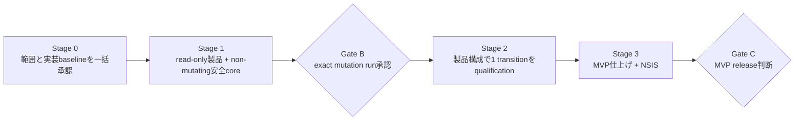

# DisplayDeck 最短実装計画

最終更新: 2026-08-30

状態: Ponytailによるロードマップ改訂済み。Gate AとStage 1は完了した。Gate Bのactual D07は2026-08-30に`DirectoryAnchorUnproven`でNo-Goとなり、exact display cell判定とmutationはOS call 0件のまま終了した。read-only MVPのStage 3はWindows実機でNSIS build/install/smoke/uninstallまで完了した。残りは最終installerの識別情報を記録し、Gate Cでrelease / No-Goを一回判断することだけである。display mutation、actual machine-dataへの書込み、永続変更、multi-display mutation、配布は不可である。

## 1. 完成の定義

最初に完成させるのは、次の範囲だけを持つWindows MVPである。

- local consoleの単一ユーザー、単一logon session
- active physical display pathが正確に1本の環境だけでmutationを許可
- 解像度とrefresh rateの列挙、一時適用、Keep、Revert
- profileやregistryへ保存しないsession-only Keep
- 15秒以内にKeepされなければ変更前のcurrent modeへ自動復元
- Tauri coreやWebViewが終了しても独立watchdogが復元
- target、mode、snapshot、session、boot、actorを一意に証明できなければApplyを無効化
- Windows向けTauri 2 / React / TypeScript / Vite / Rustの単一window
- 最小NSIS packageでclean install、launch、uninstall

次はMVP完成条件に含めない。

- 複数displayのmutation
- RDP、remote session、Fast User Switching、複数interactive userでのmutation
- scale、HDR、color、DLDSR/DSR、virtual displayのmutation
- modeの永続保存、profile切替、常駐動作
- arm64、広いGPU/driver/monitor matrix
- MSI比較、auto-update、repair、upgrade migration、署名付きpublic配布
- Fast Startup有効環境、hibernate復帰中、未認定hardwareでのmutation

read-only表示は複数displayでも構わないが、上記MVP条件を外れた環境ではApplyを出さない。未対応cellを救う追加ロジックは作らない。

今回のactual D07 No-Go後は、上記mutation項目を製品へ接続せず、Stage 1のread-only製品とStage 3の非変更packageをMVP完成範囲とする。

## 2. 現在地

| 項目 | 状態 | 今後の扱い |
| --- | --- | --- |
| `native/display-probe` | Step 1〜8、55 unit tests、Windows実機read-only観測済み | Rust domain/query実装として再利用する。追加の探索Stepは作らない |
| Candidate 04 | 590 vector、hash/index、再現生成、独立static review完了 | schemaを変えない限り再生成・再reviewしない。Stage 0で実装baselineとして一括判断する |
| D07 | actual結果=`DirectoryAnchorUnproven` / No-Go | 再測定や代替anchorを追加せずread-only MVPへ進む |
| D08 | Windows 10一台で25件観測、250 ms / 50 ms候補あり | 履歴として保持し、追加batchを行わない |
| G1A | templateのみ | 独立bundle作成を止め、Stage 0の一括判断へ統合する |
| Tauri app / UI | read-only MVP仕上げとWindows NSIS smoke完了 | Gate C判断まで変更しない |
| watchdog / worker / WAL | fake backendで実装・自動test完了 | actual backendへ接続しない |
| display mutation | D07 No-Goにより終了 | OS call 0件を維持する |
| installer | NSIS設定、fake actor同梱、clean install / launch / uninstall完了 | 最終artifactのpath / size / SHA-256をGate C候補に記録する |

Step 9の事前evidence収集はここで終了する。既存artifactは履歴として保持するが、製品コードを作らずにfixture、hash、template、手動batch、承認資料だけを増やさない。

## 3. 守る安全契約

ロードマップを短くしても、次は削らない。

1. mutation前にC0/P0、target、expected readbackを一意に取得する。曖昧ならOS callは0件。
2. mutation前にdurable recovery baselineをwrite、flush、close/reopen、readbackする。
3. watchdog、Tauri core、実行中workerを別processにし、workerは1 operationで終了する。
4. watchdogだけが期限、transaction truth、Keep/Revert arbitrationを所有する。
5. temporary apply後はfresh readbackを行い、不一致・timeout・presentation failure・未承認parent lossでC0へ戻す。
6. stale/foreign actor、unknown/corrupt journal、旧worker未終了、session/boot/topology変化ではfail closedにする。
7. persisted mode P0を変更しない。初期版は`CDS_UPDATEREGISTRY`や`SDC_SAVE_TO_DATABASE`を使わない。
8. full-process loss、OS crash、reboot、power lossは15秒保証外と明示し、次回起動recoveryと物理復旧手順を用意する。

安全契約の詳細は`docs/architecture.md`、trust boundaryは`docs/security.md`を正本とする。ロードマップ上で同じ規則をphaseごとに再記述しない。

## 4. 最短roadmap



### Stage 0: 一括開始判断

これは実装phaseではなく、今後の無限な事前検証を止める一回のhuman decisionである。

一度に決める内容:

- 1章のMVP範囲
- Candidate 04をStage 1の実装baselineに使うこと
- D08 Candidate 01をlab candidateとして使い、境界外はfail closedにすること
- D07はStage 2前のmutation Go/No-Goとし、Stage 1をblockしないこと
- 既存Step 1〜8結果をread-only調査完了入力として受け入れ、別G1A bundleを作らないこと
- Stage 1のnon-mutating application implementation authorization

この判断後もdisplay mutationは許可されない。

### Stage 1: read-only製品とnon-mutating安全core

旧Phase 2A、3、4、5を一つにする。UIだけ、query接続だけ、watchdog prototypeだけの個別phaseを作らない。作業は同じStage内で並行してよい。

作るもの:

- Tauri 2 / React / TypeScript / Viteの最小single-window app
- 既存display-probeを再利用したtyped read-only commands
- current mode、候補、変更不能理由、draft選択、Apply確認UI
- shell/fs/http/process権限をfrontendへ与えないCapability/CSP
- 独立watchdog、one-shot fake worker、private protocol
- dual-slot decision journal、operational WAL、必要なlock/epoch/lease/actor fencing
- `GetTickCount64` deadline、Keep/Revert arbitration、startup recovery判定
- fake display backendによる自動failure tests

Stage 1でdisplayを変更するWindows APIは接続しない。Apply buttonは常にdisabledまたはsimulationだけにする。

Stage 1の完了条件:

- packaged appでcurrent displayと候補を表示できる
- multi-path、remote、virtual、ambiguous、current-not-listedを変更不能として表示できる
- frontendを落としてもfake transactionがtimeout/recoveryへ収束する
- 次の6契約を自動testで確認する
  1. durable baseline readback失敗ならoperation 0件
  2. valid Keepだけがterminal Keepになる
  3. timeout/manual Revert/parent lossはRevertになる
  4. partial/corrupt/foreign journalはfail closedになる
  5. old actor/worker/duplicate commandは拒否される
  6. deadline、session、boot、target mismatchはauthorityを発行しない

Stage 1中の小さな内部milestoneに個別human approvalを要求しない。schemaまたは安全契約を変更するときだけ設計へ戻る。

### Gate B: 最初で唯一のmutation実験承認

最初の実display変更前に、次だけを一つのrecordで確認する。

- exact Windows build、x64、GPU/driver、physical display、connection
- local console単一user、active path 1本、HDR off、対象mode transition 1件
- Stage 1の自動test結果
- 実装したD07 anchor/DACLが対象volumeでpassすること
- D08がcurrent bootでpassし、restartでBootId change/tick resetを1回確認できること
- blind recovery方法、out-of-band確認方法、Operator、実行日
- このexact transitionを一時適用する明示承認

KB全件、monitor firmware、port番号、dock情報、役割ごとの別承認、別々のG1A/G2A/freeze bundleは開始条件にしない。安全判断に使う値だけを残す。

### Stage 2: 製品構成でcontrolled mutation qualification

結果: 2026-08-30の最初の必須条件D07が`DirectoryAnchorUnproven`でNo-Goとなった。exact display cell判定、monitor切断、actual backend接続、display API callは実行せず、このStageを終了した。

旧Phase 1B、2B、6を一つにする。spikeで成功した処理を別product codeへ再実装しない。最初からStage 1のwatchdog/worker/WALとpackaged appへactual display backendを接続する。

一つのapproved transitionで次を各1回確認する。

1. preflight rejectではWindows設定が変わらない
2. temporary apply、fresh readback、Keep後もP0が変わらない
3. manual RevertでC0へ戻る
4. 15秒timeoutでC0へ戻る
5. Tauri core/WebView終了でwatchdogがC0へ戻す
6. worker失敗またはhangで並行workerを出さず、安全に復元またはblockedを表示する
7. watchdog loss時に旧actorをfenceできる場合だけreplacementが引き継ぐ
8. restart時に未完了journalを安全側へ分類する

同じ成功runを固定回数繰り返さない。失敗時は原因修正後の再確認だけ行う。C0/P0不一致、別target変更、旧worker未終了での並行call、rollback不能が一度でも発生し、原因を除去できなければmutation版はNo-Goとする。

D07を証明できない場合やactual mutationがNo-Goの場合でも、Stage 1のread-only appをMVPとして完成させられる。安全性を下げてApplyを残さない。

### Stage 3: MVP仕上げとNSIS

結果: 2026-08-30にWindows 10実機でbuild、current-user install、5項目smoke、diagnostic機械確認、process停止、uninstallを完了した。uninstall後にDisplayDeckは消え、実行前後でdisplayの解像度、refresh rate、配置に変化はなかった。`READ_ONLY`、`MutationAllowed: False`、authority token不在も確認済みである。

作るもの:

- error/recovery状態を含む最小UI仕上げ
- keyboard、focus、200% zoom、high contrastの基本確認
- 明示操作で一件作るstructured local diagnostic JSON
- Tauri bundlerのNSIS clean install / launch / uninstall
- 初期support statementと既知の制限

今回のread-only RCではlaunch、display inventory表示、Apply無効、fake safety transaction、clean uninstallを一度ずつ確認する。display mutation、installer matrix、MSI比較、update/repair、schema migration、SmartScreen reputationは実行しない。

このpackageはactual recovery stateを作成・参照せず、同梱actorもfake operationしか行わないため、mutation版用のactive/unknown recovery uninstall拒否は実装しない。将来mutation版を再開する場合は、この安全契約を削除せずinstallerへ実装する。

Windows 11対応を製品表示や公開文言で主張する場合だけ、Windows 11のexact cellを一つ追加して同じRC subsetを実行する。検証していないOS/hardwareは自動的にsupport外とする。

### Gate C candidate 01: read-only MVP

状態: human ownerの一括判断待ち。public distributionは未承認。

Qualified artifact:

```text
Path: D:\project\displaydeck\target\release\bundle\nsis\DisplayDeck_0.1.0_x64-setup.exe
Length: 2160426
SHA256: 3307DB604C5C96B4E753D499ECB006E2209695006965F9BA7D65A1BF6F1EFD2F
Product source commit: e598cc4
```

Qualification cell:

- Windows 10 Home `10.0.19045` / build `19045` / x64
- NVIDIA GeForce RTX 4070 / driver `32.0.16.1088`
- local console / `RemoteSession=False`
- 3 active paths: MSI MAG342CQ `3440x1440 / 144 Hz`、TW215FHDNS `1080x1920 / 60 Hz`、BENQ E2220HD `1920x1080 / 60 Hz`
- MSI MAG342CQ HDR off

Qualified scope:

- `READ_ONLY`のdisplay inventory / mode / candidate表示
- disabled Applyとfake safety transaction
- operator操作によるlocal diagnostic JSON export
- current-user NSIS install / launch / uninstall

Stage 3でbuild/test、5項目smoke、diagnostic機械確認、accessibility基本確認、process停止、uninstall、display設定不変がPASSした。最終PASS後にinstallerが再buildされていないこともoperatorが確認した。

Candidate 01はdisplay mutation、永続変更、Windows 11 / 他cellのsupport claim、署名、auto-update、public distributionを含まない。artifact bytesまたは製品sourceが変わった場合だけ新しいcandidateとStage 3 smokeが必要になる。

## 5. 検証policy

| タイミング | 実行するもの | 実行しないもの |
| --- | --- | --- |
| 通常のcode change | format、unit test、型check、該当する少数のintegration test | hardware全matrix、手動evidence bundle |
| Candidate 04 schema変更時だけ | generator verifyと該当vector review | schema不変時の再生成・再承認 |
| Stage 1完了時 | 6 safety contractの自動failure test、packaged read-only smoke | display mutation、D08追加batch |
| Gate B | D07対象volume、D08 current/restart、exact cell manifest | sleep/hibernate/Fast Startup/複数cellの反復 |
| Stage 2 | approved transitionの8 case | 別mode・別GPU・別monitorの組合せ展開 |
| Stage 3 | release packageの5 smoke case | MSI/update/repair/public matrix |

検証回数を理由なく5回、10回と固定しない。別support cellを追加するとき、失敗を修正したとき、flaky behaviorを測る必要が生じたときだけ増やす。

## 6. 承認は3回だけ

| Gate | 承認内容 | 許可しないもの |
| --- | --- | --- |
| Gate A / Stage 0 | MVP範囲、実装baseline、Stage 1 non-mutating implementation | display mutation、配布 |
| Gate B | exact cell・exact transitionのcontrolled mutation | 他cell、永続変更、public release |
| Gate C | qualified packageのMVP release | 未検証cellのsupport claim、将来機能 |

G1A、DD-FR-002 freeze、Phase 2A開始、G2A、UI開始、read-only統合開始を別々の承認にしない。Gate Aへ統合する。Gate Bの範囲外へmutationを広げる場合だけ新しい承認を必要とする。

## 7. 完成後のbacklog

- scale変更
- HDR/color preservation対応
- multi-display mutation
- RDP/Fast User Switching対応
- Fast Startup/hibernate中のmutation qualification
- arm64
- 追加GPU/driver/monitor support cell
- MSI、署名付きpublic配布、auto-update、repair、upgrade migration
- telemetry、cloud sync、profile保存

これらはMVPをblockしない。具体的な利用要求が出た項目だけ別featureとして設計・実装する。

## 8. 次の一手

D07 No-GoによりStage 2はOS call 0件で終了し、Stage 3のWindows package smokeも完了した。Gate C candidate 01のartifact identityも固定済みである。次はhuman ownerがrelease / No-Goを一回判断する。追加Windows操作、build、install、D08測定、fixture再検証、別evidence bundle、D07、display mutationは行わない。
