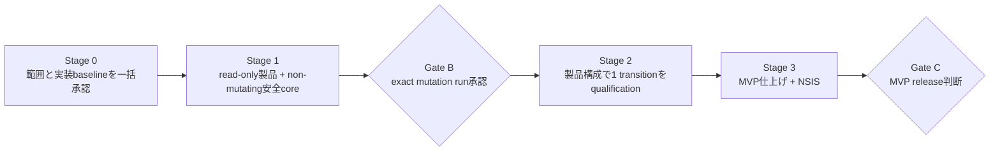
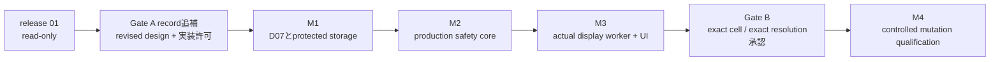

# DisplayDeck 最短実装計画

## 現行リリース範囲（2026-09-21 owner指定）

v0.1.0の目的は、Windowsのディスプレイ構成・現在の表示モードを安全に取得し、診断情報として確認・出力できるread-onlyアプリの提供である。完成条件はDisplay列挙、現在モード取得、read-only UI、diagnostic JSON、fail-closed、Installer、uninstallとする。

Display設定変更、Apply / Restore、WAL、crash recovery、watchdog、mutation safety、Gate Bはv0.2以降へ分離し、v0.1.0の完成条件やリリースの依存関係に含めない。v0.2以降の実施・リリースをこの範囲指定だけで承認したものではない。

以下の旧MVP定義・Stage・承認記録は履歴として保持する。mutation項目は今後v0.2以降の設計として参照し、v0.1.0の範囲には本節を優先する。qualified release 01のartifactと検証範囲は変更しない。

## v0.1.0 Release

- [x] Release Candidateを固定（RC3、製品source `e598cc4`）
- [x] Installer SHA256固定（RC3: `25DEFCA4CC6DA01F350CC82E1302FF0CE1783BBCEE2A88B77EE2734E0C637EFD`）
- [x] 最終Smoke Test（2026-09-21 operator報告、10項目PASS）
- [x] 証跡更新（RC3 / releaseコピーのSHA一致、Smoke全PASSを記録）
- [x] Gate C判定（2026-09-21 human ownerがRC3の固定SHAを承認）
- [x] Release（Gate C承認、製品sourceにv0.1.0 tag。Windows保存済みmetadata同期も完了）

## Gate C — v0.1.0 Release

必須:

- Build成功、Installer生成成功（既存Installerを再利用する場合は、そのartifactに対応する既存証跡を使う）
- Release CandidateとInstaller SHA256の固定
- clean install成功、read-only起動成功、diagnostic取得成功
- Display設定への副作用なし、uninstall成功
- release artifactと検証artifactが同一

対象外: Display mutation、Restore、WAL、crash recovery、Watchdog、Gate B。Gate BはこのGate Cの前提条件ではない。

RCの実体を確認してから固定し、一致する既存Installerがあれば再buildしない。不在・不一致時のみ、read-onlyソースcommitを固定してbuild → installer生成 → 即SHA256取得を1回のRC作成として扱う。RCには固有名を付け、上書きしない。固定後のbuildは禁止し、修正が必要なら別RCとして最初から扱う。現在のHEADには将来のmutation開発資産も含まれるため、再生成時の製品ソースは別途特定し、HEADを自動採用しない。

最終確認は[10項目のSmoke Test](release/v0.1.0-smoke-test.md)だけとし、590ケース等の再実行は不要。Windows操作は[検証履歴の現行手順](windows-validation-history.md#v010-rc再固定既存installerの確認2026-09-21)に従う。

最終RCから次の1組を作る。実体未確認のSHAや過去のmanifestを流用しない。

```text
release/v0.1.0/
  DisplayDeck_0.1.0_x64-setup.exe
  SHA256SUMS.txt
  release-manifest.json
  smoke-test.md
  RELEASE_NOTES.md
```

manifestには製品source commit、RC識別子、artifact名・size・SHA256、build証跡、Smoke Test証跡、検証cell、Gate C判定を記録する。RCからrelease名へコピーする場合もコピー前後のSHA256一致を確認する。Gate C承認後、製品sourceと証跡の対応が明確なrelease commitへ`git tag v0.1.0 <release-commit>`を付ける。既存tagは上書きしない。v0.1.0を閉じてからv0.2 Mutationへ進む。public distributionやsupport cell拡大はこの手順には含めない。

## v0.2 Mutation

2026-09-21 ownerから「ではv0.2を進めていきましょう」と開始指示を受領。完成目標は、承認した単一Display環境でmode選択 → Apply → Keep / 自動Restoreを通常利用できるInstallerをGate C承認まで進めること。M4の実機成功だけではv0.2完成としない。source作業は既存Gate A / R1 / R2の許可範囲から再開し、Windows実行・pin有効化・署名・Gate Bをこの開始指示だけで承認済みにしない。

- [x] 既存M1〜M3の実呼出経路と不足を確認
- [x] 再開時の非変更baseline確認（17 unit + 1 process test、Windows cross-check）
- [ ] Directory Anchor / provision authority / machine gate / writerの接続
- [ ] WAL / crash recovery / 独立watchdogのproduction接続
- [ ] Display mode変更 / Restore / typed UIの接続
- [ ] Gate B（exact cell・command・復旧手順の承認）
- [ ] Mutation実機試験
- [ ] 通常利用の仕上げ・Installer RC固定・Smoke Test
- [ ] Gate C / v0.2.0 Release

### 再開時点の実装差分（2026-09-21）

| 項目 | コードで確認した現状 | 次の実装 |
| --- | --- | --- |
| D07 / Directory Anchor | `machine_storage.rs`にvolume rootからの保持handle、relative open、ACL / identity再検証あり。`FreshProvisionObservation`は既存directory内のrecord不在を観測するだけ | gate内のfresh-create authority、protected directory初期作成、record publicationへ接続。absence観測だけでwriteを許可しない |
| provision service | `provision_handshake` → identity → manifest/package検証 → fresh observation → `PROVISION_ANCHOR_NOT_IMPLEMENTED`。publisher / manifest pinはzero | loaded-image proof、machine gate、Candidate 04 writerを接続。pinのzeroは維持 |
| authority未決事項 | actor全体hashを含むmanifestのhashを同じactorへ埋め込むと循環。Q04のexternal pin binding、certificate lifecycle policyが未決 | activation方式を既存Gate Aの追補で明確化する。証明書購入・署名・package生成を先行させない |
| MAP / MAR | `provision.rs`にdecoder、exact current-link、10種のcrash-pair分類あり | 同じ分類器をtrusted handleの読取結果とdurable publicationへ接続。分類器・fixtureを増やすだけの作業はしない |
| watchdog / WAL | `engine.rs`は`FakeApply` / `FakeRestore`、Tauriはtemporary test storageとsimulation | machine→display→user lock、production journal、lease / worker exit、parent loss / takeoverを接続 |
| Apply / UI | `display-probe/src/mutation.rs`はread-only exact cell判定。`begin_display_change`はsimulation=falseを拒否 | workerの限定FFIとfresh readback、候補tokenでの開始、presentation / Keep / Revertを接続 |

最小実装順は **M1の残り → M2のproduction安全経路 → M3のworker/UI → Gate B/M4 → 固定RC/Gate C**。M1では先にmachine gateとcreatorの保持handle条件を実呼出経路へ組み込み、未実証のloaded-image / signing authorityは明示的にdenyのまま残す。外部manifest pinとcertificate policyは有効化前に解決する。実機の単一Display化、対象resolution、blind recoveryは推測せずGate Bで固定する。

再開検証結果: `cargo test -p displaydeck-safety --all-targets --offline --locked`（17 unit + 1 process PASS）、`cargo check -p displaydeck-safety --all-targets --target x86_64-pc-windows-msvc --offline --locked`（PASS）。これはfake / source検証であり、M1完了やWindows実機安全性の証明ではない。今回、製品runtimeは変更せず、Windows操作・display API・machine-data write・依存追加は0件。

このチェックリストを現行の進捗管理の正本とする。過去のrelease 01承認やfake実装の実績から自動的に完了扱いにはしない。v0.2の完了はv0.1.0 Releaseの前提ではない。項目の並びは実行順序や実行許可を意味せず、mutation実機操作には従来どおり事前のGate B承認が必要である。

---

以下は過去の計画・承認記録（最終更新: 2026-08-30）。

状態: Gate A、Stage 1、Gate B No-Go、Stage 3、Gate Cが完了した。SHA-256 `3307DB604C5C96B4E753D499ECB006E2209695006965F9BA7D65A1BF6F1EFD2F`のDisplayDeck 0.1.0 NSIS packageを、記録済みWindows 10 exact cell限定のread-only MVPとして完成・release扱いにした。2026-08-30に`GATE-A-MUTATION-ADDENDUM-01`が承認され、9章のM1〜M3 source/config/test変更とnon-mutating build/testを開始した。Windows provision/install、actual machine-data write、D07/D08実行、display API、display切断、Gate B/M4、releaseは未許可である。

## 1. 完成の定義

最初に完成させるのは、次の範囲だけを持つWindows MVPである。

- local consoleの単一ユーザー、単一logon session
- active physical display pathが正確に1本の環境だけでmutationを許可
- 解像度とrefresh rateの列挙、一時適用、Keep、Revert
- profileやregistryへ保存しないsession-only Keep
- 15秒以内にKeepされなければ変更前のcurrent modeへ自動復元
- Tauri coreやWebViewが終了しても独立watchdogが復元
- target、mode、snapshot、session、boot、actorを一意に証明できなければApplyを無効化
- Windows向けTauri 2 / React / TypeScript / Vite / Rustの単一window
- 最小NSIS packageでclean install、launch、uninstall

次はMVP完成条件に含めない。

- 複数displayのmutation
- RDP、remote session、Fast User Switching、複数interactive userでのmutation
- scale、HDR、color、DLDSR/DSR、virtual displayのmutation
- modeの永続保存、profile切替、常駐動作
- arm64、広いGPU/driver/monitor matrix
- MSI比較、auto-update、repair、upgrade migration、署名付きpublic配布
- Fast Startup有効環境、hibernate復帰中、未認定hardwareでのmutation

read-only表示は複数displayでも構わないが、上記MVP条件を外れた環境ではApplyを出さない。未対応cellを救う追加ロジックは作らない。

今回のactual D07 No-Go後は、上記mutation項目を製品へ接続せず、Stage 1のread-only製品とStage 3の非変更packageをMVP完成範囲とする。

## 2. 現在地

| 項目 | 状態 | 今後の扱い |
| --- | --- | --- |
| `native/display-probe` | Step 1〜8、55 unit tests、Windows実機read-only観測済み | Rust domain/query実装として再利用する。追加の探索Stepは作らない |
| Candidate 04 | 590 vector、hash/index、再現生成、独立static review完了 | schemaを変えない限り再生成・再reviewしない。Stage 0で実装baselineとして一括判断する |
| D07 | actual結果=`DirectoryAnchorUnproven` / No-Go | 再測定や代替anchorを追加せずread-only MVPへ進む |
| D08 | Windows 10一台で25件観測、250 ms / 50 ms候補あり | 履歴として保持し、追加batchを行わない |
| G1A | templateのみ | 独立bundle作成を止め、Stage 0の一括判断へ統合する |
| Tauri app / UI | read-only MVP仕上げとWindows NSIS smoke完了 | Gate C判断まで変更しない |
| watchdog / worker / WAL | fake backendで実装・自動test完了 | actual backendへ接続しない |
| display mutation | D07 No-Goにより終了 | OS call 0件を維持する |
| installer | NSIS設定、fake actor同梱、clean install / launch / uninstall完了 | 最終artifactのpath / size / SHA-256をGate C候補に記録する |

Step 9の事前evidence収集はここで終了する。既存artifactは履歴として保持するが、製品コードを作らずにfixture、hash、template、手動batch、承認資料だけを増やさない。

## 3. 守る安全契約

ロードマップを短くしても、次は削らない。

1. mutation前にC0/P0、target、expected readbackを一意に取得する。曖昧ならOS callは0件。
2. mutation前にdurable recovery baselineをwrite、flush、close/reopen、readbackする。
3. watchdog、Tauri core、実行中workerを別processにし、workerは1 operationで終了する。
4. watchdogだけが期限、transaction truth、Keep/Revert arbitrationを所有する。
5. temporary apply後はfresh readbackを行い、不一致・timeout・presentation failure・未承認parent lossでC0へ戻す。
6. stale/foreign actor、unknown/corrupt journal、旧worker未終了、session/boot/topology変化ではfail closedにする。
7. persisted mode P0を変更しない。初期版は`CDS_UPDATEREGISTRY`や`SDC_SAVE_TO_DATABASE`を使わない。
8. full-process loss、OS crash、reboot、power lossは15秒保証外と明示し、次回起動recoveryと物理復旧手順を用意する。

安全契約の詳細は`docs/architecture.md`、trust boundaryは`docs/security.md`を正本とする。ロードマップ上で同じ規則をphaseごとに再記述しない。

## 4. 最短roadmap



### Stage 0: 一括開始判断

これは実装phaseではなく、今後の無限な事前検証を止める一回のhuman decisionである。

一度に決める内容:

- 1章のMVP範囲
- Candidate 04をStage 1の実装baselineに使うこと
- D08 Candidate 01をlab candidateとして使い、境界外はfail closedにすること
- D07はStage 2前のmutation Go/No-Goとし、Stage 1をblockしないこと
- 既存Step 1〜8結果をread-only調査完了入力として受け入れ、別G1A bundleを作らないこと
- Stage 1のnon-mutating application implementation authorization

この判断後もdisplay mutationは許可されない。

### Stage 1: read-only製品とnon-mutating安全core

旧Phase 2A、3、4、5を一つにする。UIだけ、query接続だけ、watchdog prototypeだけの個別phaseを作らない。作業は同じStage内で並行してよい。

作るもの:

- Tauri 2 / React / TypeScript / Viteの最小single-window app
- 既存display-probeを再利用したtyped read-only commands
- current mode、候補、変更不能理由、draft選択、Apply確認UI
- shell/fs/http/process権限をfrontendへ与えないCapability/CSP
- 独立watchdog、one-shot fake worker、private protocol
- dual-slot decision journal、operational WAL、必要なlock/epoch/lease/actor fencing
- `GetTickCount64` deadline、Keep/Revert arbitration、startup recovery判定
- fake display backendによる自動failure tests

Stage 1でdisplayを変更するWindows APIは接続しない。Apply buttonは常にdisabledまたはsimulationだけにする。

Stage 1の完了条件:

- packaged appでcurrent displayと候補を表示できる
- multi-path、remote、virtual、ambiguous、current-not-listedを変更不能として表示できる
- frontendを落としてもfake transactionがtimeout/recoveryへ収束する
- 次の6契約を自動testで確認する
  1. durable baseline readback失敗ならoperation 0件
  2. valid Keepだけがterminal Keepになる
  3. timeout/manual Revert/parent lossはRevertになる
  4. partial/corrupt/foreign journalはfail closedになる
  5. old actor/worker/duplicate commandは拒否される
  6. deadline、session、boot、target mismatchはauthorityを発行しない

Stage 1中の小さな内部milestoneに個別human approvalを要求しない。schemaまたは安全契約を変更するときだけ設計へ戻る。

### Gate B: 最初で唯一のmutation実験承認

最初の実display変更前に、次だけを一つのrecordで確認する。

- exact Windows build、x64、GPU/driver、physical display、connection
- local console単一user、active path 1本、HDR off、対象mode transition 1件
- Stage 1の自動test結果
- 実装したD07 anchor/DACLが対象volumeでpassすること
- D08がcurrent bootでpassし、restartでBootId change/tick resetを1回確認できること
- blind recovery方法、out-of-band確認方法、Operator、実行日
- このexact transitionを一時適用する明示承認

KB全件、monitor firmware、port番号、dock情報、役割ごとの別承認、別々のG1A/G2A/freeze bundleは開始条件にしない。安全判断に使う値だけを残す。

### Stage 2: 製品構成でcontrolled mutation qualification

結果: 2026-08-30の最初の必須条件D07が`DirectoryAnchorUnproven`でNo-Goとなった。exact display cell判定、monitor切断、actual backend接続、display API callは実行せず、このStageを終了した。

旧Phase 1B、2B、6を一つにする。spikeで成功した処理を別product codeへ再実装しない。最初からStage 1のwatchdog/worker/WALとpackaged appへactual display backendを接続する。

一つのapproved transitionで次を各1回確認する。

1. preflight rejectではWindows設定が変わらない
2. temporary apply、fresh readback、Keep後もP0が変わらない
3. manual RevertでC0へ戻る
4. 15秒timeoutでC0へ戻る
5. Tauri core/WebView終了でwatchdogがC0へ戻す
6. worker失敗またはhangで並行workerを出さず、安全に復元またはblockedを表示する
7. watchdog loss時に旧actorをfenceできる場合だけreplacementが引き継ぐ
8. restart時に未完了journalを安全側へ分類する

同じ成功runを固定回数繰り返さない。失敗時は原因修正後の再確認だけ行う。C0/P0不一致、別target変更、旧worker未終了での並行call、rollback不能が一度でも発生し、原因を除去できなければmutation版はNo-Goとする。

D07を証明できない場合やactual mutationがNo-Goの場合でも、Stage 1のread-only appをMVPとして完成させられる。安全性を下げてApplyを残さない。

### Stage 3: MVP仕上げとNSIS

結果: 2026-08-30にWindows 10実機でbuild、current-user install、5項目smoke、diagnostic機械確認、process停止、uninstallを完了した。uninstall後にDisplayDeckは消え、実行前後でdisplayの解像度、refresh rate、配置に変化はなかった。`READ_ONLY`、`MutationAllowed: False`、authority token不在も確認済みである。

作るもの:

- error/recovery状態を含む最小UI仕上げ
- keyboard、focus、200% zoom、high contrastの基本確認
- 明示操作で一件作るstructured local diagnostic JSON
- Tauri bundlerのNSIS clean install / launch / uninstall
- 初期support statementと既知の制限

今回のread-only RCではlaunch、display inventory表示、Apply無効、fake safety transaction、clean uninstallを一度ずつ確認する。display mutation、installer matrix、MSI比較、update/repair、schema migration、SmartScreen reputationは実行しない。

このpackageはactual recovery stateを作成・参照せず、同梱actorもfake operationしか行わないため、mutation版用のactive/unknown recovery uninstall拒否は実装しない。将来mutation版を再開する場合は、この安全契約を削除せずinstallerへ実装する。

Windows 11対応を製品表示や公開文言で主張する場合だけ、Windows 11のexact cellを一つ追加して同じRC subsetを実行する。検証していないOS/hardwareは自動的にsupport外とする。

### Gate C release 01: read-only MVP

状態: 2026-08-30 human owner承認済み。read-only MVP完成。public distributionは未承認。

Qualified artifact:

```text
Path: D:\project\displaydeck\target\release\bundle\nsis\DisplayDeck_0.1.0_x64-setup.exe
Length: 2160426
SHA256: 3307DB604C5C96B4E753D499ECB006E2209695006965F9BA7D65A1BF6F1EFD2F
Product source commit: e598cc4
```

Qualification cell:

- Windows 10 Home `10.0.19045` / build `19045` / x64
- NVIDIA GeForce RTX 4070 / driver `32.0.16.1088`
- local console / `RemoteSession=False`
- 3 active paths: MSI MAG342CQ `3440x1440 / 144 Hz`、TW215FHDNS `1080x1920 / 60 Hz`、BENQ E2220HD `1920x1080 / 60 Hz`
- MSI MAG342CQ HDR off

Qualified scope:

- `READ_ONLY`のdisplay inventory / mode / candidate表示
- disabled Applyとfake safety transaction
- operator操作によるlocal diagnostic JSON export
- current-user NSIS install / launch / uninstall

Stage 3でbuild/test、5項目smoke、diagnostic機械確認、accessibility基本確認、process停止、uninstall、display設定不変がPASSした。最終PASS後にinstallerが再buildされていないこともoperatorが確認した。

Release 01はdisplay mutation、永続変更、Windows 11 / 他cellのsupport claim、署名、auto-update、public distributionを含まない。artifact bytesまたは製品sourceが変わった場合だけ新しいcandidateとStage 3 smokeが必要になる。

## 5. 検証policy

| タイミング | 実行するもの | 実行しないもの |
| --- | --- | --- |
| 通常のcode change | format、unit test、型check、該当する少数のintegration test | hardware全matrix、手動evidence bundle |
| Candidate 04 schema変更時だけ | generator verifyと該当vector review | schema不変時の再生成・再承認 |
| Stage 1完了時 | 6 safety contractの自動failure test、packaged read-only smoke | display mutation、D08追加batch |
| Gate B | D07対象volume、D08 current/restart、exact cell manifest | sleep/hibernate/Fast Startup/複数cellの反復 |
| Stage 2 | approved transitionの8 case | 別mode・別GPU・別monitorの組合せ展開 |
| Stage 3 | release packageの5 smoke case | MSI/update/repair/public matrix |

検証回数を理由なく5回、10回と固定しない。別support cellを追加するとき、失敗を修正したとき、flaky behaviorを測る必要が生じたときだけ増やす。

## 6. 承認は3回だけ

| Gate | 承認内容 | 許可しないもの |
| --- | --- | --- |
| Gate A / Stage 0 | MVP範囲、実装baseline、Stage 1 non-mutating implementation | display mutation、配布 |
| Gate B | exact cell・exact transitionのcontrolled mutation | 他cell、永続変更、public release |
| Gate C | qualified packageのMVP release | 未検証cellのsupport claim、将来機能 |

G1A、DD-FR-002 freeze、Phase 2A開始、G2A、UI開始、read-only統合開始を別々の承認にしない。Gate Aへ統合する。Gate Bの範囲外へmutationを広げる場合だけ新しい承認を必要とする。

## 7. 完成後のbacklog

- scale変更
- HDR/color preservation対応
- multi-display mutation
- RDP/Fast User Switching対応
- Fast Startup/hibernate中のmutation qualification
- arm64
- 追加GPU/driver/monitor support cell
- MSI、署名付きpublic配布、auto-update、repair、upgrade migration
- telemetry、cloud sync、profile保存

これらはMVPをblockしない。具体的な利用要求が出た項目だけ別featureとして設計・実装する。

## 8. 次の一手

Gate C release 01のread-only MVPは完成済みである。`GATE-A-MUTATION-ADDENDUM-01`に従いM1〜M3を実装し、new candidateのnon-mutating test/buildまで進める。Windows operator action、provision/install、actual machine-data write、D07/D08、display API、display切断、Gate B/M4は引き続き行わない。

### M1の実呼出経路と実装順（2026-09-08）

確認済みのsource経路は、serviceの`provision_handshake` → identity/token検証 → `manifest_authority_handshake` → package検証 → `FreshProvisionObservation` → 無条件の`PROVISION_ANCHOR_NOT_IMPLEMENTED`である。publisher/manifest pinがzeroの現candidateはpackage検証以前に拒否する。Candidate 04の分類器はtestと公開exportにとどまり、service/writerからの呼出しはない。分類器やtest件数の追加だけをM1完了への接続と数えない。

次は下表の順で、既存serviceとstorage実装へ接続する。別の汎用backendや未接続の検証器を先に増やさない。

| 順序 | 未完成の実経路 | 次の実装単位・確認条件 |
| --- | --- | --- |
| 1 | machine-wide gateなしでfresh不存在を観測している | `manifest_authority_handshake`で固定名gateを観測前に取得し、同じinvocation中保持するsource candidate。owner/principal/SDDLを明示し、busy、abandoned、security不明では先へ進めない。現行zero pinと最終denyは維持する |
| 2 | process名とopened actor bytesだけで、起動元の同一性が未証明 | R1 coordinator→SCM→serviceの起動経路と保持package handlesを結び、loaded-image/launch provenanceを証明する。path文字列一致をgrantにしない |
| 3 | 既存のprotected directoryしか扱えず、初期作成・writerがない | SYSTEM専用のdirectory/record初期作成、exclusive create、actual identity/DACL再検証、one-use grant、Candidate 04のpublication/readbackを同じ経路へ接続する。既存MAP/MAR decoderとcrash-pair分類を再利用し、collision/途中失敗で既存証拠を上書き・削除しない |

各単位は既存Rust testでreject時の後続処理0件と保持・解放条件を確認し、format/test/Windows cross-compileだけを行う。M1完了は9.3の条件で判断し、その後にM2のtest storage置換へ進む。

未決事項はsource作業と分離する。exact named-object securityとstandard-user feasibilityはarchitecture 19.2の人間判断・Windows evidence対象、external manifest pinの非循環binding、実certificate、timestamp/revocation、実install ACL適合はQ04/qualification対象として残す。これらを推測で確定せず、証明が揃うまでgrantはdenyする。ただしzero pinやWindows未実行を理由に、承認済みsource candidateの実装まで止めたりR1/R2の再承認を求めたりはしない。

## 9. Read-onlyから最初の実解像度変更までの再開案

### 9.1 到達点と境界

到達点は、専用labの一つのapproved exact cellで、read-only列挙から選ばれた一つの完全なresolution tupleをprofileへ保存せず一時適用し、fresh GDI/CCD readbackで意図したtargetだけが変わったことを確認し、manual Revertと15秒timeoutでC0へexact復元できることである。幅、高さ、refresh、Win32 flagをReactやoperator入力から合成しない。

この到達点はcontrolled mutation qualificationであり、mutation版releaseではない。Gate C release 01のartifactとsupport claimは変更しない。永続変更、3-display構成でのmutation、multi-display、Windows 11、別GPU/driver/display、署名、auto-update、public distributionは含めない。

現在のGate C cellはactive pathが3本であり、そのままではmutation条件を満たさない。最初のrunには別途承認した単一active physical pathのcellを使う。現構成からdisplayを切断することは、この計画だけでは許可しない。



新しいgateは作らない。Gate Aの同じrecordを追補し、Gate Bを新candidateのexact run recordとして更新する。mutation packageをreleaseする場合だけ、M4完了後にGate Cの新しいrelease recordを作る。

### 9.2 Gate A record追補: 一括設計・実装判断

次を一つの判断にまとめ、承認前はsourceを変更しない。

- 初回はsession-only Keepとし、P0を変更しない。
- 初回はGDI `ChangeDisplaySettingsExW`の`CDS_TEST`、flag 0 dynamic apply、captured C0 exact restoreと、GDI/CCD fresh readbackを使う。`CDS_UPDATEREGISTRY`、`SDC_SAVE_TO_DATABASE`、`SetDisplayConfig` applyは使わない。
- Keep受付はverified readbackをdurable化した`t0`から15秒、watchdog単独lossはfenced takeover、Tauri coreとwatchdogの同時lossは15秒保証外とする。
- Revertを初期focusとし、Keepのglobal/default shortcutを作らない。
- 初回cell、actual resolution tuple、blind recoveryはread-only capture後にGate Bでexact固定する。値を事前に推測しない。
- M1〜M3のapplication/native/config/test変更と非変更build/testを許可するかを明記する。Windows actual machine-data write、`CDS_TEST`、dynamic applyはまだ許可しない。

### 9.3 M1: D07とprotected storageを成立させる

現在の`inspect_machine_actor_storage`は`DirectoryAnchorUnproven`を返し、runtime engineはtemporary test directoryしか使わない。ここを最初に閉じる。

1. D07の各sub-predicateをside-effect 0のbounded diagnosticとして分け、root open、volume、reparse、direct-child、file ID、stream、attribute、DACLのどこでNo-Goになったかを固定codeで特定する。最終判定を緩めるためのfallback pathは作らない。
2. documented handle/APIだけでProgramData配下をanchorし、relative openでdirectory、ProvisionRecord、MachineActorRecordを保持する。path文字列の再openをwrite authorityにせず、write直前に同じhandleのvolume/file ID/DACL/attributeを再検証する。
3. SYSTEMだけが初期作成できる一回のprovision pathでfixed-size file、owner、protected DACL、separate ProvisionRecordを作る。standard-user runtimeはdesignated SIDに許したexact slot writeだけを行う。current-user read-only installerを暗黙にper-machine mutation installerへ昇格しない。
4. reparse、hardlink、ADS、non-fixed/non-NTFS、ACL inheritance、別SID、file replacement、sharing violationをNo-Goにする最小unit/process testを既存Rust testへ追加する。
5. D07用のprovision/inspect commandとstop/continue条件をcode review可能な形にする。実機ではまだ実行せず、Gate B recordがこのexact cellのactual machine-data writeを許可した後に`docs/windows-validation-history.md`へ転記し、`README.md`へ短いpointerだけを置き、commit/pushしてから一度実行する。

M1実装完了条件は、non-mutating unit/process testで全predicate、revalidation、No-Go side-effect 0を確認し、actual Windows commandが未実行であること。実機D07の完了条件はGate Bの最初のconditional stepで、全predicateのreadback後に`GO`となり、なお`MutationAuthorized: false`であること。どれか一つでもunprovenならGate Bはその場でNo-Goとなる。

### 9.4 M2: fake safety coreをproduction transactionへ置き換える

既存のReact、typed command、独立actor process、one-shot child、CSPRNG token、`GetTickCount64`、DecisionJournal/WALのtest codeは再利用する。別framework、generic backend interface、新dependencyは追加しない。

実装するもの:

- Candidate 04のcanonical wire、dual-slot publication/readback、MachineActorRecord、owner WAL、DecisionJournalをactual D07 handlesへ接続する。`create_test_storage`とtemporary directoryをproduction authorityに使わない。
- machine-wide gate → per-display lock → per-user/logon recovery lockの順序、bootId、owner SID/logon、epoch、leaseVersion、generation、actor/process identity、one-use GOを実装する。
- worker roleを`inspect`、`capture-baseline`、`preflight`、`temporary-apply`、`readback`、`restore-current`へ分け、各processを1 role / 1 operationで終了させる。旧worker exit未証明なら次workerを出さない。
- parent EOF、worker crash/hang、presentation timeout、session change、stale command、watchdog loss/takeover、startup recoveryを既存state machineへ接続する。
- MachineActor `ACTIVE_INTENT`をowner WAL `PREPARED`より先に、`TERMINAL_CLEAN`をowner terminalと全actor quiescenceより後にdurable化する。

M2ではdisplay APIを呼ばない。完了条件は、既存6 safety contractに加え、production wire/lock/actor faultをfake display operationで検査し、全reject caseのdisplay call countが0、valid fake Keep/Revertだけがterminalへ到達すること。

### 9.5 M3: actual resolution backendと最小UIを接続する

最初のactual backendは既存`display-probe`と`windows = 0.62.2`だけで作る。

1. fresh enumerationでsingle path、local console、single interactive user、exact GPU/driver/display/connection、HDR off、C0/P0、候補tuple、exact CCD expected observationを再解決する。
2. 初回Gate B candidateは、read-only captureに存在する一つの完全なresolution tupleだけに絞る。現在hard-codeされている同一解像度の144 Hz→60 Hz候補は「解像度変更」の合格証拠に使わない。
3. worker内の小さいWin32 boundaryで、列挙由来`DEVMODEW`に対する`CDS_TEST`、flag 0 temporary apply、captured C0のflag 0 exact restoreを実装する。API returnだけで成功にせず、別workerのfresh GDI/CCD readbackで確定する。
4. `begin_display_change`を`{snapshotRevision, monitorToken, modeToken}`へ戻し、Reactからsimulation flag、duration、width、height、refresh、device path、raw flagを受け取らない。
5. UIはqualified candidateを一つ選ぶ最小select、Apply、pre-rendered confirmation overlay、Revert/Keepだけを追加する。`mutationAllowed`はD07/D08、exact cell、storage、locks、watchdog readinessが全て成立したときだけtrueにする。

M3完了時点でもlive callは行わない。非Windows/unit testではrecorded observationとfake FFI resultを使い、preflight/apply/readback/restoreの順序、mismatch時のRevert、stale token拒否を一つずつ確認する。source/artifactが変わるため新candidateとして扱い、release 01 artifactを上書きしない。

### 9.6 Gate BとM4: controlled mutation qualification

Gate B recordは一つだけ作り、次をexactに固定する。

- new candidateのcommit、package path、size、SHA-256
- Windows edition/build/x64、GPU/driver、physical display/connection、local console、active path=1、HDR off
- C0/P0と、列挙済みの一つの異なるresolution tuple、expected GDI/CCD observation
- protected storage provision/D07/D08のexact commandとstop/continue条件、全M2/M3自動test結果。実機結果は同じGate B recordへ追記し、別gateを作らない
- `CDS_TEST`とflag 0 temporary applyを含むexact transition一件の承認
- blind recovery、out-of-band capture、Operator、Evidence Owner、実行日

Windows runは記録済みcommandの順にだけ行う。

1. package/protected storageを作り、D07/D08を再読する。No-Goならdisplay call 0件で停止する。
2. appを起動し、fresh snapshot、target、C0/P0、candidate、expected observation、presentation readinessを照合する。不一致なら停止する。
3. 一回目はtemporary apply → exact readback → manual Revert → C0 exact readbackを確認する。
4. 二回目はtemporary apply → 操作しない → 15秒timeout → C0 exact readbackを確認する。
5. Tauri/WebView終了、worker failure、watchdog lossは既存Stage 2の各caseを一回ずつ確認する。旧workerがquiescentでなければ並行restoreせずblockedを記録する。
6. 最後にKeepを一回確認し、Rがexact、P0が不変、durable `KEPT_SESSION` readback前にReact successが出ないことを確認する。

完了条件:

- intended targetのresolutionだけがexact tupleへ変わり、fresh GDI/CCD readbackがexpected observationと一致する。
- manual Revert、timeout、未承認parent lossでC0へexact復元する。
- P0、別target、HDR/color/policy fieldが変わらない。
- rollback failure、別target変更、P0 drift、readback unknown、worker exit未確認での並行callが0件である。

一件でも満たさなければそのcellはNo-Goとし、evidenceを保持してread-onlyへ戻す。M4完了は「実解像度変更がcontrolled labで成立」の到達点であり、一般ユーザー向けApply有効化やmutation版Gate C releaseは別作業である。

### 9.7 主な変更箇所

| 現在のgap | 最小変更先 |
| --- | --- |
| D07がcoarse No-Go、actual storage未接続 | `native/displaydeck-safety/src/machine_storage.rs`と既存evidence command |
| fake operation/test storageだけ | `engine.rs`、`journal.rs`、`wal.rs`、`protocol.rs`、`displaydeck_actor.rs` |
| exact read-only bindingだけでdisplay APIなし | `native/display-probe/src/mutation.rs` |
| simulation DTO、Apply disabled | `src-tauri/src/lib.rs`、`src/services/tauriApi.ts`、`src/App.tsx` |
| current-user read-only package | 既存Tauri/NSIS configへprotected provisionに必要な最小差分だけ。release 01は変更しない |

新しいcrate、npm package、常駐service、別service binary、汎用plugin systemは追加しない。R1で承認された既存actor imageの一時SCM registrationだけを例外とする。既存dependencyでdocumented Windows APIを表現できないことがcompile evidenceで判明した場合だけ、Gate A recordへ差分を戻す。

### 9.8 Gate A mutation-track追補記録

状態: `APPROVED / IMPLEMENTATION_AUTHORIZED`

Record ID: `GATE-A-MUTATION-ADDENDUM-01`

承認日: 2026-08-30

承認者: human owner

このrecordをhuman ownerが明示承認した場合だけ、9.1〜9.7をrevised designとして採用し、M1〜M3に必要なapplication/native/config/test変更と、display APIを実行しないformat、typecheck、unit/process test、non-mutating buildを許可する。既存dependencyと実装を再利用し、新dependency、別framework、汎用backend abstractionは追加しない。必要性がcompile evidenceで判明した場合は実装せず、このrecordへ戻す。

この追補は、Windowsでのprovision/install、actual machine-data write、D07/D08実行、`CDS_TEST`、dynamic apply、display切断、single-pathへの物理再構成、release 01のrebuild/overwrite、Gate B/M4、mutation版releaseを許可しない。これらはexact command、cell、candidate、stop/continue条件を持つGate B recordの明示承認まで0件を維持する。

承認時のexact statement:

> `GATE-A-MUTATION-ADDENDUM-01`を承認し、9.1〜9.7をrevised designとして採用する。M1〜M3のsource/config/test変更とnon-mutating build/testを許可する。Windows provisioning、actual machine-data write、D07/D08、display API、display切断、Gate B/M4、releaseは許可しない。

承認記録: 2026-08-30にhuman ownerが上記Record IDを明示して承認した。許可範囲と非許可範囲は上記statementのとおりであり、Gate B/M4のauthorityへ昇格しない。

### 9.9 Implementation status after addendum approval

2026-08-30のM1 non-mutating implementationで、D07のcoarse `DirectoryAnchorUnproven`をbounded fixed failure codeへ分解し、drive-letter absolute NT openをvolume GUID root + relative component handlesへ置き換えた。ProgramData ancestor、DisplayDeck directory、ProvisionRecord、MachineActorRecordのhandle/file ID/volume/direct-child chainを保持し、actor write前のsame-handle revalidationへ接続した。local unit/process testは10件PASSし、`x86_64-pc-windows-msvc --all-targets` compileもPASSした。Windows command、actual machine-data write、D07、display APIは0件である。

この時点ではM1のSYSTEM provision executorは未実装であり、NSIS elevated administratorをSYSTEM creatorの代替にしなかった。one-shot service、scheduled task、その他のSYSTEM actor起動/identity proofの選択はinstaller privilege、crash recovery、cleanup、signed image identityを変えるため、次のR1でexact方式と非許可範囲を追補した。

### 9.10 R1: one-shot LocalSystem service方式

状態: `APPROVED / SOURCE_IMPLEMENTED / WINDOWS_EXECUTION_NOT_AUTHORIZED`

Record ID: `GATE-A-MUTATION-ADDENDUM-01-R1`

承認日: 2026-08-30

承認者: human owner

2026-08-30にhuman ownerがRecord IDとone-shot LocalSystem service方式を明示して承認した。先頭の`G`が脱落した入力は、直前に提示した唯一のR1 statementへの応答であるため、このRecord IDの承認として記録する。

R1のexact方式:

- 新しいbinaryや常駐serviceを作らず、packaged fixed pathの既存`displaydeck-actor`を再利用する。
- elevated coordinator roleはdirect SCM APIだけを使い、fixed service name `DisplayDeckProvisionV1`、fixed argument `--provision-service`、`SERVICE_WIN32_OWN_PROCESS`、`SERVICE_DEMAND_START`、`SERVICE_ERROR_NORMAL`、LocalSystem account、dependencyなしで登録する。shell、PowerShell、frontend値、任意path/argumentは使わない。
- 同名serviceが残っている場合、current actor absolute pathをquoteしたexact ImagePath、service type、start type、error control、LocalSystem、display name、dependencyなし、停止状態が全部一致するときだけ再利用する。unknown/mismatch/running stateではstart/delete/reconfigureせずblockedにする。
- service roleはmain threadから直ちにSCM dispatcherへ接続し、control handlerとstatusを登録する。current process tokenがLocalSystemであること、active local console sessionがexactly one interactive userであること、`WTSQueryUserToken`からvalid designated runtime SIDを取得できることを確認し、user token handleを閉じる。
- R1 handshake成功かつ`SERVICE_STOPPED`をreadbackした場合だけservice registrationを削除する。failure、timeout、unknown resultでは登録を残し、次回は上記exact identity checkから再開する。自動stop、未知serviceの削除、blind recreateは行わない。
- R1 service bodyはprotected directory/fileをcreate/open-for-writeせず、ProvisionRecord/MachineActorRecordを変更せず、display APIを呼ばない。package manifest/signer/hash qualification、D07再検証後のactual provision state machine、durable terminal条件は後続M1としてfail-closedのまま残す。

この承認はR1 source/config/test変更とdisplay-API-free unit/process test、Windows cross-compileだけを許可する。WindowsでのSCM登録/起動/削除、installer接続、actual provision、machine-data write、D07/D08、Gate B/M4、display API、releaseは許可しない。

承認時のexact statement:

> `GATE-A-MUTATION-ADDENDUM-01-R1` one-shot LocalSystem service方式を承認する。

R1 implementation status:

2026-08-30に、既存actorへfixed `--provision-handshake` coordinatorと`--provision-service` SCM roleを追加した。coordinatorはexact config/stopped-state照合後だけstartし、serviceはLocalSystem token、single active local console user、designated SID取得を検査する。成功したstopped readbackだけ登録を削除し、それ以外はfail closedで保持する。service bodyはidentity handshakeだけで、protected machine-data provisionとdisplay operationを持たない。

新dependencyは追加せず、既存`windows = 0.62.2`のServices/RemoteDesktop featureだけを有効化した。local unit 10件とactor process 1件がPASSし、`x86_64-pc-windows-msvc --all-targets` cross-compileがwarning 0でPASSした。Windows SCM command、provision、machine-data write、D07/D08、display APIは0件である。次のM1 source taskはpackage manifest/signer/hash authorityとD07 same-handle revalidationへbindしたactual provision wire state machineであり、Windows実行は引き続きGate B待ちである。

### 9.11 R2: detached signed provision manifest

状態: `APPROVED / IMPLEMENTATION_AUTHORIZED / WINDOWS_EXECUTION_NOT_AUTHORIZED`

Record ID: `GATE-A-MUTATION-ADDENDUM-01-R2`

承認日: 2026-08-31

承認者: human owner

R1の次のsource taskを追跡した結果、Candidate 04の`MachineActorProvisionRecordV1` wire/state chainはそのまま再利用できる一方、state 1の`installerManifestDigest`へauthorityを与える署名者とmanifest形式が未決定だった。local hash、elevated coordinatorの申告、任意のWindows trusted publisher、unsigned NSISをauthorityにするとarchitectureのnonrecursive trust rootを満たさないため、actual provision writerはまだ実装しない。

R2のexact方式は次で固定する。

- protected per-machine install root内のfixed pathに、bounded UTF-8 JSON `DisplayDeckProvisionManifestV1`とdetached PKCS#7 signatureを置く。path、最大byte数、schema version、required field、field order、unknown field rejectionをsource constantにし、frontend、environment、command line、registryから受け取らない。
- manifestはexact actor image SHA-256、Candidate 04 record/profile digests、fixed machine-data paths、package candidate IDを含む。serviceはopened manifest bytesのSHA-256をCandidate 04 `installerManifestDigest`へbindし、actor imageもopened-handle/readbackからexact照合する。
- Windows native `CryptVerifyDetachedMessageSignature`でmanifest bytesとsignatureを検証してsigner certificateを取得し、`CertGetCertificateChain`と`CERT_CHAIN_POLICY_AUTHENTICODE`でchain/policyを検査し、`CERT_SHA256_HASH_PROP_ID`がGate B candidate recordで固定するsingle publisher certificate digestとexact一致するときだけ先へ進む。signature validだけ、chain validだけ、publisher名文字列一致だけでは許可しない。
- R2 sourceではpublisher certificate digestをunset/zeroのfail-closed constantとして実装し、実署名、certificate選定、timestamp/revocation policy、manifest/package artifact生成、protected install、Windows verification実行は行わない。Gate B candidate recordがexact certificate digest、package/manifest hashes、cell、commands、stop/continue条件を固定するまでprovision grantは常にdenyとする。
- 上記authority、LocalSystem identity、single active console user、machine gate、D07 same-handle revalidationが同じservice invocation内ですべて成立した場合だけ、後続のCandidate 04 provision state machineへgrantを一度渡す。どれかがunknown/mismatchならfile create/write/delete、SCM cleanup、display APIを0件にする。

R2が許可するのは、manifestのstrict parser/hash binding、detached signature/pinned certificate verification、fail-closed provision grant、Candidate 04 wire/state transitionのsource/config/test変更と、display-API-free test/Windows cross-compileだけである。signing、package/manifest artifact生成、Windows SCM/provision、actual machine-data write、D07/D08、Gate B/M4、display API、releaseは許可しない。

承認時のexact statement:

> `GATE-A-MUTATION-ADDENDUM-01-R2` detached PKCS#7 manifest + pinned publisher certificate方式を承認する。

承認記録: 2026-08-31にhuman ownerが上記Record IDと方式を明示承認した。許可範囲はsource/config/testとdisplay-API-free test/Windows cross-compileに限り、signing、artifact生成、Windows SCM/signature-verification/provision実行、actual machine-data write、D07/D08、Gate B/M4、display API、releaseへ昇格しない。

### 9.12 R2 verification foundation status (2026-09-06)

状態: `VERIFICATION_FOUNDATION_IMPLEMENTED / PROVISION_GRANT_DENIED / M1_INCOMPLETE`

`provision_service.rs`にbounded canonical JSON parser、actor full-file SHA-256 binding、detached PKCS#7 single-signer verification、certificate SHA-256 pin照合、Code Signing usageとAuthenticode chain policyのsourceを実装した。manifestは4,096 bytes、signatureは65,536 bytes、actorは64 MiBを上限とする。field order、duplicate/unknown key、BOM、非canonical escape/whitespace、actor/profile/path mismatchをrejectする。manifestにはpackage candidate IDと32-character lowercase hexのinstaller transaction evidence IDを含む。新dependencyはなく、既存windows crateのCryptography featureだけを追加した。

actor/manifest/signatureはread-only handleを保持し、concurrent write/delete openを拒否するshare modeで開く。file ID/volume/length、non-directory、non-reparse、single hardlinkを確認し、署名検証後も同じhandleでbytes/hashを再読する。この検証はprotected install parent-chain、loaded process image identity、D07初回作成anchorの証明を代替しない。現段階ではその証明とmachine gate、certificate lifecycle policy、actual provision writerが未接続で、証明書がvalidでもwrite grantを発行しない。

publisher/manifest pinはともにzeroを維持する。coordinatorの公開entry pointはSCMを開く前に`PROVISION_MANIFEST_AUTHORITY_UNCONFIGURED`で終了し、service roleでも同じ未設定を拒否する。pinを将来変更しただけでも、残りのproofが未接続である限り最終拒否になる。manifestがactor full-file hashを含むため、そのmanifestの最終hashを同じactor image内に埋める方法は循環参照になる。現在のzero manifest constantは未設定sentinelだけであり、activation時のexternal manifest pin bindingはQ04に残す。未設定値を実値へ置換するだけで有効化できるとは扱わない。

`provision.rs`へCandidate 04 MAPRV1のpure decoder/classifierを追加した。header、slotのsize/checksum、canonical payload、state/parity、resident predecessor hash、identity/nonce/owner/manifest binding、terminal carryを検査する。returned classificationはinternal structureだけを示し、actual file identity、署名authority、referenced MachineActor bytesを検証した証明でもwrite/cleanup grantでもない。

実fixtureを使ったtestで`MAPRV1-P-STATE-06.bin`のprefix offset 120（file offset 8,312）がlinked clean versionを3から4へ変更することを検出した。architecture 19.2はstate 6でstate 5のexact clean link保持を要求するため、この原本はrejectする。fixture/generator/hash/indexは変更せず、test内のmemory copyだけをversion=3へ補正してinternal chainのpositive checkを行う。外部MARとのexact link照合は後続実装であり、この補正をqualified runtime evidenceへ昇格しない。

確認結果: local unit 12件とfake actor process 1件がPASS。`cargo fmt --all -- --check`、`cargo check -p displaydeck-safety --all-targets --target x86_64-pc-windows-msvc --offline --locked`、`git diff --check`がPASS。WindowsでのCryptoAPI/SCM/provision、actual machine-data write、D07/D08、display API、署名/package生成は実行していない。

次の許可済みM1 source作業は、protected install/process-image bindingとfresh-absence creator anchor、その後にMAR decoderとMAP/MAR exact-link/state publicationを接続すること。R2承認を再取得せず、M1〜M3 source実装の範囲で進める。M1完了、Gate B readiness、actual provision成功はまだ主張しない。

### 9.13 R2 fixed-install anchor source (2026-09-06)

状態: `INSTALL_ANCHOR_SOURCE_IMPLEMENTED / PROCESS_IMAGE_BINDING_INCOMPLETE / PROVISION_GRANT_DENIED`

設計判断/source変更: `FOLDERID_ProgramFiles/DisplayDeck`をfixed install candidate pathとし、current executableのparentをinstall authorityへ採用する経路を除いた。D07のknown-folder/volume-GUID resolver、NT relative `FILE_OPEN`、object/stream/volume検証を再利用し、volume rootからProgram Files（最大16 components）、DisplayDeck、3つのfixed package filesまでparent handlesを保持する。ancestor/direct-child relation、local fixed NTFS、non-reparse/single-link、file length/stream、owner/DACLを検査し、署名後も同じhandlesのidentity、security digestとpackage bytesを再確認する。D07既存recordのexclusive share modeとexact DACLは変更していない。

install ACLのcandidate admissionは意図的に保守的である。owner/effective write trusteeはSYSTEMまたはBuiltin Administratorsのみとし、その他のeffective ACEはread/executeのみを許す。root/Program Files ancestorに限り、既存childの置換を許さないadd-file/add-subdirectoryを許容する。DisplayDeckとpackage filesにはこの例外を与えない。inherit-only ACEはそのobjectのgrantには数えず、各existing childを別途検査する。null/empty DACL、unknown/deny/object/callback ACE、unknown flag/mask、malformed SID/ACLは拒否する。TrustedInstallerなど未採用owner、D07 attribute allowlist外のinstall directory、実cellのdefault ACLも適合を推測せずNo-Goとする。これは現在のWindows install layoutが通るという主張ではなく、通すためのowner/ACL変更も許可しない。確認済みAPIの権限意味は[Microsoft file access rights](https://learn.microsoft.com/en-us/windows/win32/fileio/file-access-rights-constants)と[ACE_HEADER](https://learn.microsoft.com/en-us/openspecs/windows_protocols/ms-dtyp/628ebb1d-c509-4ea0-a10f-77ef97ca4586)に基づく。

coordinatorとserviceは共通のpackage検証を通り、coordinatorではSCMを開く前に検査する。service commandもfixed known-folder pathから構築し、`current_exe`やfrontend指定pathからは作らない。`QueryFullProcessImageNameW`によるcurrent-process name一致を前後で確認するが、APIが返すのは[executable imageの名前](https://learn.microsoft.com/en-us/windows/win32/api/winbase/nf-winbase-queryfullprocessimagenamew)であり、load前後のfile replacementやloaded image bytes/proven launch provenanceを証明するものとは扱わない。この不足、certificate lifecycle/external manifest pin binding、machine gate、fresh-absence creator anchor、actual writerは引き続き未接続で、serviceの最終結果は拒否のままである。publisher/manifest pinsもzeroを維持する。

確認結果: ACL positive/negative/malformed/truncated inputを含むlocal unit 13件とfake actor process 1件がPASS。format check、Windows all-targets offline cross-check、diff whitespace checkがPASS。dependency/package設定追加なし。Windows署名検証/SCM/provision、actual machine-data write、D07/D08、display API、package生成は実行していない。次はloaded-image/launch bindingとfresh-absence creator anchorの不足を埋めるM1 source作業であり、Windows操作の依頼ではない。

### 9.14 R2 fresh-leaf observation source (2026-09-06)

状態: `FRESH_LEAF_OBSERVATION_IMPLEMENTED / CREATE_GRANT_DENIED / M1_INCOMPLETE`

source変更: D07のvolume root→ProgramData→DisplayDeckの保持handle、exact directory DACL、identity/stream、direct-child chainとsame-handle revalidationを`MachineDirectoryAnchor`へ共通化した。D07は引き続き両recordのactual identity/DACL/length/chainを検査し、record openのaccess/share modeは維持する。ProgramData component数は16を上限とする。

SYSTEM service向け`FreshProvisionObservation`は、保持したconsole tokenのSID digest一致と既存のprotected directory anchorを確認し、そのdirectory handleから両fixed record名をread-only `FILE_OPEN`で検査する。以前のOption-only openに加えNTSTATUSを保持する内部関数を使い、`STATUS_OBJECT_NAME_NOT_FOUND`だけをleaf不存在として扱う。existing file（empty/terminal/corruptを含む）、directory collision、access denied、sharing violation、missing parent、reparse failure、unknown statusはすべて拒否する。前後でdirectory anchorを再検証する。directory自身がmissingなら拒否し、作成・owner/DACL修復は行わない。根拠は[Microsoft NtCreateFileのFILE_OPEN定義](https://learn.microsoft.com/en-us/windows-hardware/drivers/ddi/ntifs/nf-ntifs-ntcreatefile)と[NTSTATUS定義](https://learn.microsoft.com/en-us/openspecs/windows_protocols/ms-erref/596a1078-e883-4972-9bbc-49e60bebca55)。console tokenは同じservice invocation内の検査が終わるまで保持する。

重要な境界: これは読取専用の観測であり、machine gateなしの複数観測をatomic fresh-absence proofに昇格しない。`FreshProvisionObservation`にwriter/create APIやgrantはなく、serviceは観測成立後も最終拒否する。loaded-image/launch binding、machine gateのexact named-object security、初回directory作成、certificate lifecycle/external manifest pin、Candidate 04 writerは未接続である。次のsource作業でもこの不足を埋めるか、独立したMAR decoder/exact-link検証を進める。bootstrap実行、M1完了、Gate B readinessは主張しない。

確認結果: local unit 14件（exact absence statusと異常系を追加）+ fake actor process 1件がPASS。format、Windows all-targets offline cross-check、diff whitespace checkがPASS。publisher/manifest pinはzeroで、公開coordinator entryはSCM以前に拒否する既存testもPASS。Windows署名検証/SCM/provision/D07/D08/display API、actual machine-data write、package/fixture生成は実行していない。

### 9.15 Candidate 04 bootstrap record cross-link (2026-09-06)

状態: `BOOTSTRAP_CURRENT_LINK_SOURCE_IMPLEMENTED / STRUCTURAL_ONLY / M1_INCOMPLETE`

`validate_candidate04_current_provision_link`をpure byte検証として追加した。MARはINITIAL_PROVISIONのA/version 1=`MAINTENANCE_INTENT`、B/version 2=`MAINTENANCE_ACTIVE`、A/version 3=`TERMINAL_CLEAN`だけを読み、header/slot/checksum、canonical typed JSON、physical parity、resident predecessor、nonzero epoch/lease、tick ordering、P/Q actor/kind/nonce、bootstrap O/T typed absenceを検査する。一般の13-state decoderではなく、他state/operation、optional critical evidence、孤立active/clean、ahead/lagging/crash-resume pairは拒否する。MAP state 3〜6のcurrentおよびresident predecessorが参照するMAR full header/slot hash、state/version/epoch/lease、actor/nonceを照合し、cleanではdesignated owner SID digestも照合する。既存のMAP parser、header/hash/hex/actor検証を再利用した。

照合実装中に、Windows token SID helperがraw SIDだけをSHA-256へ渡していた不一致を検出した。Candidate 04 D03の`SHA-256("DisplayDeck.OwnerSidDigest.V1\0" || actualLength:u32le || actualSidBytes)`へ共通helperで修正し、OWNERSIDV1の3つのknown-answerと一致させた。Windows token側のnative SID validationを維持し、wire側のpure structural SID検査をnative validationやtrusted-token provenanceの代替にはしない。qualified release 01や既存fixtureのbytes/hashは変更していない。

MAP/MAR原本のlayout fixture pairはprovision actor/nonceやlinked versionがexact bootstrap chainとして一致せず、新検証ではrejectする。positive testは原本のmemory copyだけからactor/nonce/version/parity/hashを整合させた3段chainとMAP state 3〜6を構築する。これはtest専用で、fixture/package生成やfreeze更新ではない。checksumを再計算したsemantic negatives、P/Q/owner不一致、noncanonical JSON、short file、ahead pairも検査する。

境界: 戻り値は構造上のcurrent-link分類のみでwrite/cleanup grantではない。actual file ID/DACL、署名・boot/live actor authority、completion内checkpointの実bytes、durability、machine gate、loaded-image bindingは別途必要である。service/Windows writerへは接続しておらず、pin zeroと最終拒否を維持する。local unit 16件+fake actor process 1件、format、Windows all-targets offline cross-check、diff whitespace checkがPASS。Windows操作、display API、machine-data writeは0件。

### 9.16 Candidate 04 bootstrap crash-pair classification (2026-09-06)

状態: `CRASH_PAIR_CLASSIFIER_SOURCE_IMPLEMENTED / STRUCTURAL_ONLY / M1_INCOMPLETE`

既存MAP/MAR decoder・actor/nonce/owner/link検証を共通化し、`classify_candidate04_provision_pair`を追加した。architectureのbootstrap crash tableに対応する10組を読取専用で分類する。`Absent`、`Unavailable`、identity付き`Present(bytes)`を別入力とし、CREATE_INTENT前後のtarget不存在、checkpoint後のsame-ID empty/header+zero slots/intent、MAPに対しMARが一致または1段先の組を区別する。record内のIDは入力されたobserved provision/target IDと照合するが、この入力型自体はtrusted handleからの取得を証明しない。

checkpoint前のexisting target、checkpoint後のmissing/unreadable/wrong-ID target、partial/all-zero/unknown/corrupt file、2段以上先や逆行したpair、FAILED_CLOSEDは拒否する。MAP4 + MAR cleanだけは、MAR Aの旧intentがcleanで上書き済みのため、MAP3が参照する旧slot bytesを再構成しない。MAP4→resident activeのexact hash/version/epoch/lease link、MAR resident active→cleanのchain、MAP3のheader/epoch/lease整合は引き続き要求する。既存のsteady-state current-link APIはahead pairを拒否する契約を維持する。

17 local unit tests + fake actor process 1件がPASS。追加contractではMAP 6状態×target 7観測の42組（10 accepted structural pairs）を走査し、wrong ID、partial/fresh/failed evidence、resident active改変とoverwritten historyのepoch矛盾も拒否する。format、Windows all-targets offline cross-check、diff whitespace checkがPASS。fixture原本・release 01は変更していない。

全分類はdiagnostic evidenceだけで、next-write token、retry/repair/cleanup、install成功を発行しない。sourceはservice/Windows writerへ未接続であり、machine gate、loaded-image/manifest/boot/actor authority、actual handle/DACL、durable checkpoint/package completionの検証が必要な点は変わらない。pin zeroとserviceの最終拒否を維持し、Windows操作・machine-data write・display APIは実行していない。

### 9.17 M1 machine gate source connection（2026-09-21）

状態: `MACHINE_GATE_SOURCE_CONNECTED / WINDOWS_UNTESTED / PROVISION_GRANT_DENIED`

`manifest_authority_handshake`のpackage検証後、fresh absence観測前に`Global\DisplayDeck.MaintenanceMutation.v1`を取得し、service invocationが終わるまでthread-bound guardで保持する。Windows mutexはthread所有なのでguardはSend / Sync不可。`FreshProvisionObservation::observe`はgate参照を必須とし、無gateの呼出しを除いた。現在のzero pinではこの経路に到達せず、最終`PROVISION_ANCHOR_NOT_IMPLEMENTED`も維持する。

source candidate SDDLは`O:SYG:SYD:P(A;;0x001f0001;;;SY)(A;;0x00120000;;;BA)(A;;0x00120001;;;<designated-runtime-SID>)`。SIDはWTS tokenから取得する。SYSTEM full、Administrators read-control / synchronize、designated runtime read-control / synchronize / modify-state。継承handleなし。mutex取得handleにはread-control / synchronize / modify-stateだけ要求する。default DACLを使用しない。

既存fileのexact owner/DACL検査をobject kindとmaskの引数化だけで共用し、mutexでは`SE_KERNEL_OBJECT`を用いる。作成済みmutexは作成時SDDLを無視するため、SYSTEM owner・protected DACL・3 ACEの順序 / trustee / maskを同じhandleでwait前後に検証する。既存file側のmask / 判定は変更しない。0ms waitでbusy / failed / unknownは拒否。abandonedは所有権を得ても進行許可にせず、guardでreleaseして拒否する。abandoned recovery inspectionは未接続。

Microsoft一次資料: [CreateMutexExW](https://learn.microsoft.com/en-us/windows/win32/api/synchapi/nf-synchapi-createmutexexw)、[同期objectの権限](https://learn.microsoft.com/en-us/windows/win32/sync/synchronization-object-security-and-access-rights)。これはsource candidateであり、exact SDDLの実機適合・standard-user権限・他session競合の承認/実証ではない。

検証: 18 unit tests + 1 fake process test PASS、Windows all-targets offline locked cross-check PASS、format / diff check PASS。Windows APIは実行していない。unit追加はclean / abandoned所有権 / timeout / failure / unknownの区別。WindowsのACL readback、mutex競合・abandoned・thread ownershipはGate B前にrecordする実機検証項目として残る。

次はcreator用directory / recordのexclusive createとCandidate 04 publicationの接続。loaded-image proof、external manifest pin / certificate policy、durabilityは未完了であり、gate取得をwrite grant・M1完了・Gate B readinessに昇格しない。
