# DisplayDeck 実装計画

最終更新: 2026-08-13
状態: CLI milestoneとしてのexploratory read-only Step 1〜8は実装・Windows実機観測済み。ただし、これは承認済みPhase 1A execution recordまたはclosure evidenceではない。正式なPhase 1A closure / G1A reviewとPhase 2A専用承認は未完了であり、Phase 2A product/runtime code、file operation、serializer、fault harnessは開始不可。今回の統合freeze-evidence authorizationで許可されたbounded fixture/hash/index生成とD07/D08 evidence laneは、このPhase 2A実装禁止とは別scopeである。

## 1. 実行ルール

- 人間が改訂設計を承認するまでPhase 1以降を開始しない。
- 各Phaseは個別承認であり、前Phaseの承認は次Phase、mutation、配布、署名、公開を自動承認しない。
- Windows API spikeは1A read-onlyと1B controlled mutationを分ける。最初の承認は1Aだけを対象とする。
- product mutation統合より先に、watchdog/WAL/fencingをdisplay mutationなしで証明する。
- 実機で未検証の項目を成功、supported、doneと扱わない。
- 中止条件に該当した場合、scope縮小かarchitecture再設計を行い、迂回実装しない。
- Phase outputはapplication product code、spike code、evidenceを明確に分離する。spike codeを無審査でproductへ移植しない。

### 1.1 実機Phaseの役割

- **Operator**: target machine上で承認済みcommandだけを実行し、中止条件で即停止する人物。
- **Evidence Owner**: log、screenshot、environment manifest、out-of-band記録を照合し、失敗runを上書きせず保存する人物。
- **Reviewer**: Phase closureと次Phase可否を判定する人物またはreview session。Operator/Evidence Ownerと同一でもよいかは承認者が明示する。
- **Target Machine**: exact Windows/GPU/display/connection cellとしてfreezeした物理端末。値を推測せず、未決定欄が1つでも残るPhaseは`NOT EXECUTABLE`とする。

Phase 1A/1Bはそれぞれ次のrecordをPhase開始前に完成させる。現在値はすべて未決定である。

| Field | Phase 1A | Phase 1B |
| --- | --- | --- |
| Target Machine identifier | 未決定 | 未決定 |
| Windows edition | 未決定 | 未決定 |
| Windows version | 未決定 | 未決定 |
| OS build | 未決定 | 未決定 |
| Installed KB list/evidence | 未決定 | 未決定 |
| CPU architecture | 未決定 | 未決定 |
| GPU | 未決定 | 未決定 |
| GPU driver version | 未決定 | 未決定 |
| Monitor | 未決定 | 未決定 |
| Monitor firmware | 未決定 | 未決定 |
| Connection type | 未決定 | 未決定 |
| Port | 未決定 | 未決定 |
| Dock / adapter | 未決定 | 未決定 |
| Current resolution | 未決定 | 未決定 |
| Current refresh Hz | 未決定 | 未決定 |
| HDR state | 未決定 | 未決定 |
| Scale | 未決定 | 未決定 |
| RDP or local | 未決定（local予定、要記録） | 未決定（local必須） |
| Exact call allowlist (API name + allowed query/flag) | 未決定 | 未決定 |
| Allowlist version / immutable evidence ID | 未決定 | 未決定 |
| Explicit forbidden-call list / static audit result | 未決定 | 未決定 |
| Evidence fields collected | 未決定 | 未決定 |
| Redaction policy (field-by-field keep/hash/drop) | 未決定 | 未決定 |
| Evidence retention / access policy | 未決定 | 未決定 |
| Operator | 未決定 | 未決定 |
| Evidence Owner | 未決定 | 未決定 |
| Reviewer | 未決定 | 未決定 |
| Execution date | 未決定 | 未決定 |
| Evidence location | 未決定 | 未決定 |
| Approver | 未決定 | 未決定 |
| Approval result | 未承認 | 未承認 |
| Phase-specific human authorization record | 未承認 | 未承認 |

個人名、機材、日付、保存場所をagentが補完しない。Phase 1Aのrecord完成/承認はPhase 1B欄の承認ではない。

Phase 2Aも次のseparate recordを開始前にfreezeする。Phase 1A/1B recordの値や承認を自動継承しない。

| Phase 2A field | Current value |
| --- | --- |
| Exact Windows/CPU/environment cell | 未決定 |
| Filesystem/volume/security product matrix | 未決定 |
| Named-object/file/DACL exact call allowlist | 未決定 |
| Fault/crash/power-loss injection allowlist | 未決定 |
| DD-FR-002 wire/serialization freeze artifact ID | active profile=`DD-FR-002-WIRE-PROFILE-V1-CANDIDATE-04`。CANDIDATE-03は77 vectorのbytes/hash/index自己整合後もD02/MAP/D03/DJ/MAR coverage gapsにより独立review不合格・freeze不可。CANDIDATE-04は590 vectorを生成し、self-verify、別directoryへのbyte-for-byte再生成、全体独立static reviewがCLEAN。`DD-FR-002-D04-C04-RESOLUTION-PACKAGE-01`は2026-08-13に一括承認済み。`DESIGN_DIRECTION_APPROVED / FULL_BYTES_GENERATED / SHA256_COMPUTED / FULL_INDEPENDENT_STATIC_REVIEW_CLEAN / HUMAN_FREEZE_APPROVAL_PENDING` |
| DecisionJournalV1 serialization test-vector ID | spec label `DJV1-VECTORS-V1-CANDIDATE-04-SPEC`。`FULL_BYTES_GENERATED / SHA256_COMPUTED / FULL_INDEPENDENT_STATIC_REVIEW_CLEAN / HUMAN_FREEZE_APPROVAL_PENDING` |
| MachineActorRecordV1 golden-vector ID | spec label `MARV1-VECTORS-V1-CANDIDATE-04-SPEC`。`FULL_BYTES_GENERATED / SHA256_COMPUTED / FULL_INDEPENDENT_STATIC_REVIEW_CLEAN / HUMAN_FREEZE_APPROVAL_PENDING` |
| MachineActorProvisionRecordV1 vector ID | spec label `MAPRV1-VECTORS-V1-CANDIDATE-04-SPEC`。`FULL_BYTES_GENERATED / SHA256_COMPUTED / FULL_INDEPENDENT_STATIC_REVIEW_CLEAN / HUMAN_FREEZE_APPROVAL_PENDING` |
| Worker one-shot negative-test oracle version | spec label `WORKER-ONESHOT-ORACLE-V1-CANDIDATE-04-SPEC`。`CODE_NOT_CREATED / FULL_BYTES_GENERATED / SHA256_COMPUTED / FULL_INDEPENDENT_STATIC_REVIEW_CLEAN / HUMAN_FREEZE_APPROVAL_PENDING` |
| DD-FR-002 human decision package | D01〜D06=`POLICY_APPROVED / SPEC_CANDIDATE / BYTE_ARTIFACT_GENERATED / INDEPENDENT_STATIC_REVIEW_CLEAN / HUMAN_FREEZE_APPROVAL_PENDING`、D07=`POLICY_APPROVED / SPEC_CANDIDATE / DIRECTORY_ANCHOR_UNPROVEN / NO_GO_RECORDED / HUMAN_FREEZE_APPROVAL_PENDING`、D08=`POLICY_APPROVED / SPEC_CANDIDATE / READ_ONLY_AUTHORIZED / ACTIVE_SLEEP_RESTART_BATCHES_15_OF_15_IDENTITY_METRICS_CONSISTENT / CROSS_SLEEP_TICK_UTC_ADVANCE_CONSISTENT / RESTART_BOOT_BOUNDARY_CONFIRMED / TOLERANCE_EVIDENCE_PENDING / HUMAN_FREEZE_APPROVAL_PENDING`。G1A=`TEMPLATE_AND_VALIDATOR_READY / FORMAL_RESULT_EVIDENCE_PENDING`。package aggregate=`DESIGN_DIRECTION_APPROVED / FULL_BYTES_GENERATED / SHA256_COMPUTED / FULL_INDEPENDENT_STATIC_REVIEW_CLEAN / HUMAN_FREEZE_APPROVAL_PENDING` |
| Machine runtime owner / provision model | SYSTEM creator/maintenance + installer-designated single runtime owner + separate provision record方針承認済み。DACL mask/orderはdocument candidate、full-byte/Windows evidence pending |
| Evidence fields/redaction/retention/location | 未決定 |
| Operator | 未決定 |
| Evidence Owner | 未決定 |
| Reviewer | 未決定 |
| Execution date | 未決定 |
| Approver / immutable approval ID | 未決定 |
| Approval result | 未承認 |

## 2. 全体roadmap

Phase番号はworkstream family名であり、数値順の開始許可を意味しない。本文では参照性のため1A/1B、2A/2Bをfamily単位で記載するが、唯一の実行順は次図と各`前提Phase`である。特にPhase 1B節がPhase 2A節より先に置かれていても、Phase 2A/G2A closure前のPhase 1B開始を許可しない。

```mermaid
flowchart LR
    P0["P0 設計改訂・再レビュー"] --> P1A["P1A Win API read-only spike"]
    P1A --> G1A{"G1A P1A result review"}
    G1A --> P2A["P2A coordination/storage/process<br/>no display mutation"]
    P2A --> G2A{"G2A P2A evidence review"}
    G2A --> P1B["P1B controlled mutation spike"]
    P1B --> P2B["P2B watchdog controlled recovery"]
    P2B --> P3["P3 Tauri product foundation<br/>non-mutating別承認"]
    P3 --> P4["P4 mock UI"]
    P4 --> P5["P5 Rust command連携"]
    P5 --> P6["P6 safety統合"]
    P2B --> P6
    P6 --> P7["P7 実機総合test"]
    P7 --> P8["P8 NSIS/MSI配布"]
    P8 --> REL{"initial release判定"}
    REL -. future .-> P9["P9 scale別spike"]
```

## Phase 0: Tauri設計改訂と再レビュー

### 目的

既存の製品/UI/recovery要件を維持しながら、current architectureをTauri 2、React、TypeScript、Vite、Rust、Windows専用へ改訂し、再レビュー可能にする。

### 作成対象

- 本リポジトリで許可された設計文書
- Tauri migration record
- Tauri design review checklist
- human decision listとsupport/release gate

### 完了条件

- current designから旧runtime固有のactive architectureが除去されている。
- 6 command（専用presentation ACKを含む）、Capability/Permission/CSP、session/state、watchdog/worker/WAL/fencingが定義されている。
- Windows 10/11、NSIS/MSI、WebView2、scale、DLDSR、full-process-lossの未決定事項が明示されている。
- historical review文書を改変せず、新architectureへの影響がmigration文書に記録されている。
- `docs/tauri-review-resolution.md`でTDR-001〜006、DD-RRR-001〜003、DD-FR-001の設計gapがRESOLVEDとなり、DD-FR-002がpre-Phase 2A freeze conditionとして記録され、短い再確認でCritical/High/Mediumの未解決設計gapがないと人間が確認する。これはPhase承認ではない。

### テスト方法

- 文書cross-reference、requirement/acceptance/test traceability review
- current design文書の旧runtime/別OS用語sweep
- Mermaid、state/command/error/tableのpeer review
- 公式Tauri/Microsoft資料へのfact check

### リスク

- runtime変更で過去reviewのcontrolを暗黙に失う。
- Tauri sidecar同梱をwatchdog independenceと誤認する。
- Windows 10 target追加でmatrixが過大になる。

### 前提Phase

なし。

### 中止条件

- watchdog independent processまたはone-shot worker separationを設計から削る要求がある。
- full-process-loss保証境界、session-only Keep、support matrixを決めずにmutation実装を求められる。

### 次Phase判断

改訂設計とPhase 1Aのread-only範囲・機材・担当者を人間が明示承認する。現時点は未承認。

## Phase 1: Windows API技術スパイク

React/Tauri UIを作らず、isolated Rust spikeでAPI fidelityを検証する。1Aと1Bは別承認である。

### Phase 1A: Read-only

#### 目的

`windows` crate候補からGDI/CCDを安全に呼び、monitor identity、current/persisted、mode candidate、expected observationを一意にmodel化できるか確認する。

#### 作成対象

- spike-only Rust workspace/artifact（承認後。product treeへ自動採用しない）
- GDI/CCD query wrapperとsanitized evidence exporter
- exact support machine manifest
- candidate mapping/classification report

#### 実行allowlist

以下はallowlist作成対象のAPI family候補であり、実行承認済みallowlistではない。開始前recordには各callを`Allowlist ID / DLL / exact API / permitted argument・flag / purpose / bounded output / timeout・abort / collected field / keep・hash・drop redaction / prohibited sibling call / artifact version・hash / human approver・approval ID`の1行としてfreezeする。包括表現、wildcard、family単位承認、口頭承認を不可とし、現在approved rowは0件である。

- display enumeration: `EnumDisplayDevicesW`
- current/persisted/available mode enumeration: `EnumDisplaySettingsExW`
- topology/current observation: `GetDisplayConfigBufferSizes`、`QueryDisplayConfig`、`DisplayConfigGetDeviceInfo`
- monitor identity、current process user SID、current logon identity、active console session ID、OS version/build/installed KB、boot/clockのdocumented read-only observation
- bounded JSON evidence出力、read-only error/timeout、Rust + `windows` crate compile/binding確認

#### 明示禁止

- `CDS_TEST`
- `SDC_VALIDATE`
- `ChangeDisplaySettingsExW`の全call
- `SetDisplayConfig`の全call
- temporary apply、restore、profile/registry write、その他display mutation
- `CreateMutexW`/`OpenMutexW`/named semaphore/event/file-lock作成、mutex ownership取得、abandoned mutex test、`Global\\`/`Local\\` namespace object、security descriptor/DACL/SDDL設定、cross-session writable object、machine gate/record/per-user WAL/lock prototypeの作成・更新（すべてPhase 2A）
- process spawn/termination、watchdog/worker/heartbeat/takeover、installer/update/repair/uninstall operation

`CDS_TEST`/`SDC_VALIDATE`を「実変更しないからread-only」と扱わない。mutation API familyを呼ぶ事前validationとしてPhase 1Bだけへ置く。

#### 完了条件

- `EnumDisplayDevicesW`、`EnumDisplaySettingsExW`、`QueryDisplayConfig`、`DisplayConfigGetDeviceInfo`のbinding/returnを確認する。
- GDI↔CCD target cross-mapをexactに作れるsupport cellsと作れないcellsを分類する。
- C0/P0、59.94/60、preferred、current-not-listed、virtual/DRR/HDR/color depthを観測する。
- RDP/multi-path/virtual/hotplugをfail closed分類できる。
- exact crate version/feature/unsafe wrapper方針を提案する。

#### テスト方法

- Windows 10/11のapproved exact physical cellsでread-only採取
- Windows Settings表示とのmanual comparison
- buffer race、invalid output、timeout、permission、hotplug
- sanitizer/redaction review

#### リスク

- GDI integer refreshとCCD rationalの一意mappingができない。
- current baselineをallowlisted fieldだけで再構築できない。
- Windows 10 EOL/support cellを確保できない。

#### 前提Phase

Phase 0再レビューapprovalとPhase 1A専用承認。さらに1.1のPhase 1A record、上記形式のexact call allowlist、field-by-field redaction/evidence location・retention、Operator、Evidence Owner、Reviewer、Target Machine、immutable approval IDが全てfreezeされていること。候補API名の記載を承認と読み替えない。現在は全欄未決定かつapproved row 0件のため`NOT EXECUTABLE`である。

#### 中止条件

- read-only queryでsystem instabilityまたはunbounded hangが再現する。
- target/candidate mappingが曖昧で、推測なしに`canApply`を作れない。

#### 次Phase判断

read-only evidenceを設計へ反映し、mapping rule、hard exclusion、Phase 1Bのexact transition/physical recoveryをSafety reviewerが承認する。1A完了は1B承認ではない。

### Phase 1B: Controlled mutation

> **Execution gate:** この節はPhase family番号順に配置しているだけである。Phase 2A/G2A closureより前は`NOT EXECUTABLE`であり、Phase 2BはPhase 1B完了後である。

#### 目的

pre-qualified physical labで、candidate validate、durable snapshot、watchdog ready、non-persistent temporary apply、2-stage presentation ACK、Confirm/Revert、timeout/crash restore、session fencingを一つのcontrolled mutation harnessとして実証し、API strategyを決める。これはspike integrationでありproduct統合ではない。

#### 作成対象

- mutation spike-only one-shot Rust process
- approved designに従うspike-only watchdog、dual-slot snapshot/journal、presentation/confirm/revert control harness
- `CDS_TEST`/dynamic `ChangeDisplaySettingsExW`候補と`SDC_VALIDATE`/`SDC_APPLY`比較evidence
- before/after/persisted/HDR/color observation
- out-of-band videoとblind recovery record

#### 完了条件

- valid/invalid resolution/refresh、driver-adjusted resultを区別する。
- selected API/flagがP0を変更しないことを確認する。
- C0 exact restore、C0!=P0、failed apply/result unknownを観測する。
- operation timeoutとphysical fallbackを測る。
- initial single-path strategyをGo/No-Go決定する。
- recovery snapshotがdurableでwatchdog readyになる前のmutation callが0件である。
- 2-stage presentation ACK、Confirm、manual/timeout Revert、watchdog/core/process crash、session fencingを1 qualified transitionで確認する。
- standard user/asInvokerとadministrator tokenの差を記録し、自動elevationを採らない判断を確認する。

#### テスト方法

- dedicated physical display、out-of-band capture、指定Operator/Evidence Owner
- approved transitionごとApply/readback/restore
- process killとdriver/API failure injection
- presentation ACK loss/old view、Confirm/Revert race、watchdog単独crash/takeover、Fast User Switching拒否
- Windows 10/11 exact cell比較

#### リスク

- black screen、driver hang、P0 drift、HDR/color変化。
- preflight successでもapply/readbackが一致しない。

#### 前提Phase

次を全て満たすこと。1件でも未充足なら`NOT EXECUTABLE`である。

1. TDR-001〜TDR-006の設計resolutionが全て`RESOLVED`で、Tauri設計再レビューが完了している。
2. Phase 1A result reviewが完了し、exact mapping/hard exclusion/call behaviorが承認されている。
3. Phase 2A closure/G2A reviewが完了し、`KEEP_AUTHORIZED` linearization、two-slot `DecisionJournalV1`、canonical `MachineActorRecordV1`→per-user WAL順序、2-stage presentation/BOOT_HANDSHAKE view fence、clock/boot、approved heartbeat policy、live takeover、cross-session/maintenance contractが証拠付きで承認されている。
4. exact Target Machine、Windows/GPU/driver/monitor/connection/current/HDR/scaleを1.1 recordへfreezeしている。
5. Operator、Evidence Owner、Reviewer、execution date、evidence location、approver/resultを指定している。
6. testするGPU、monitor、connection、qualified transition、API/flagsを記録している。
7. emergency/blind recovery procedure、out-of-band capture、別端末または別操作経路、stop authorityを準備している。
8. このexact runで実displayを変更することを人間が明示承認している。

spike-only watchdog harnessでありproductへ未統合のため一般環境で実行しない。Phase 1Aや設計再レビューの承認をmutation承認へ読み替えない。

#### 中止条件

- C0 exact restore不能、P0非意図変更、別target/attribute変更。
- operatorがapproved blind procedure以外の介入を必要とする。

#### 次Phase判断

安全責任者が選定API/flag/support fingerprintとPhase 2Bで使う1つのqualified transitionを承認する。

## Phase 2: Watchdog技術スパイク

### Phase 2A: Coordination/storage/process proof（Display mutationなし）

#### Pre-Phase 2A design freeze （DD-FR-002）

このfreezeはPhase 1A blockerではないが、Phase 2Aのcode、file、serializer、fixture、fault harnessを1 byteでも作る前にversion付きartifactとgolden vectorを固定し、Recovery/Storage/Windows Security reviewerの短いdesign checkを通す。Phase 2A実行中に同じschemaVersionの意味を変えない。

**履歴（2026-08-13）**: `DD-FR-002-D01..D08`のrecommended candidateは設計方針として承認され、当時は文書上のfreeze candidate作成だけが許可された。これはwire artifact freeze、fixture作成/実行、Phase 2A実装、display mutationの許可ではなかった。

**現況（CANDIDATE-04 artifact generated / static review clean）**: active profile `DD-FR-002-WIRE-PROFILE-V1-CANDIDATE-04`について、full-byte fixture、expected SHA-256、semantic manifest、artifact index、aggregate hashの590-vector生成と検証、および全体独立static reviewが完了した。CANDIDATE-03は77 vectorのbytes/hash/index自己整合後もD02 canonical-source、D03/SID binding、MAP resume/cleanup、DJ/MAR coverage gapsで独立review不合格となった履歴候補であり、freezeしない。CANDIDATE-04のstatusは`FULL_BYTES_GENERATED / SHA256_COMPUTED / FULL_INDEPENDENT_STATIC_REVIEW_CLEAN / HUMAN_FREEZE_APPROVAL_PENDING`であり、Phase 2A product/runtime code、watchdog/worker/Tauri integration、runtime serializer/WAL file、fault harness、display mutationの許可ではない。D07は`DIRECTORY_ANCHOR_UNPROVEN / NO_GO_RECORDED`、D08は`READ_ONLY_AUTHORIZED / ACTIVE_SLEEP_RESTART_BATCHES_15_OF_15_IDENTITY_METRICS_CONSISTENT / CROSS_SLEEP_TICK_UTC_ADVANCE_CONSISTENT / RESTART_BOOT_BOUNDARY_CONFIRMED / TOLERANCE_EVIDENCE_PENDING`、G1Aはformal result evidence pendingである。Reviewer/Approver/immutable approval referenceが残る限り`FROZEN`またはPhase 2A executableへ変更しない。

1. `DecisionJournalV1`のheader / slot A / slot Bの全offset、整数幅、endianness、enum値、absence表現、exact file length、checksum coverageとself-field規則。
2. `MachineActorRecordV1`のdual-slot publication形式、13 stateのwire値、canonical field order、optional group表現、SID / ID / process identity / operation intentのencodingと上限、checksumとexact file length。
   D06採用candidateのseparate `MachineActorProvisionRecordV1` create intent / post-create checkpoint / machine-state link / terminal retentionも同じfreeze packageへ含める。
3. operational WALの`ownerWalState`をmachine recordへexact linkするためのversioned wire enum。UI projectionや自由文字列を使用しない。
4. first baseline、Keep、全13 machine state、unknown/reserved/trailing/short/torn/conflictのfull-byte golden / negative vectorsとSHA-256。
5. one-shot workerのsame-process instance rotate、PID reuse、old-process未exit、role/operation/nonce mismatchを拒否するdeterministic oracle。
6. create/open/access/share/flush/reopen、DACL、reparse/hardlink/sparse、eligible filesystem/volumeのexact Windows call/flag profile。
7. `DD-FR-002-D01..D08`の各decisionについて、採用案/却下案、Security/Recovery/Product owner、immutable approval referenceを記録する。未決定をartifact hashで代用しない。
8. artifact hash、Reviewer、Approver、immutable approval reference、およびPhase 2A専用authorization。

exploratory Step 8の55 testsとWindows実機assessmentはG1A review入力の一部だが、bounded formal evidence bundle、approved CCD surface、exact environment/session manifestを欠くため、これだけでPhase 1A closureまたは上記freezeを成立させない。

pre-code cross-checkと2026-08-13の方針承認から、19.7に`OwnerWalLinkStateV1`、critical evidence tuple、tagged completion、SYSTEM/single-owner DACL、`MachineActorProvisionRecordV1`、post-create actual file-ID checkpoint、JSON/SID/boot identity representationを統合し、19.8にapproved-policy decision recordを置く。`JOURNAL_CORRUPT_OR_UNKNOWN`をclassification、valid writerの`FAILED_CLOSED`をterminalとして分離する方針は承認済みである。一方、full-byte vector/hash、D07 directory-anchor Windows evidence、D08 cross-check tolerance、artifact reviewer/approverは存在しないため、candidate code/offset/DACL表を実装正本として使用しない。

`DecisionJournalV1` wire freeze:

- integer width、byte order、bool/enum表現、UUID/digest長、string/absence marker
- file header/slot A/slot B offset、exact header/slot size、exact file length
- checksum algorithm、checksum対象byte範囲、checksum field自身のzero/exclusion rule
- reserved byte、padding zeroing、unknown/reserved value、trailing byte、short file、sparse fileの拒否
- truncate/delete/recreate policy、create/open disposition、access flags、sharing mode、synchronous/write-through/no-bufferingの採否
- trusted final path/file identity/reparse/hardlink rule、eligible local volume/filesystem、unsupported cellのNo-Go
- `schemaVersion/minReader`、slot canonical serialization、first-baseline/Keepのserialization test vectors

`MachineActorRecordV1` serialization freeze:

- numeric width/byte order、string encoding、fixed/bounded length、record length
- checksum algorithm/coverage/checksum-field handling、reserved/padding
- optional field encoding、forbidden field encoding、unknown/trailing field rejection
- schema migration、old reader behavior、old recovery binary保持、stateごとのgolden test vector

worker one-shot invariant:

- 1 worker processは1 role/1 operation/1 `workerInstanceId`だけを持ち、same process内のinstance rotate/reuseを禁止する。
- 同じ`workerProcessIdentity`で異なる`workerInstanceId`を持つrecord/frameをrejectする。PIDとprocess creation timeを別に比較する。
- old workerのprocess object signaled/exact exit証明後にだけnew worker process/new instanceを作る。corresponding negative testをfreeze artifactに含める。

#### 目的

Tauri非依存のRust watchdog/worker prototypeで、`KEEP_AUTHORIZED` decision-lock arbitration、two-slot `DecisionJournalV1`、canonical machine/per-user durable order、protocol、clock/boot、heartbeat policy、parent/writer loss、quiescence、fencing、maintenance operation fenceをdisplay変更なしに証明する。

#### 作成対象

- spike watchdogとfake one-shot worker
- dual-slot operational JSON WAL、fixed-header/fixed-slot A/B `DecisionJournalV1`、canonical `MachineActorRecordV1`、OS-wide lock、epoch/nonce/session model
- private pipe/framed protocol
- deterministic clock/fault harness

#### 完了条件

- architecture 7.4 `ProvisionCurrentDecisionBaselineV1`のfile absent、first root、old normal rollover、mixed slots、critical evidence retention、all provisioning crash checkpointsが一つのoracleに収束し、全provisioning faultでdisplay mutation 0件である。
- DD-FR-002 freeze artifactとgolden/negative vectorがPhase 2A artifact hashに結び付き、test中にschema/layout/oracleを変更していない。
- 全write/GO/exit/readback境界でdecision tableが一意に動く。
- parent kill後もwatchdogが生存し、fake restoreを実行する。
- worker hang/late exit/PID reuse/OpenProcess denialで並行operationを出さない。
- confirm/revert/timeout/double launch/stale sessionがCAS/fencingで解決する。
- deadline前/同値/後の`KEEP_AUTHORIZED` entryと、authorization後のslot write/flush/readback delayを分離し、deadline後entryは拒否、期限内entry後のvalid terminal publicationは期限後でも成立する。
- `DecisionJournalV1`のA/B、partial/torn/short write、generation gap/previous mismatch/conflict、flush/readback/response前crash、outcome unknown、AV/filter/power-loss相当simulationの全windowでKeep/Revert/FAILED_CLOSEDが一意になる。simulationとsupport-cell別のphysical power/reboot evidenceを混同しない。
- `MoveFileExW`/`ReplaceFileW`をdeadline CASとして扱わず、`FlushFileBuffers`/`FILE_FLAG_WRITE_THROUGH`単独をatomicity/CAS証明にしない。fixed slots + generation + checksums + flush + readback + recovery規則の組合せを検証する。
- journal corruption/unknown schema/ACL/path replacementがfail closedになる。
- dedicated presentation ACK Stage 1/2、`StatusRequestV1`のBOOT/ORDINARY/PRESENTATION mode、root remount accepted path、core-issued `viewRevision` lifecycle、stale/duplicate/old-view tokenとConfirm/Revert raceが`KEEP_AUTHORIZED`/DecisionJournal規則に従う。
- Win32 `GetTickCount64`、wall-clock change、sleep/hibernate、bootId、30秒pre-apply、60秒max lifetimeがdeadlineを延長しない。
- heartbeat miss/hung/IPC stall/resume/starvation/security-product delay/process exitを区別し、測定した`HeartbeatPolicyV1`候補をevidence化する。exit証明前にreplacementを開始せず、leaseVersionを増やしてold actorをfenceする。confirmationは再開しない。
- Global machine maintenance/mutation gate、per-display lock、per-user journal、canonical `MachineActorRecordV1`がFast User Switchingとmaintenanceを調停し、wire ACTIVE_INTENT→owner PREPARED/ACTIVE_PREPARED→ACTIVE_WATCHDOG_READY/APPLY_ARMED/MUTATED、owner terminal→TERMINALIZING→actor quiescence→TERMINAL_CLEANのdurable順を全crash pointで維持する。
- 全13 machine wire state、required/optional/forbidden fields、instance/process identity個別rotate、unknown schema/enum、old reader/recovery binary/schema migration crashを検証する。
- update/repair/uninstall begin/complete、DACL/read-only owner-WAL照合、record/WAL contradiction、AV/share/reparse/tamperをfail closedで処理する。

#### テスト方法

- fault injection、process kill、fake clock、protocol fuzz
- process/job/handle、Global/Local named object/DACL、session notification、machine record/WAL durability、fixed-offset A/B write/flush/readback、AV/EDR/filter/power-loss behaviorをphysical Windows 10/11で確認
- Tauri sidecar候補起動とplain Win32 process launch候補を比較

#### リスク

- Tauri/bundler/installerのJobがwatchdogを同時終了させる。
- old worker quiescenceをstandard userで証明できない。
- file flush/AV behaviorが想定と異なる。

#### 前提Phase

Phase 1A closureとG1A result reviewの承認。exact read-only call allowlist、redaction/evidence、Target Machine、役割、Phase 2A専用human authorizationがfreezeされ、上記DD-FR-002 wire/serialization/worker-oracle artifactとvector IDが全て承認済みであること。display mutation承認は不要であり、Phase 2Aでは禁止する。D01〜D08のdesign direction以外の実行gate、artifact、evidence、Phase authorizationは未決定/未承認で、現在は`NOT EXECUTABLE`である。

#### 中止条件

- parent death後のwatchdog survivalまたはworker quiescence証明が成立しない。
- crash-consistent WALをbounded stateで実現できない。
- DecisionJournal outcome、writer fencing、power-loss相当crash consistencyを一意に証明できない、またはcanonical machine record/WAL順とminimum DACLをstandard userで成立させられない。
- heartbeat candidateで許容可能なfalse positive/exit-to-takeover behaviorを人間が承認できない。

#### 次Phase判断

G2AでPhase 2A evidence、`KEEP_AUTHORIZED`/`DecisionJournalV1`方式、canonical machine schema、DACL/operation fence、`HeartbeatPolicyV1` product値候補、revised architectureを人間が再レビューする。G2A closureなしにPhase 1Bへ進まない。

### Phase 2B: Controlled watchdog recovery

#### 目的

Phase 1Bでqualifiedされた1 transitionだけを用い、timeout、confirm、Tauri相当parent kill、watchdog recoveryをphysical labで統合検証する。

#### 作成対象

- watchdogとreal one-shot workerのspike統合
- exact C0/P0/R journalとstartup recovery
- timeout/parent-loss/restore evidence

#### 完了条件

- watchdog start/journal failure時mutation 0件。
- `KEEP_AUTHORIZED`前の15秒timeout、explicit revert、parent forced killでC0 exact restore。authorization後のparent/writer killはDecisionJournal readbackどおりKeep/Revert/FAILED_CLOSEDへ収束する。
- confirmがactive sessionだけをKeepしP0不変。
- watchdog単独crashはlive replacement takeover、startup takeover、worker hang/blockedを設計どおり分類し、old watchdogのlate operationをfenceする。
- 2-stage presentation ACK失敗、Confirming中Revert、deadline直前Confirm、15秒超sleep/resumeで`KEPT_SESSION`とRevert terminalが二重成功しない。
- Fast User Switching/RDP/second interactive userでnew mutationを拒否し、未authorized live transactionはrestore、`KEEP_AUTHORIZED`後はold frontendをfenceしてjournal outcomeへ収束する。
- full-process-loss limitとblind recoveryを実証する。

#### テスト方法

- `docs/testing-strategy.md`のPhase 2 subset
- out-of-band captureとmandatory fault cases

#### リスク

- watchdog自体のloss window、rollback SLA、driver hang。

#### 前提Phase

Phase 1B closure + Phase 2A/G2A closureとPhase 2B専用の別mutation承認。Phase 2BはPhase 1Bの前提ではなく、Phase 1B完了後に開始する。

#### 中止条件

- rollback failure/blockedがsupport cellで一度でも発生しroot causeを除去できない。
- watchdogがparentと同時終了する。

#### 次Phase判断

Recovery/Safety ownerがproduct foundation着手を承認する。Phase 2B closureなしにPhase 3以降へ進まない。

## Phase 3: Tauriプロジェクト基盤

### 目的

React/TypeScript/Vite/Tauri 2/Rustの最小安全基盤を作る。display mutationは接続しない。

### 作成対象

- Tauri 2 project、single main WebViewWindow
- frontend build、Rust module skeleton、error/DTO
- 6 custom command（専用presentation ACKを含む）のnon-mutating stub
- Capabilities、Permissions、CSP、navigation policy
- structured local logging/redaction

### 完了条件

- remote content、shell/fs/http/opener/process permissionがない。
- main local window以外からcommandを呼べない。
- production artifactにdev URL/global debug surfaceがない。
- Tauri/WebView2/package versionをfreezeする。

### テスト方法

- static config review、command abuse、CSP/navigation、packaged smoke
- Tauri mock runtime/WebDriver候補比較

### リスク

- generated permission identifier/version差、CSPで必要surfaceを過剰許可。

### 前提Phase

Phase 2B closureとPhase 3専用human authorization。Phase 2B closureはproduct implementationの自動承認ではない。

### 中止条件

- minimal CapabilityでUIを動かせず、broad shell/fs/network permissionが必要になる。

### 次Phase判断

Security reviewがcommand/CSP/permission baselineを承認する。

## Phase 4: Mock UI

### 目的

Windows APIなしでUI/UX/state projection/accessibilityを完成させる。

### 作成対象

- current/planned cards、resolution/refresh slider/select、scale read-only row
- Apply/Reset、confirmation overlay、startup recovery/error screens
- deterministic mock API/events

### 完了条件

- Apply前mutation call 0件のcontract。
- candidate多数、59.94/60、stale、all error statesを表示できる。
- Rust stateとの再同期flowをmockで通す。
- keyboard/zoom/high contrast基本testを通す。

### テスト方法

- React unit/component/a11y/visual test
- event gap/late event/double action/focus failure simulation

### リスク

- mockがwatchdog semanticsを単純化し実機差を隠す。

### 前提Phase

Phase 3。

### 中止条件

- UIがraw Win32 value/pathやgeneric invokeを要求する。

### 次Phase判断

UX/Accessibility ownerがconfirmation policyを承認する。

## Phase 5: Rust read-only連携とcommand統合

### 目的

Tauri commandからread-only worker/domainを接続し、snapshot、candidate、statusをproduct構成で動かす。mutationはfeature gateで存在させない。

### 作成対象

- Windows query worker、domain mapping、6 commandのread-only/state部分
- `tauriApi.ts` contract、error conversion、event/status resync
- startup recovery statusのread-only表示

### 完了条件

- packaged appでWindows 10/11 approved cellsのsnapshotが一致する。
- raw path/native dataがfrontendへ漏れない。
- stale/multi/remote/virtualでfail closed。
- mutation worker/GO pathが未接続でもUIが安全に動く。

### テスト方法

- Rust/command/integration、physical read-only、packaged WebView2

### リスク

- spikeとproduct crate/Tauri runtimeでbinding/thread/DPI behaviorが変わる。

### 前提Phase

Phase 1A、3、4。

### 中止条件

- spike mappingをproduct packageで再現できない。

### 次Phase判断

Read-only product evidenceとPhase 2B watchdog artifactのintegration planを再レビューする。

## Phase 6: Safety統合

### 目的

product Tauri coreへsigned watchdog/worker、WAL、temporary apply、confirm/restoreを統合する。

### 作成対象

- fixed path launch/image verification/private pipe
- begin/confirm/restore/status commandのfull behavior
- startup recovery、presentation handshake、critical error UI
- installer前のsidecar staging

### 完了条件

- watchdog未ready/journal未durableではmutation 0件。
- Tauri/WebView loss、double launch、old session、corrupt journalでdesignどおり動く。
- exact/degraded/failed/blockedを区別する。
- selected qualified candidate以外はApply不可。
- presentation ACK、Confirm/Revert priority、`KEPT_SESSION` commit、watchdog replacement、clock/boot/session/owner/display fenceがproduct packageでも同じcontractになる。

### テスト方法

- fake worker fault suite、packaged Windows controlled transition、security abuse

### リスク

- Tauri lifecycle/installer Jobとspikeのprocess behavior差。

### 前提Phase

Phase 2B、3、4、5のclosureと別product mutation承認。

### 中止条件

- sidecar independence、signature、quiescence、WAL orderingのいずれかをproduct packageで再現できない。

### 次Phase判断

Safety/Security reviewerがRC qualification開始を承認する。

## Phase 7: Windows実機総合test

### 目的

finite frozen Windows 10/11 hardware matrixで機能、安全性、black screen、accessibility、zero-tolerance gateを実行する。

### 作成対象

- RC manifest、stable test IDs、evidence bundle
- Windows 10/11、GPU/driver/display/WebView2 qualification report
- known limitation/support statement

### 完了条件

- mandatory repetition全件合格、zero-tolerance failure 0件。
- full-process-loss blind recovery各cell5回成功。
- Narrator/focus/15秒policy承認。
- unsupported cell/vendor/editionを明記する。

### テスト方法

`docs/testing-strategy.md`の全physical matrix。

### リスク

- matrix/機材/driver updateによる再qualification費用。

### 前提Phase

Phase 6とfrozen human-approved matrix。

### 中止条件

- rollback failure、別target変更、worker exit未確認、unclassified stateが1件でも残る。

### 次Phase判断

Release ownerがinstaller候補とsupport statementを承認する。

## Phase 8: NSIS installerと配布検証

### 目的

signed main/watchdog/worker/WebView2 dependencyを安全にinstall/upgrade/repair/uninstallする。

### 作成対象

- NSIS first-candidate installer
- MSI comparison artifact/decision（必要な場合）
- signing/timestamp/publisher verification
- WebView2 install mode
- upgrade/uninstall recovery gate

### 完了条件

- sidecarsがexact architectureで同梱・署名・runtime検証される。
- per-machine/per-user decision、UAC/runtime privilegeが明確。
- pending/failed/blocked recovery中にbinaryを削除しない。
- machine-wide maintenance/mutation gateとprotected machine actor recordにより、全user/sessionがterminal-cleanでない限りupgrade/repair/uninstallを拒否する。
- owner不在/別userのper-user recoveryをinstallerが代行せず、old version watchdog/workerをrecovery可能なままversion coexistence/rollbackする。
- clean/offline/proxy/old WebView2環境で期待behavior。

### テスト方法

- clean VM + physical machine、standard user/admin、install/repair/upgrade/uninstall
- Tauri forced kill後のwatchdog survival、AV/SmartScreen観測

### リスク

- certificate予算、SmartScreen、offline installer size、per-user sidecar置換。

### 前提Phase

Phase 7 safety closure、signing/distribution human decision。

### 中止条件

- watchdog/workerが欠落・置換可能、upgrade/uninstallでrecovery不能になる。

### 次Phase判断

Product/Safety/Security/Release ownerの共同release approval。Phase 8完了だけで公開しない。

## Phase 9: Scale別技術スパイク

### 目的

documented Windows APIだけでper-monitor scaleの取得/候補/適用/再login/Explorer behavior/rollbackを安全に実現できるか再調査する。

### 作成対象

- API research update、read-only prototype、別threat/recovery model
- Windows 10/11 multi-monitorを含むmatrix案

### 完了条件

- documented setterとsupport contractが確認できる、または実装しないdecisionを記録する。
- registry直接変更やundocumented packetへ依存しない。
- mode transactionとのatomicity/compensationを設計する。

### テスト方法

- まずread-only。mutationはさらに別承認。

### リスク

- setter不存在、sign-out/restart要求、per-monitor差、Explorer/UI不整合。

### 前提Phase

initial release後の別承認。Phase 8/initial releaseをblockしない。

### 中止条件

- public supported setter/rollback contractが確認できない。

### 次Phase判断

別featureのdesign reviewへ戻す。initial codeへ直接追加しない。

## 3. Phase共通の完了定義

- 目的・scope外・artifact・evidence・owner/approverが記録されている。
- test failureを消去/上書きせずroot causeとdecisionを残す。
- security/unsafe/dependency/license/supply-chain reviewが該当Phaseで完了する。
- requirement/test/evidence traceabilityにmissing/duplicate/orphanがない。
- next Phaseの中止条件と承認範囲を人間が明示する。
- 実機未実施なら「設計/CI上完了」とのみ記し、supported/verifiedとしない。
