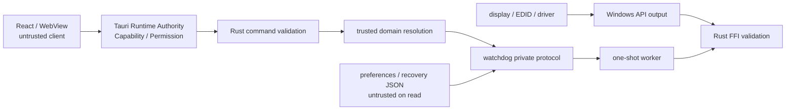

# DisplayDeck セキュリティ設計

最終更新: 2026-08-24
状態: Gate Aとnon-mutating Stage 1は完了した。Gate Bのactual D07は2026-08-30に`DirectoryAnchorUnproven`でNo-Goとなった。mutation authorityは発行せず、exact binding、actual machine-data write、display mutationを実行しないread-only MVPへ進む。永続変更、multi-display mutation、配布は未承認である。

## 1. セキュリティ目標

1. WebView/Reactが侵害・誤動作しても、任意のshell、file、process、URL、Win32 parameterを操作できない。
2. staleまたは偽造されたsnapshot/mode/sessionで別monitorや別transactionを変更できない。
3. watchdog/worker/journalが置換・改ざん・競合・再利用された場合、fail closedにする。
4. rollback safetyをavailability上の最優先security propertyとして扱う。
5. standard user runtimeを基本とし、表示変更を理由に広い管理者権限を常時与えない。
6. Rust `unsafe`とWindows APIを小さな監査可能な境界へ閉じ込める。

TauriのCapability systemはfrontend compromiseの影響を減らせるが、malicious/incorrect Rust code、過大なscope、system WebViewの脆弱性、supply-chain compromiseを防ぐものではない。Rust側validationと配布integrityを別に設計する。[Tauri Capabilities](https://v2.tauri.app/security/capabilities/)

## 2. 信頼境界と外部入力

未信頼入力:

- commandの全argument、WebView event/order、window lifecycle
- Tauri event payloadを受けるReact local state
- monitor friendly name、device path、EDID、mode list、Win32 return/buffer
- preferences JSON、recovery slot、old schema、filesystem metadata
- sidecar stdout/stderr、exit code、PID、process timing
- current time、suspend/resume、topology change、external Windows Settings操作
- installer/update/uninstall environment

## 3. Tauri 2 CapabilityとPermission

### 3.1 基本方針

- bundled local contentを表示するsingle main WebViewWindowだけをCapability対象にする。
- remote originをCapabilityへ追加しない。
- custom command permissionを6 commandへ分け、main windowだけへgrantする。
- generated schemaを採用Tauri versionで確認し、exact permission identifierをPhase 3で固定する。存在を推測しない。
- broad default permission setを無検討に付けない。必要なcore event listen/unlisten等を個別に列挙する。
- frontendへshell、process、filesystem、HTTP、opener、dialog path、updater、global shortcut、tray、clipboardのpermissionを与えない。
- Tauriのglobal objectは有効化せず、bundled moduleからtyped wrapperだけを使う候補とする。

Tauri公式資料ではCapabilityはwindow/WebViewとPermissionを結び付け、複数Capabilityに属するwindowは権限がmergeされる。また、登録したapplication commandが既定で全window/WebViewから使える場合があるため、custom app manifest command listによる制限も検討する。[Capabilities](https://v2.tauri.app/security/capabilities/)、[Permissions](https://v2.tauri.app/security/permissions/)

### 3.2 Command allowlist

| Command | Security effect | Permission scope |
| --- | --- | --- |
| `get_display_snapshot` | read-onlyだがdevice情報を扱う | main local window、rate/size limit |
| `begin_display_change` | display mutation開始 | main local window、single-flight、fresh token限定 |
| `ack_display_change_presentation` | 確認UI stageを進めるがKeepではない | main local/current view、active session/generation/lease、stage token/nonce限定 |
| `confirm_display_change` | trialをsession内維持 | active session/generation限定 |
| `restore_display_change` | current sessionのrollback要求 | active session/generation限定 |
| `get_display_change_status` | recovery state read。`StatusRequestV1`の`BOOT_HANDSHAKE`だけcurrent view bindingをrotate | main local window、exact version/mode。`frontendBootNonce`はduplicate識別だけでauthorityにしない |

generic `invoke(commandName,payload)`をfeature codeへ公開しない。`src/services/tauriApi.ts`にmethodごとのDTOを定義し、それ以外からTauri core APIを直接importしないlint/architecture ruleを後で設ける。

### 3.3 Event

- fixed `display-state-changed` eventだけをmain windowへ送る。
- eventはhintであり、Keep/Revertの権限やterminal successにならない。
- frontend指定event name、global broadcast、raw native payloadを禁止する。
- payload generationが古い場合は破棄し、gapはstatus commandで回復する。

## 4. Content Security Policyとcontent loading

### 4.1 CSP

production CSPの出発点は次の意味的制約とする。

- `default-src 'self'`
- script/style/font/imageはbundled selfのみ。必要なinline style/hashはbuild output検証後に最小追加
- `object-src 'none'`
- `base-uri 'none'`
- `frame-src 'none'`
- `frame-ancestors 'none'`
- `form-action 'none'`
- network `connect-src`はTauri internal IPCに実際に必要なsourceだけ
- `unsafe-eval`を許可しない。remote script/CDN/data-driven HTMLを許可しない

TauriはconfigurationでCSPを有効にし、build時にnonce/hashを補助する。exact directiveは採用Tauri/WebView2/Vite outputをpackaged testして固定し、動かないことを理由に`*`やremote hostを追加しない。[Tauri CSP](https://v2.tauri.app/security/csp/)

### 4.2 Navigation/window

- initial URLはbundled local entryだけ。
- `http:`, `https:`, `file:`, `data:`, `javascript:`、custom external schemeへのnavigationをdenyする。
- `window.open`、popup、新規WebView、download、drag-and-drop file navigationをdenyする。
- 外部linkを初期UIに置かない。将来必要なら固定allowlist URLとOS browser openを別Permission reviewする。
- remote capabilityとdev server URLをproduction artifactへ含めない。

### 4.3 WebView2

- WebView2 runtime/versionをsupport manifestへ記録する。
- runtimeが欠損/古い場合のinstaller behaviorを検証する。
- DevToolsはproductionで無効候補とし、debug buildとrelease buildを分離する。
- WebView2 cache/user-data directoryがrecovery journalやsidecar directoryと同居しないようにする。

## 5. Rust command入力検証

validationはtyped deserializeだけで終わらない。

### 5.1 共通shape/length

- plain structured DTOだけを受け、unknown field、missing required field、null混在を拒否する。
- stringをUTF-8 byte lengthと限定alphabetで検査する。
- integerはRust target typeへ変換する前にprotocol rangeを検査する。
- float/NaN/Infinityをmode identityへ使わない。refreshはbounded numerator/denominator integerとする。
- array/object/depth/total frameに上限を設ける。
- commandごとにtimeout/rate/single-flightを持つ。

### 5.2 Monitor/mode/snapshot

- monitorToken/modeTokenはopaque random token/digestで、device pathやwidth/Hzをencodeした値として信用しない。
- snapshotRevisionがcurrent in-memory snapshotと一致し、TTL内であることを検査する。
- Rust側がapply直前にWindowsをfresh列挙し、tokenのtargetとcomplete candidateを再解決する。
- exactly one GDI candidate、exactly one CCD target、exactly one expected observationを要求する。
- stale topology、multi-path、remote/virtual、support fingerprint mismatch、classification不明で拒否する。

### 5.3 Session

- sessionIdはCSPRNGで128-bit以上、URL-safe限定表現、固定最大長とする。
- sessionIdだけでなくjournal generation、epoch、leaseVersion、bootId、owner SID/logon、displayId、controller/watchdog instance、operation nonce、durable stateを照合する。
- `presentation ACK`はcurrent main view、該当stage、rotated presentation token、core-issued CSPRNG `viewRevision`、`controllerInstanceId`、ackNonce、presentation deadline、observed payload digestのexact一致だけ。tokenはsecret authorizationではなくstale/replay fenceである。reload/navigation/root remount/crash/recreate前のview、React生成token、Stage 1権限を移送したnew view、別presentation sessionのtokenと旧viewの組合せを拒否する。
- `confirm`は2-stage ACK済みAwaitingConfirmation、fresh current=R/persisted=P0、watchdog decision lock内のexact identity/Revert未勝利/fresh tickでだけ`KEEP_AUTHORIZED`へ入る。accepted stateやReact `remainingMs`を成功根拠にせず、valid `DecisionJournalV1(KEPT_SESSION)` readback後だけsuccessを返す。
- `restore`はactive sessionのApplying/Presenting/Awaiting、authorization前Confirming、Restoringだけ。別session/owner/displayのjournalを指定できず、`KEEP_AUTHORIZED`後にordinary Revertを開始しない。
- `BOOT_HANDSHAKE`はinitial root mount/root remount/frontend restart/renderer recoveryだけのaccepted pathである。repeated handshakeはbinding失効によるavailability DoSを起こし得るが、presentation/Confirmのwatchdog tupleを生成せずKeep authorityを与えない。`ORDINARY_RESYNC/PRESENTATION_RESYNC`は旧stage authorityを移送しない。
- confirm/revert/ACK nonceはwatchdogがstatus projectionとして発行し、operation/state/generation/leaseへbindする。frontend生成nonceや他operationへのnonce流用を拒否する。
- terminal結果の冪等再読出しは許可できるが、terminalから新たなoperationを開始しない。

### 5.4 Native output

- structure size/count、buffer multiplication overflow、UTF-16 termination、enum/flag allowlist、rational denominator、width/height/frequency上限を検査する。
- unknown enum/field bitを無視してapplyせず、candidateをunsupportedにする。
- API successでもreturned count/index/referenceが配列内であることを検証する。
- friendly name/log textをcontrol messageやformat stringとして解釈しない。

## 6. Shell/command injection対策

- frontendにTauri shell pluginのexecute/spawn Permissionを与えない。
- watchdog/worker起動に`cmd.exe`、PowerShell、shell stringを使わない。
- executableはpackaged fixed pathからだけ起動する。frontend、preferences、journal、environmentからpathを受け取らない。
- command line argumentは固定role/protocol versionとbounded opaque nonceに限定する。可能な値はstructured private pipeへ送る。
- `%PATH%`検索、current working directory search、file associationを使わない。
- stdoutはframed control専用、stderrはbounded diagnostic専用とし、textを再実行しない。

Tauri公式sidecar文書はfrontendからspawnするpermissionも説明するが、DisplayDeckではその経路を使用しない。bundle inclusionだけを利用候補とし、起動はtrusted Rust内部に限定する。[Tauri sidecar](https://v2.tauri.app/develop/sidecar/)

## 7. File pathと保存領域

### 7.1 Preferences

- current userのfixed application data directory内にJSONを保存する。
- UI preference、last selected presentation option等の非特権情報だけを持つ。
- executable/journal/device path、Win32 flag、trusted candidate、command名を保存しない。
- parse failureはdefaultへ戻し、display mutationを自動開始しない。

### 7.2 復元ファイル（Recovery journal）

- preferencesと別のfixed Recovery directoryにdual slotを置く。
- terminal decisionは同directoryの固定名`DecisionJournalV1` 1 fileに、fixed headerとfixed-size A/B slotで置く。active selector、frontend指定path、rename-based headを持たない。
- user入力からfilename/pathを作らない。sessionIdもfilenameへ直接使わずfixed slot名とする。
- directory/fileをreparse point、symlink、hardlink等の置換対象として扱い、open handleのfinal path/identityを検証する方針をPhase 2Aで確定する。
- owner userと必要なOS principalだけのDACL。broad Users/Everyone writeを拒否する。
- install directoryとuser-writable recovery directoryを混同しない。
- `DecisionJournalV1`のfixed pathはopen/reopenごとにtrusted directory handle、final path、volume/file identityを再検証する。reparse point/symlink、unexpected hardlink/alternate path、sparse/short/trailing file、unsupported local volume/filesystemを拒否する。
- first creationはoperational WALのdurable create intent後の`CREATE_NEW`相当だけとし、collision時は上書きせずclassificationをやり直す。stale file planting、check-create race、file identity replacementはmutation 0件の`FAILED_CLOSED`とする。
- current access tokenから得たowner SID/logonのfixed directoryだけを使う。別userのjournal/slot、raw path digestから復元したpath、frontend指定pathをcurrent baselineへ使わない。
- active/unresolved sessionでfileをtruncate/delete/recreateせず、unknown schema、checksum mismatch、missing expected fileを自動fresh fileとして初期化しない。V1 session rolloverはarchitecture 7.4のdurable intentで選んだ1 slot overwriteだけを許す。

### 7.3 改ざん・破損対策

- operational WALはcanonical JSON、schema、state-required mask、length、generation、SHA-256 digestでtorn write/accidental corruptionを検出する。`DecisionJournalV1`はfixed slot boundary、generation/previousGeneration/stateVersion、payload/header checksumで検出する。
- current identityに完全一致するsession-local chainのdual-slot最大valid generationだけをdecisionへ採用し、foreign generationは比較せずreclaim/retention判定へ渡す。unknown major schema、invalid transition、両slot破損ではmutationしない。
- decision write/flush/readback errorではpossible `KEPT_SESSION`をRevertで上書きせず、close/reopen後のA/B readbackでnew Keep、prior `REVERT_REQUIRED`、unreadable/conflictを区別する。
- journal値をそのままWin32 structへcastしない。allowlisted field、integer range、target/topology、current/persisted、support fingerprintをfresh observationで再検証する。
- HMAC keyをDPAPI等で保護する案はPhase 2A security spikeの比較対象とするが、同一userで任意code実行できるattackerに対する完全なauthenticityとは断定しない。
- checksum/HMACの有無にかかわらず、journalから任意target/modeをblind applyしないことを最終防御とする。
- current decision readerは`sessionId,bootId,displayId,ownerSidDigest,logonId,decision-chain leaseVersion`が全一致するslotだけをcurrent generation chainへ入れる。owner/boot/display/logon/lease mismatch、old `KEPT_SESSION`、大きなforeign generationはcurrent authorityを一切与えず、cross-session injectionによるKeepまたはrollback target切替を防ぐ。
- foreign slotを無視せずreclaim eligibilityに渡す。normal terminalはprior machine `TERMINAL_CLEAN`、linked WAL terminal digest、old actor absence、identity readability、retentionを証明した後だけreclaimでき、対象slot/full digest/actor/reasonのdurable reclaim intent/audit summaryを残す。
- `FAILED_CLOSED`、critical/degraded/blocked、`RECOVERY_REQUIRED`、`RESTORING`、outcome unknown、unreadable、checksum/generation conflict、unsupported schema、actor/worker/owner/boot/display unknownはevidence-destruction防止のため自動reclaimしない。normal terminalとcritical evidenceのretention policyを分け、critical evidenceは別承認support procedureまで無期限にblock/preserveする。
- normal terminalのfull slotも`TERMINAL_CLEAN`、actor exit、次sessionのdemand-driven reclaimまで保持し、terminal直後にcleanupしない。reclaim/cleanup crashで両slotを失わず、current partial baselineはexact reclaim intentがある場合だけ同targetへretryする。

同一userのmalwareはWindows APIを直接呼べる可能性があり、DisplayDeckのACLだけでdisplay tampering全般を防げない。このthreat boundaryを明示しつつ、DisplayDeckがtampered journalを増幅して別targetへ適用しないようにする。

## 8. Watchdog/worker security

### 8.1 Executable置換対策

- NSIS/MSIでprotected install rootへ置くper-machine signed installを第一候補にする。
- main/watchdog/worker/DLL/installerをAuthenticode署名し、publisher/chain/timestamp policyを決める。
- 起動前にfinal canonical path、install root、file identity、expected digest、`WinVerifyTrust`相当のpublisher検証を行う候補とする。
- TOCTOUを減らすため、path validation後のopen handleとprocess image identityを照合する。実現APIはPhase 2Aで検証する。
- per-user writable installを採る場合は置換riskを再評価し、signed image runtime verificationをrelease gateにする。

### 8.2 Process identity/fencing

- PIDに加えprocess creation time、image identity、role、bootId、owner SID/logon、controllerInstanceId、watchdogInstanceId、epoch、leaseVersion、generation、owner nonce、operation sequence、one-use nonceをdurable化する。
- takeoverはmachine-wide maintenance/mutation gate、per-display lock、per-user recovery lockの取得、old watchdog process exit、旧worker quiescence、journal/machine actor recordの一致を全て要求する。
- PID reuse先をkillしない。open/query deniedまたはidentity不明ではblockedにする。
- late frame/resultはepoch/generation mismatchで破棄する。
- watchdogはworkerへ次operationやkeep権限を渡さない。
- `KEEP_AUTHORIZED`後のjournal writerがalive-but-hungでも、replacementはexact writer process exit、journal-writer lock、lease/instance fencingを証明するまで同じA/B slotへ書かない。unknown outcomeはreadbackで判定し、concurrent writerやpossible KeepのRevert上書きを禁止する。

### 8.3 Cross-sessionとmachine maintenance

- mutation watchdogは`Global\\` machine maintenance/mutation gateをtransaction全期間保持し、trusted display digestのper-display lock、owner SID/logonのlocal recovery lockを順に取得する。lock名へfrontend値を連結しない。
- named objectはdefault DACLに依存せず、standard user runtime、別interactive user、SYSTEMに必要な最小accessをexact SDDLで固定する。別interactive userに他ownerのrecovery journal read/write権限は与えない。named-object exact SDDLはPhase 2A evidence pendingで、成立しなければmaintenance/mutationを拒否する。
- ownerのper-user WALに対しては、SYSTEM maintenance actorへterminal照合用read/synchronizeだけを候補とし、write/restore権限は与えない。D05/D06のmachine fileとper-user WALのACLを混同せず、per-user WAL権限を拡張しない。
- D05/D06 policy-approved file DACL candidateはowner=`SYSTEM`、protected DACL、inherited ACEなしである。maskは`R=0x00120089`、`RW_SLOT=0x0012008B`、`DIR_TRAVERSE=0x001200A8`、`FA=0x001F01FF`とし、machine-data directoryは`SYSTEM:FA / Administrators:R / designated runtime SID:DIR_TRAVERSE`、`MachineActorRecordV1`は`SYSTEM:FA / Administrators:R / designated runtime SID:RW_SLOT`、`MachineActorProvisionRecordV1`は`SYSTEM:FA / Administrators:R / designated runtime SID:R`のcanonical orderだけを許す。creator/maintenance writerはSYSTEM token、runtime writerはinstallerがtrusted console token/session observationから固定したsingle designated SIDだけである。
- `Users`、`Authenticated Users`、`INTERACTIVE`、`Everyone`、`CREATOR_OWNER`、inherited ACE、runtime SIDへのappend/EA/attribute/delete/ACL/owner/SACL変更権限を禁止する。別SID、missing/invalid ProvisionRecord、owner SID digest mismatchはread-only inspectionだけに留める。Administrator/SYSTEM privilegeによるOS-level bypassはこのDACLが防ぐthreatではない。
- D07のdirectory anchor / reparse / file identity / volume / filesystem / attribute / hardlink / ADS predicateをdocumented handle/APIでrace-resistantに証明できないcellは`DIRECTORY_ANCHOR_UNPROVEN`として、provision create/resume、storage write、mutationを0件にする。final resolved pathだけをparent-chain proofとして扱わない。
- current access tokenのcanonical SID、authentication/logon LUID、Windows session ID、active-console identityをtrusted Rustが取得する。React、journal、environmentからowner identityを受け取らない。
- initial mutationは唯一のlocal active-console interactive logonだけに限定する。RDP、second logon、Fast User Switching、session notificationの欠落/ambiguityは`KEEP_AUTHORIZED`前ならfail closed/active Revert、authorization後ならold frontend authority失効とjournal-only completion/recoveryにする。
- protected machine-dataの`MachineActorRecordV1`は`docs/architecture.md` 19.2のcanonical fields、13 wire states、state-specific field/transition表だけを正本とし、ここで別schemaやaliasを定義しない。C0/P0/R、raw path、不要な個人情報を持たず、instance IDとprocess identityを別fieldにする。checksumはauthorizationではない。
- machine wire `ACTIVE_INTENT`をflush/reopen/publishする前にowner WAL `PREPARED`を書かず、`ACTIVE_PREPARED/ACTIVE_WATCHDOG_READY/ACTIVE_APPLY_ARMED/ACTIVE_MUTATED`をlinked WAL/actor evidenceに合わせる。owner WAL terminal、worker/transaction actor quiescenceより先に`TERMINALIZING -> TERMINAL_CLEAN`へ進めない。UI projectionの`ACTIVE/PREPARING/CRITICAL_UNKNOWN/CLEAN/PENDING`をwire decodeに使わない。
- approved SYSTEM maintenance actorはmachine gateを取得し、signed installer/update/repair/uninstall package/process identity、machine record、read-onlyで開いたreferenced owner WALがexact terminal-cleanである場合だけ`MAINTENANCE_ACTIVE`をdurable化してbinaryを変更する。elevated interactive admin tokenをSYSTEMの代替writerにしない。active/pending/critical/unknown/unreadable/owner-unavailable recordでは拒否し、別admin userが他owner journalを復元しない。
- same-userまたは別local userがglobal gate/actor recordを使ってavailability DoSを起こす可能性は残る。初期版はunsafe maintenance/mutationよりfail-closed DoSを選び、Phase 2AでDACL/private namespace案を比較する。

### 8.4 Protocol

- inherited private pipeを第一候補とし、handle inheritance allowlistを明示する。
- frame size、count、depth、string、time、stderr budgetを固定する。
- strict message type/state sequenceを検査し、unknown field/protocol versionを拒否する。
- control channel confidentialityより、endpoint非公開、ACL/handle isolation、integrity/replay防止、session bindingを優先する。
- protocol faultがmutation後なら旧worker exit確認後のrollbackへ進む。

### 8.5 Availability/DoS

- same-user actorがmutexを保持、journalを書換え、workerを妨害するDoSは完全には防げない。
- その場合、競合mutationで回復を試みずblockedにする。
- control stdout/stderrを並行drainし、log floodでwatchdogをblockさせない。
- watchdog threadとblocking Win32 callを同じfailure domainに置かない。

## 9. 権限昇格

- runtimeは`asInvoker`/standard userを第一候補とする。
- display API failureを見て自動UAC再起動しない。
- ordinary UI/runtime/watchdog transaction laneはadministrator token、service、SYSTEM、scheduled taskを要求しない。
- D05/D06のinitial provisionとmachine maintenanceだけはapproved SYSTEM token laneを必要とする。per-machine installer elevationとSYSTEM actor起動/identity proof、ordinary runtime capabilityを分離し、service/scheduled-task等の具体的なSYSTEM起動方式は別承認・Phase 2A evidenceなしに採用しない。
- runtime elevationが必要と判明した場合、attack surface、journal ownership、low/high integrity IPC、unelevated UIとの境界を再設計し、初期scopeを再承認する。

## 10. Rust `unsafe`とWindows API境界

- `unsafe`を`src-tauri/src/windows/ffi`相当へ限定する。
- 1 unsafe blockごとに、pointer validity、buffer length、structure initialization、union member、UTF-16 lifetime、thread/DPI context、handle ownershipをコメント/文書化する。
- safe wrapperはowned Rust typeとtyped errorを返し、raw pointer/handleをdomain/commandへ出さない。
- handleはRAIIでcloseし、inheritanceはexplicit allowlistにする。
- arithmeticはchecked conversion/multiplicationを使い、OS countをそのままallocationへ使わない。
- FFI wrapperのunit/property/fuzz testと、Windows実機のinvalid/edge output testを計画する。
- unsafe禁止ではなく、review ownerとcoverageを明確にする。

## 11. Log policy

### 残してよい

- timestamp、app/protocol/schema version
- state transition、operation kind、duration、retry count
- fixed error code、sanitized Win32 category、diagnostic ID
- hashed/support fingerprint、OS build、GPU/driver version、WebView2 version（明示consent/evidence bundle内）
- rollback exact/degraded/failed/blocked classification

### 通常logへ残さない

- raw monitor device path、EDID serial、username、home/profile path
- full command payload、session nonce、owner nonce、one-use GO token
- recovery JSON本文、raw DEVMODE/CCD buffer、memory address/handle
- executable full path、environment、stack traceをユーザー向けlogへ出すこと
- screen content、window title、外部app情報

diagnostic bundleは明示操作、項目preview、redaction、size limitを別設計する。初期版にtelemetry/uploadを含めない。

## 12. Supply chain・installer・update

- Tauri、Rust crate、npm packageはexact version/lockfile/signature/advisoryをPhase 3以降に管理する。現在はdependencyを追加しない。
- `windows` crateを第一候補にしても自動的に安全とはみなさず、生成bindingとfeatureをreviewする。
- NSIS/MSIのcustom hookを最小化し、任意download/script実行を追加しない。
- WebView2 bootstrapperのdownload/embedded/offline方式、hash/publisher、proxy/offline failureを検証する。
- auto-updateは初期範囲外。manual upgrade/uninstallでもactive/pending/degraded/failed/blocked journalを検出し、安全復旧前にbinaryを削除しない。
- certificate rotation、revocation offline policy、timestamp、SmartScreen reputationは人間の配布decisionとする。

## 13. Security受け入れ条件

- main window以外/remote origin/未許可commandから6 commandを呼べない。
- shell/fs/http/opener/process permissionがfrontend Capabilityに存在しない。
- CSP/navigation testでremote code、popup、file navigation、`unsafe-eval`が拒否される。
- malformed/oversized/stale command DTOがRust側でmutation前に拒否される。
- forged monitor/mode/session/generationで別target/sessionを操作できない。
- old presentationToken/controller/watchdog/lease/boot/logon/commandNonce、別owner SID、別displayIdでACK/Confirm/Revert/takeover/cleanupできない。
- reload/crash/root remount後のold `viewRevision`とStage 1 authority transferが拒否され、`BOOT_HANDSHAKE`だけがnew bindingを発行する。repeated handshakeやXSS/compromised old rendererがKeep authorityを獲得できない。
- watchdog start/image verification/journal durable化が失敗するとmutation 0件になる。
- sidecar置換、path reparse、publisher mismatch、PID reuse、old epoch、protocol replayでfail closedになる。
- journal torn write、unknown schema、invalid transition、bad digest、range overflowでarbitrary restoreしない。
- deadline後の`KEEP_AUTHORIZED` entryを拒否し、期限内entry後のI/O delayはdeadlineで逆転させない。DecisionJournal slotのpartial/torn/short write、generation conflict、checksum mismatch、outcome unknownはA/B readbackでKeep/Revert/FAILED_CLOSEDへ一意に分類し、valid terminal readback前にReact successを返さない。
- `KEEP_AUTHORIZED`前のTauri/WebView crash後もwatchdogが生存しC0へ戻す。authorization後はwatchdogがterminal publicationを継続し、writer lossならreplacementがA/B readbackでKeep/Revert/FAILED_CLOSEDを決める。core+watchdog loss limitは別に表示・testする。
- canonical machine wire `TERMINAL_CLEAN`以外、unknown schema/enum/field violation、record-WAL mismatch中はupgrade/uninstallがbinaryを置換・削除できない。UI projection名をwire判定に使わない。
- machine recordとper-user WALの片側欠落、不一致、ACL/read failure、actor/quiescence不明ではupdate/repair/uninstallを開始できない。
- unsafe inventoryがFFI boundaryだけで、各invariantとtest ownerを持つ。
- runtime standard userで合格するか、必要権限が未決定としてrelease blockされる。
