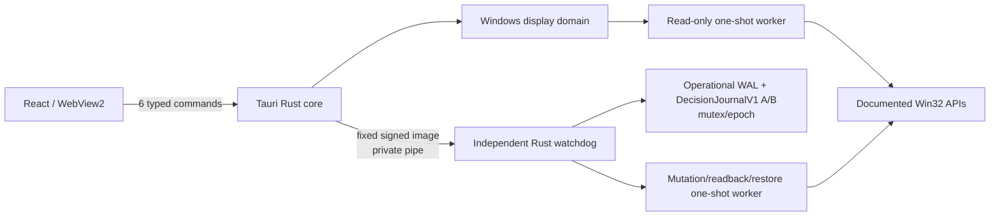

# DisplayDeck Tauri移行設計

最終更新: 2026-08-04  
状態: 移行設計案。過去reviewの履歴は保持。Tauri設計の再レビュー未完了。

## 1. 変更理由

DisplayDeckのdesktop runtimeをElectronからTauri 2へ変更し、Windows専用productとして、React/TypeScript UIとRust/Win32処理を同一のsecurity/recovery architectureへ整理する。

変更の目的:

- Windows API、watchdog、worker、journalをRustへ統一する。
- Node.js runtime/native add-on/PowerShellをdisplay control pathから除外する。
- TauriのCapability/Permission/CSPをfrontendの最小権限境界に使う。
- WebView2/Tauri bundler/NSISをWindows distribution baselineにする。
- 別OS向けproduction abstractionを除き、Windows 10/11のphysical qualificationへ集中する。

runtime変更は安全要件を弱める理由ではない。Tauri Rust coreがnativeであることだけではrollback safetyを満たさないため、独立watchdogとone-shot workerの分離を維持する。

## 2. 維持する要件

- Applyを押すまでOSを変更しない。
- resolution/refreshは列挙済みcandidateのdiscrete selection。
- resolution変更時にrefresh候補を再計算する。
- currentとplannedを明確に比較する。
- apply前のfresh validation、C0/P0/Rの保存、post-apply readback。
- 15秒以内にKeepされなければrollback。
- UI/app crashでもrollback。
- rollback failure/degraded/blockedを最重要状態として扱う。
- single active path、session-only temporary apply、scale read-onlyの初期scope。
- exact candidate-to-observation mapping、WAL、mutex/epoch/worker identity fencing。
- all-process lossは別product guarantee decisionとblind physical recoveryを必要とする。
- multi-monitor、scale mutation、DLDSR固有対応を初期版から外す。

## 3. 変更する要件

| 項目 | 旧design | 新design |
| --- | --- | --- |
| Desktop runtime | Electron | Tauri 2 / WebView2 |
| Frontend boundary | renderer + preload/contextBridge | React + typed Tauri command wrapper |
| Privileged process | main process | Tauri Rust core |
| IPC | preload method + Electron IPC | 6 custom Tauri commands（専用presentation ACKを含む）+ sanitized event hint |
| Frontend security | nodeIntegration/contextIsolation/sandbox | Capability/Permission/Runtime Authority/CSP/navigation deny |
| Native integration | app service + native helper | Rust domain + watchdog + worker + `windows` crate candidate |
| Rollback owner | native rollback supervisor | independent Rust watchdog sidecar |
| Packaging | Electron tool候補 | Tauri bundler、NSIS first、MSI comparison |
| Target OS | Windows implementation + separate development OS mock | Windows 10/11 product only、frontend/test mock only |
| Query API | 複数IPC query候補 | atomic `get_display_snapshot` |
| Prepare/apply | service内部/IPC設計 | public分離を廃止し`begin_display_change`に統合 |

## 4. 廃止する構成

- Electron runtime、BrowserWindow、main/renderer terminologyをcurrent architectureに使うこと
- preload、contextBridge、ipcMain/ipcRenderer、Node integration/isolation設定
- custom application protocolによるasset serving contract
- Electron-specific build/package selection
- OS判定でproduction display serviceを切り替える構成
- macOS実display serviceおよび将来対応用platform abstraction
- Node.js native add-on、existing Node display package、PowerShell scriptをprimary control pathにする案
- frontendまたはgeneric shell APIからsidecarをspawnする構成

過去の`docs/design-review.md`と`docs/review-resolution.md`には履歴としてこれらの語が残る。current designではない。

## 5. 新しい構成

公開command:

- `get_display_snapshot`
- `begin_display_change`
- `ack_display_change_presentation`
- `confirm_display_change`
- `restore_display_change`
- `get_display_change_status`

`get_displays`、`get_current_display_settings`、`get_available_display_modes`を分けない。別々の世代を混ぜるriskを避けるためである。`prepare_display_change`と`apply_display_change`もpublicには分けず、watchdog内部のdurable stateとして分ける。presentation ACKはeventやConfirmへ流用せず、stage/token/generationをbindした専用commandにする。

## 6. Electron設計から流用できる部分

runtime非依存で流用したもの:

- product/functional/non-functional requirementとinitial scope
- candidate identity、apply tuple、display label、expected observationの分離
- C0/P0/Rとsession-only Keep
- one-shot worker separation、worker quiescence、PID+creation time/image identity
- dual-slot WAL、state-required payload、write-ahead GO、startup decision table
- OS-wide mutex、epoch、owner nonce、operation sequence
- confirmation presentation二段ackとdeadline非延長
- decision lock内`KEEP_AUTHORIZED` entryによるConfirm/Revert priority、fixed A/B `DecisionJournalV1` commit、watchdog単独lossのreplacement takeover
- machine-wide maintenance/mutation gate、per-display lock、per-user recovery、architecture 19.2 canonical `MachineActorRecordV1`、owner/boot/lease/generation/instance-process fencing
- exact/degraded/failed/blocked error priority
- finite RC hardware manifest、mandatory repetitions、zero tolerance、traceability

これらは再利用した設計controlであり、Tauri/Rust上で実証済みという意味ではない。

## 7. 書き換えた部分

- process責務をReact/Tauri Rust core/watchdog/workerへ再配置した。
- frontend bridgeをpreload methodからtyped Tauri command wrapperへ変更した。
- sender validationをCapability/PermissionとRust handler validationの二層に変更した。
- asset custom protocolを廃止し、bundled local content + CSP/navigation policyへ変更した。
- confirmationを別runtime windowではなく、single main WebViewWindowのpre-rendered modal overlayにした。
- Tauri eventをauthoritative IPCではなくstate hintへ限定し、status commandで再同期するようにした。
- native controlをNode側serviceからRust domain/FFIへ移した。
- packagingをTauri bundler/sidecar/NSISへ変更した。
- Windows 10/11の両方をproduct targetとし、exact support cellを改めて未決定にした。

## 8. 削除したmacOS関連設計

- product target、build artifact、runtime OS detection、display service implementation
- 別OS用PlatformServiceと同contractのproduction backend
- macOS上で実displayを変えずにproduct UIを開発する前提
- 将来macOS対応を見越したdirectory/dependency direction

残した`src/mocks`はReact component/API contract test用のdeterministic mockであり、macOS product supportやruntime platform switchingではない。Windows以外でproduction applicationを動かすことを受け入れ条件にしない。

## 9. PowerShellを採用しない理由

- Rustからdocumented Win32 APIを直接扱い、struct/flag/return/readbackをtypedに検証する方が今回のtransaction modelに合う。
- script host、execution policy、locale、quoting、command injection、AV policyという追加surfaceを避けられる。
- watchdog/worker/WAL/protocolをRustへ統一できる。

PowerShellが技術的に一切利用不能という意味ではない。調査/運用上のread-only補助で必要になった場合も、product control pathへの追加は別design/security reviewを必要とする。

## 10. Rustを採用する範囲

- 6 Tauri command handler（専用presentation ACKとstatusを含む）とapplication controller
- snapshot/candidate/session/state/errorのdomain model
- GDI/CCD query/validation/apply/restoreのWindows FFI wrapper
- independent watchdog、one-shot worker、framed protocol
- dual-slot recovery journal、preferences JSON、ACL/path handling
- executable/signature/image identity、process/mutex/pipe/handle管理
- structured local logging/redaction

React/TypeScriptはUI/draft/typed DTO/mockだけを担当する。Rust `unsafe`はWindows FFI/process boundaryへ限定する。

## 11. Watchdog構成

### Ownership

watchdogがsession、machine/display/user locks、epoch/leaseVersion/generation、operational WAL、`DecisionJournalV1`、`GetTickCount64` deadline、decisionの正本である。Tauri coreはwatchdog clientとprocess/heartbeat monitorであり、timerやConfirm/Revertの勝者を最終権威にしない。deadlineは`KEEP_AUTHORIZED` entryに適用し、terminal slot I/O完了期限にはしない。

### Startup

1. Rust coreがfresh snapshot/mode tokenを解決する。
2. fixed packaged path、signed image、protocolを確認してwatchdogをshellなしで起動する。
3. watchdogがmutex/stale journal/old workerを検査する。
4. capture workerをGO-waitでspawnし、identity/intentをdurable化後にC0/P0を取得する。
5. PREPARED/preflightをdurableに進め、ready ACK後だけapply workerへGOを渡す。

### Live control

- inherited private pipeを第一候補とする。
- presentation ACK/`CONFIRM`/`REVERT`はsessionId、bootId、owner/logon、displayId、epoch、leaseVersion、generation、actor、operation nonceにbindする。
- root mount/remount/frontend restart/renderer recoveryは6 command内の`get_display_change_status(StatusRequestV1{mode:BOOT_HANDSHAKE})`でnew view bindingを受ける。focus/event gap/child remountの`ORDINARY_RESYNC`はrotateせず、`PRESENTATION_RESYNC`はold stage authorityを移送しない。
- `KEEP_AUTHORIZED`前のTauri core lossはEOFとしてwatchdogがRevert decisionを取る。authorization後はEOFでdecisionを逆転せずterminal slot publicationを継続する。
- eventはfrontend表示用で、watchdog controlには使わない。

`KEEP_AUTHORIZED`後のConfirmはUI上`ConfirmCommitInProgress`であり、React successではない。watchdogはfixed A/B slotのwrite/flush/close/reopen/readback後だけcommitを返す。writer loss/unknown outcomeはreplacementがold process exitとlocks/leaseをfenceしてjournalをreadbackし、valid Keep/No Keep/unreadableをKeep/Revert/FAILED_CLOSEDへ分類する。

### Worker separation

watchdogはWin32 display APIを直接呼ばない。各operationをseparate one-shot workerへ渡し、process object signaledとidentity clearのdurable化後にだけ次operationへ進む。

### Loss boundary

watchdogが生存するTauri/WebView lossは`KEEP_AUTHORIZED`前なら自動rollback対象、authorization後ならterminal commit継続対象である。watchdog単独lossでTauri coreが生存する場合はreplacement watchdogがold actor/worker/writerをfenceし、confirmationを再開せずDecisionJournal readbackからKeep/Revert/FAILED_CLOSEDを選ぶ。Tauri core+watchdogを含むall-process loss、OS crash/power lossは初期15秒保証外で、next-launch recoveryとblind P0 recoveryを別に扱う。

## 12. 移行で新たに発生するrisk

- Tauri sidecar/bundlerとWindows Jobの組合せがwatchdog independenceを満たすか未確認。
- Tauri Capability/Permissionのexact version/identifier/configを誤るrisk。
- WebView2 runtime/version/install modeによる起動・CSP・E2E差。
- Rust `windows` crate binding/feature/unsafe wrapperの新しいreview surface。
- NSIS external binary同梱、architecture naming、signature/update/uninstallのrisk。
- eventとcommand responseのorder差によるReact/Rust desync。
- Windows 10をproduct targetへ含めることでEOL/security/support matrixが拡大。
- separate Rust binariesによりsigning、hash、installer、AV/SmartScreenの対象が増える。

## 13. 既存review指摘への影響

`docs/design-review.md`と`docs/review-resolution.md`は2026-08-01時点のElectron設計に対する履歴として変更しない。次表はTauri移行後のstatusであり、過去記録を書き換えるものではない。

| ID | Tauri移行の影響 | Current action |
| --- | --- | --- |
| DDR-001 | helper/watchdog failure-domain分離は引き続きCritical | Rust watchdog + one-shot workerで継承。Phase 2A/2B再検証 |
| DDR-002 | crash-consistent journalはruntime非依存 | dual-slot JSON WALへ継承。Rust storage再レビュー |
| DDR-003 | all-process loss boundaryは同じ | watchdog lossを15秒外としhuman decision継続 |
| DDR-004 | C0/P0補償順序は同じ | initial profile不変、C0 exact/P0 degraded |
| DDR-005 | exact baseline schemaは同じ | Rust domain schemaへ移植、Phase 1A再検証 |
| DDR-006 | GDI/CCD mappingは同じ | `windows` crate spikeで再検証 |
| DDR-007 | fencingは同じ | Windows mutex/epoch/process identityをRustで実装予定 |
| DDR-008 | Electron custom protocol contractはcurrent designで無効 | bundled content/CSP/navigation/Capabilityとして新規review |
| DDR-009 | native framing/budgetは引き続き有効 | watchdog/worker private protocolへ継承 |
| DDR-010 | confirmation presentation failureは同じ | single-window overlay + two-stage ackへ書換え |
| DDR-011 | V1をmulti-monitorへ反復しない方針は同じ | future V2 full-plan review |
| DDR-012 | finite matrix/zero toleranceは同じ | Windows 10/11 targetへmatrix再freeze |
| DDR-013 | scale read-only rowは同じ | 初期版維持 |
| DDR-014 | traceabilityは同じ | Tauri/Rust test IDへ更新 |
| DDR-Q01 | 未決定のまま | session-only proposal維持 |
| DDR-Q02 | 未決定のまま | watchdog loss boundaryをTauri構成で再承認 |
| DDR-Q03 | 旧W11-only safe proposalは新しいproduct target decisionでsuperseded | Win10/11 target固定、exact edition/build/archは未決定 |
| DDR-Q04 | installer toolが変わる | NSIS/MSI/signingとして再決定 |
| DDR-Q05 | 未決定のまま | Enter/initial focusを再レビュー |
| DDR-Q06 | 未決定のまま | Phase 1A後にdiagnostic表示を判断 |

DDR-008は旧controlがそのまま適用できず、Tauri security designに置き換えたため新規review必須である。Critical/Highの過去「設計解消」は、新runtimeでのimplementation/evidence closureではない。

## 14. 再レビューが必要な項目

- 6 commandのarg/result/state/idempotency/timeout/concurrency
- registered app commandをCapability/Permissionで本当に限定できるか
- CSP、local content、navigation、dev URL、WebView2
- Rust command/input/native output validation
- `unsafe` inventoryとhandle/buffer invariants
- `windows` crateとGDI/CCD API selection
- watchdog launch/parent loss/Job/pipe/worker separation
- WAL schema/durability/ACL/tamper/startup decision
- session/epoch/process identityとdouble operation
- single-window confirmation presentation/focus/Enter policy
- NSIS external binaries/signing/WebView2/update/uninstall
- Windows 10/11 exact support matrix/EOL policy
- scale/multi/DLDSRがinitial releaseから除外されていること
- frontend mockがproduction platform abstractionになっていないこと

## 15. Migration完了条件

- current design文書がTauri/Rust/Windows専用で整合する。
- historical review以外の旧runtime/別OS記述がcurrent requirementとして残らない。
- Tauri-specific security/watchdog/distribution riskがopen questionへ追加される。
- `docs/tauri-design-review-checklist.md`による再レビューが完了する。
- 人間がPhase 1Aの範囲を別途承認する。

本書作成時点では最後の2条件を満たしておらず、実装開始不可である。
